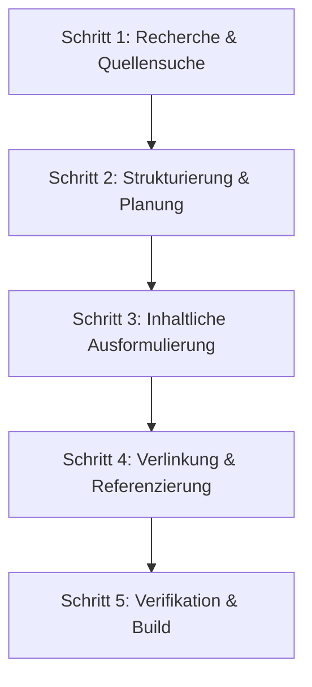

# Agenten-Leitfaden: Generische Erstellung von Gesetzeskommentaren

Dieser Leitfaden definiert die standardisierte Vorgehensweise für den autonomen Glossagens-Agenten zur vollautomatischen Erstellung, Erweiterung und Pflege von Gesetzeskommentaren. Er dient als Runbook, um beliebige Gesetzesbestimmungen auf ein wissenschaftlich fundiertes, verifiziertes Niveau mit hohem Praxisnutzen zu heben.

---

## 1. Ziel und Qualitätskriterien

Jeder kommentierte Gesetzesartikel muss folgende Qualitätskriterien erfüllen:
1.  **Strukturkonformität**: Aufbau als standardisiertes Hugo Page Bundle.
2.  **Kommentierungstiefe**: Strukturierte Aufbereitung des Gesetzeswortlauts, der systematischen Einordnung und der dogmatischen Bedeutung.
3.  **Praxisorientierung**: Identifikation von mindestens **ein bis zwei kantonalen Praxisfragen** (typische Hürden oder Streitpunkte in der kantonalen Gerichtspraxis).
4.  **Fundierte Rechtsprechung**: Dokumentation von **mindestens 10 praxisrelevanten Entscheiden** (Leitentscheide des Bundesgerichts sowie kantonale Gerichtsentscheide; es können aber auch mehr sein).
5.  **Verifizierbarkeit**: Direkte Verlinkung aller zitierten Urteile (in der Regel via OpenCaseLaw.ch-Hyperlinks).

---

## 2. Dateistruktur (Hugo Page Bundles)

Kommentarartikel dürfen nicht als Flat-Files, sondern müssen zwingend als **Hugo Page Bundles** angelegt werden:

```text
content/kommentar/{gesetz}/
├── _index.md                             ← Übersicht des Gesetzes
└── art-{nr}/                             ← Ordner für das Page Bundle des Artikels
    ├── _index.md                         ← Hauptkommentar (Branch Bundle, nicht index.md!)
    └── rechtsprechung.md                 ← Rechtsprechungsübersicht (Leaf Bundle)
```

### Frontmatter-Schema für den Hauptkommentar (`art-{nr}/_index.md`)
```yaml
---
title: "Art. {nr} {Gesetz} — {Kurztitel}"
weight: {nr}
date: YYYY-MM-DD
lastmod: YYYY-MM-DD
description: "Kurze Beschreibung des Artikels und seiner Kernpunkte."
tags: ["{Gesetz}", "{Kategorie}", "{Hauptthema}"]
agent_verified: true
---
```

### Frontmatter-Schema für die Rechtsprechung (`art-{nr}/rechtsprechung.md`)
```yaml
---
title: "Rechtsprechung zu Art. {nr} {Gesetz}"
weight: 99
date: YYYY-MM-DD
lastmod: YYYY-MM-DD
description: "Übersicht der Rechtsprechung zu Art. {nr} {Gesetz}."
tags: ["Rechtsprechung", "{Gesetz}", "{Hauptthema}"]
agent_verified: true
---
```

---

## 3. Inhaltliche Gliederung

### A. Hauptkommentar (`art-{nr}/_index.md`)
Der Kommentarartikel ist wie folgt zu gliedern:

1.  **Gesetzeswortlaut**: Zitat der aktuellen Gesetzesbestimmung (inkl. Absatznummerierung) in einem CSS-Zitat-Block (`{: .gesetzeszitat}`).
2.  **Überblick und Bedeutung**: Einordnung der Norm in die Systematik des Gesetzes, Zweck und Tragweite.
3.  **Kommentierung**: Absatzweise oder thematische Gliederung der Bestimmung. Hierbei sind Kernaussagen der wichtigsten Bundesgerichtsentscheide direkt im Text mit Hyperlinks zu zitieren (z.B. `([BGE 144 III 519](https://mcp.opencaselaw.ch/entscheid/bge_BGE_144_III_519))`).
4.  **Praxisfragen**: Dokumentation kantonaler Besonderheiten, Streitpunkte oder verfahrensrechtlicher Hürden (z.B. Fristberechnungen, Unterschriftsmängel, Zustellungsfragen). Jede Frage muss mit dem klärenden Entscheid verknüpft sein.

### B. Rechtsprechungsseite (`art-{nr}/rechtsprechung.md`)
Die Rechtsprechungsseite listet **mindestens 10 ausgewählte Entscheide** auf (es können auch mehr sein), aufgeteilt in zwei Abschnitte:

1.  **I. Leitentscheide (mindestens 5)**: Die wegweisendsten Entscheide des Bundesgerichts (BGEs), welche die grundlegende Auslegung der Norm definieren (mindestens 5 Entscheide).
2.  **II. Weitere Entscheide (mindestens 5)**: Ergänzende Entscheide (weitere Bundesgerichtsurteile sowie kantonale Obergerichts-/Kantonsgerichtsentscheide), die spezifische Detailfragen, Verfahrensaspekte oder kantonale Praktiken regeln (mindestens 5 Entscheide).

Jeder Eintrag muss Folgendes enthalten:
*   Ein aussagekräftiges, fettgedrucktes Thema als Überschrift.
*   Zitatsyntax mit funktionierendem Link (z.B. `[BGE 144 III 519](https://mcp.opencaselaw.ch/entscheid/bge_BGE_144_III_519)`).
*   Ein Abstract, das den Sachverhalt kurz skizziert und die prozessuale bzw. materielle Kernaussage präzise auf den Punkt bringt.

---

## 4. Vorgehensweise des Agenten (Workflow)

Bei der Erstellung oder dem Ausbau eines Kommentars geht der Agent nach folgendem 5-Schritte-Prozess vor:



### Schritt 1: Recherche & Quellensuche
*   Abfrage der nationalen Urteilsdatenbanken (über den `swiss-caselaw`-Server oder Websuche) nach der Gesetzesnorm (z.B. `Art. 222 ZPO`).
*   Filterung nach Relevanz (meistzitierte Urteile, publizierte BGEs).
*   Identifikation von Streitpunkten in der kantonalen Gerichtspraxis (z.B. durch Suche nach `Art. X Gesetz kantonale Praxis` oder `Beschwerde prozessleitender Entscheid Art. X`).

### Schritt 2: Strukturierung & Planung
*   Auswahl von mindestens 10 qualitativ besten Entscheiden, die das Spektrum des Artikels abdecken.
*   Festlegung der ein bis zwei kantonale Praxisfragen, die im Kommentar behandelt werden sollen.
*   Erstellung einer Taskliste (`task.md`) zur Abarbeitung.

### Schritt 3: Inhaltliche Ausformulierung
*   Erstellung des Page Bundles und Befüllung der `_index.md` und `rechtsprechung.md`.
*   Formulierung der Abstracts in präziser, sachlicher Juristensprache.

### Schritt 4: Verlinkung & Referenzierung
*   Erstellung von Hyperlinks für alle Entscheide.
*   Formatierung: `[BGE XXX III YYY](https://mcp.opencaselaw.ch/entscheid/bge_BGE_XXX_III_YYY)`.
*   Kreuzverweise: Einbau der Links direkt in den fliessenden Erläuterungstext des Hauptkommentars.

### Schritt 5: Verifikation & Build
*   Ausführung des lokalen `hugo`-Befehls.
*   Prüfung des Outputs auf Build-Fehler, fehlende Parameter im Frontmatter oder fehlerhafte Markdown-Syntax.
*   Bei erfolgreichem Build: Commit und Push.
