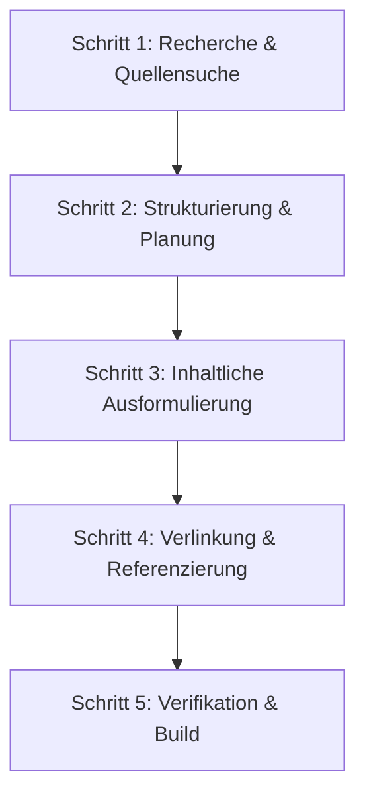

# Agenten-Leitfaden: Generische Erstellung von Gesetzeskommentaren

Dieser Leitfaden definiert die standardisierte Vorgehensweise für den autonomen Glossagens-Agenten zur vollautomatischen Erstellung, Erweiterung und Pflege von Gesetzeskommentaren. Er dient als Runbook, um beliebige Gesetzesbestimmungen auf ein wissenschaftlich fundiertes, verifiziertes Niveau im Stil des Onlinekommentars (onlinekommentar.ch) zu heben.

nehme immer noch zusätzlich die Anforderungen und die Workflows von ./agent/skills/glossagens-content-creation hinzu

---

## 1. Ziel und Qualitätskriterien

Jeder kommentierte Gesetzesartikel muss folgende Qualitätskriterien erfüllen:
1. **Strukturkonformität**: Aufbau als standardisiertes Hugo Page Bundle.
2. **Kommentierungstiefe & Umfang**: Umfassende und strukturierte Aufbereitung des Gesetzeswortlauts, der systematischen Einordnung sowie der dogmatischen Bedeutung. Der Umfang und die Tiefe orientieren sich am Standard renommierter Onlinekommentare (onlinekommentar.ch).
3. **Sprache und Stil**: 
   - Schweizer Rechtsterminologie (z.B. "grosser" statt "großer", zwingend **kein Eszett / ß**).
   - Akademischer, präziser und juristisch einwandfreier Stil – keine umgangssprachlichen Wendungen.
4. **Praxisorientierung**: Identifikation von mindestens **ein bis zwei kantonalen Praxisfragen** (typische Hürden oder Streitpunkte in der kantonalen Gerichtspraxis).
5. **Fundierte Rechtsprechung**: Dokumentation von **mindestens 10 praxisrelevanten Entscheiden** (Leitentscheide des Bundesgerichts sowie kantonale Gerichtsentscheide; es können auch mehr sein).
6. **Verifizierbarkeit & Qualitätskontrolle (Halluzinationsverbot)**: 
   - Direkte Verlinkung aller zitierten Urteile (in der Regel via OpenCaseLaw.ch / MCP-Urteilsdatenbank).
   - Jede zitierte Quelle (Urteile, Literatur, Gesetzesmaterialien) **muss tatsächlich existieren**. Es dürfen unter keinen Umständen Urteile, Literaturstellen oder Materialien erfunden werden.
7. **Gesetzesübersicht**: Aktualisierung der Gesetzes-Übersichtsseite (`content/kommentar/{gesetz}/_index.md`), um den neuen Artikel im Inhaltsverzeichnis des jeweiligen Gesetzes zu verlinken.

---

## 2. Quellenrecherche und Zitierweise

### A. Quellenarten & Recherche
Bei der Recherche sind folgende Quellenarten aktiv einzubeziehen:
- **Gesetzesmaterialien**: Botschaft des Bundesrates (insbesondere BBl-Fundstellen) sowie Protokolle der parlamentarischen Beratungen (Amtliches Bulletin / Curia Vista).
- **Rechtsprechung**: Recherche nach Bundesgerichtsentscheiden (bger.ch / swiss-caselaw Server) sowie kantonalen Urteilen (entscheidsuche.ch).
- **Lehre & Literatur**: Zitation ausschliesslich von Schweizer Quellen (Schweizer Autoren / Schweizer Publikationen / Domainendung `.ch`).

### B. Zitierregeln (onlinekommentar.ch)
Es sind strikt die Zitierrichtlinien des Onlinekommentars anzuwenden:
- **Urteile**: BGE-Nummer oder BGer-Urteilsnummer mit Datum und Erwägung.
  - *Beispiele*: `BGE 142 III 16 E. 3.1`; `BGer 4A_123/2020 vom 1.3.2021 E. 4.2`
- **Literatur**: Autor, Titel, Auflage, Erscheinungsort/-jahr, zitierte Stelle (N oder S.).
  - *Beispiel*: `BK-Autor, Berner Kommentar, 2. Aufl., Bern 2021, N 12` oder `S. 45`
- **Materialien**: BBl-Fundstelle mit Seitenzahl.
  - *Beispiel*: `BBl 2017 399, S. 450` bzw. `BBl 2017 399 ff.`

---

## 3. Dateistruktur (Hugo Page Bundles)

Kommentarartikel dürfen nicht als Flat-Files, sondern müssen zwingend als **Hugo Page Bundles** angelegt werden:

```text
content/kommentar/{gesetz}/
├── _index.md                             ← Übersicht des Gesetzes
└── art-{nr}/                             ← Ordner für das Page Bundle des Artikels
    ├── _index.md                         ← Hauptkommentar (Branch Bundle, nicht index.md!)
    └── rechtsprechung.md                 ← Rechtsprechungsübersicht (Leaf Bundle)
```

### Frontmatter-Schema für den Hauptkommentar (`art-{nr}/_index.md`)
```yaml
---
title: "Art. {nr} {Gesetz} — {Kurztitel}"
weight: {nr}
date: YYYY-MM-DD
lastmod: YYYY-MM-DD
description: "Kurze Beschreibung des Artikels und seiner Kernpunkte."
tags: ["{Gesetz}", "{Kategorie}", "{Hauptthema}"]
agent_verified: true
---
```

### Frontmatter-Schema für die Rechtsprechung (`art-{nr}/rechtsprechung.md`)
```yaml
---
title: "Rechtsprechung zu Art. {nr} {Gesetz}"
weight: 99
date: YYYY-MM-DD
lastmod: YYYY-MM-DD
description: "Übersicht der Rechtsprechung zu Art. {nr} {Gesetz}."
tags: ["Rechtsprechung", "{Gesetz}", "{Hauptthema}"]
agent_verified: true
---
```

---

## 4. Inhaltliche Gliederung

### A. Hauptkommentar (`art-{nr}/_index.md`)
Der Kommentarartikel ist wie folgt zu gliedern:

1. **Gesetzeswortlaut**: Zitat der aktuellen Gesetzesbestimmung (inkl. Absatznummerierung) in einem CSS-Zitat-Block (`{: .gesetzeszitat}`).
2. **Überblick und Bedeutung**: Einordnung der Norm in die Systematik des Gesetzes, Zweck und Tragweite unter Beizug der Gesetzesmaterialien (Botschaft, BBl) und Dogmatik.
3. **Kommentierung**: Absatzweise oder thematische Gliederung der Bestimmung. Hierbei sind Kernaussagen der wichtigsten Bundesgerichtsentscheide und Lehrmeinungen direkt im Text mit korrekter Zitierweise und Hyperlinks zu zitieren (z.B. `([BGE 144 III 519 E. 5.2](https://entscheidsuche.ch/docs/CH_BGE/CH_BGE_005_BGE-144-III-519_2018.html#consideration_5.2))`).
4. **Praxisfragen**: Dokumentation kantonaler Besonderheiten, Streitpunkte oder verfahrensrechtlicher Hürden (z.B. Fristberechnungen, Unterschriftsmängel, Zustellungsfragen). Jede Frage muss mit dem klärenden Entscheid verknüpft sein.

### B. Rechtsprechungsseite (`art-{nr}/rechtsprechung.md`)
Die Rechtsprechungsseite listet **mindestens 10 ausgewählte Entscheide** auf (es können auch mehr sein), aufgeteilt in zwei Abschnitte:

1. **I. Leitentscheide (mindestens 5)**: Die wegweisendsten Entscheide des Bundesgerichts (BGEs), welche die grundlegende Auslegung der Norm definieren (mindestens 5 Entscheide).
2. **II. Weitere Entscheide (mindestens 5)**: Ergänzende Entscheide (weitere Bundesgerichtsurteile sowie kantonale Obergerichts-/Kantonsgerichtsentscheide), die spezifische Detailfragen, Verfahrensaspekte oder kantonale Praktiken regeln (mindestens 5 Entscheide).

Jeder Eintrag muss Folgendes enthalten:
* Ein aussagekräftiges, fettgedrucktes Thema als Überschrift.
* Zitatsyntax mit funktionierendem Link und Erwägung (z.B. `[BGE 144 III 519 E. 5.2](https://entscheidsuche.ch/docs/CH_BGE/CH_BGE_005_BGE-144-III-519_2018.html#consideration_5.2)`).
* Ein Abstract, das den Sachverhalt kurz skizziert und die prozessuale bzw. materielle Kernaussage präzise auf den Punkt bringt.

---

## 5. Vorgehensweise des Agenten (Workflow)

Bei der Erstellung oder dem Ausbau eines Kommentars geht der Agent nach folgendem 5-Schritte-Prozess vor:


```mermaid
graph TD
    A[Schritt 1: Recherche & Quellensuche] --> B[Schritt 2: Strukturierung & Planung]
    B --> C[Schritt 3: Inhaltliche Ausformulierung]
    C --> D[Schritt 4: Verlinkung & Referenzierung]
    D --> E[Schritt 5: Verifikation & Build]
```

### Schritt 1: Recherche & Quellensuche
* Abfrage der nationalen Urteilsdatenbanken (über den `swiss-caselaw`-Server, `bger.ch` oder `entscheidsuche.ch`) nach der Gesetzesnorm (z.B. `Art. 701 OR` oder `Art. 222 ZPO`).
* Recherche in den Gesetzesmaterialien (Botschaft des Bundesrates / BBl) und Schweizer Doktrin/Lehre.
* Filterung nach Relevanz (meistzitierte Urteile, publizierte BGEs).
* Identifikation von Streitpunkten in der kantonalen Gerichtspraxis.

### Schritt 2: Strukturierung & Planung
* Auswahl von mindestens 10 qualitativ besten Entscheiden, die das Spektrum des Artikels abdecken.
* Festlegung der ein bis zwei kantonale Praxisfragen, die im Kommentar behandelt werden sollen.
* Erstellung einer Taskliste (`task.md`) zur Abarbeitung.

### Schritt 3: Inhaltliche Ausformulierung
* Erstellung des Page Bundles und Befüllung der `_index.md` und `rechtsprechung.md` unter Einhaltung des Onlinekommentar-Stils.
* Formulierung der Abstracts und Kommentierungen in präziser, sachlicher Schweizer Juristensprache (kein Eszett).
* Aktuelle Materialien (BBl) und Schweizer Literatur einbinden.
* Aktualisierung der Gesetzes-Übersichtsseite (`content/kommentar/{gesetz}/_index.md`) zur Verlinkung des neuen Artikels im jeweiligen Gesetzesindex.

### Schritt 4: Verlinkung & Referenzierung
* Erstellung of Hyperlinks für alle Entscheide.
* **Linkziel: entscheidsuche.ch**, opencaselaw nur als Rückfall (siehe CLAUDE.md, „Verlinkung von
  Entscheiden"). Die URL nie konstruieren, sondern verbatim aus `document_url` von
  `mcp__entscheidsuche__search_by_case_number` übernehmen.
* Formatierung gemäss Zitierregeln: `[BGE 144 III 519 E. 5.2](https://entscheidsuche.ch/docs/CH_BGE/CH_BGE_005_BGE-144-III-519_2018.html#consideration_5.2)` — Anker
  `#consideration_{E-Nr}` nur bei HTML-Dokumenten und nur, wenn die Erwägung dort existiert; bei
  PDF-Dokumenten ohne Anker verlinken.
* Kreuzverweise: Einbau der Links direkt in den fliessenden Erläuterungstext des Hauptkommentars.

### Schritt 5: Verifikation & Build
* Durchführung der Qualitätskontrolle (Verifikation: Existieren alle zitierten Urteile, Literaturstellen und Materialien wirklich?).
* Ausführung des lokalen `hugo`-Befehls.
* Prüfung des Outputs auf Build-Fehler, fehlende Parameter im Frontmatter oder fehlerhafte Markdown-Syntax.
* Bei erfolgreichem Build: Commit und Push.