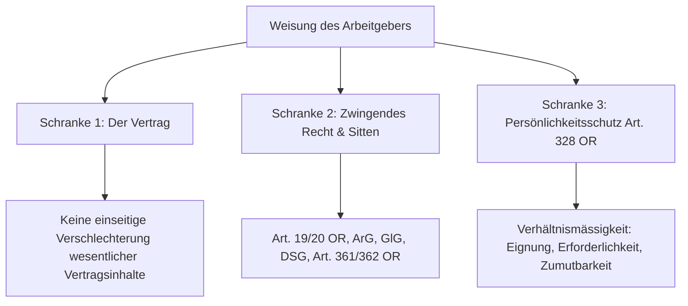
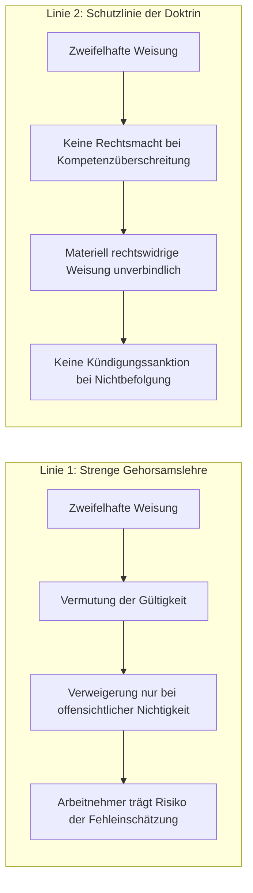
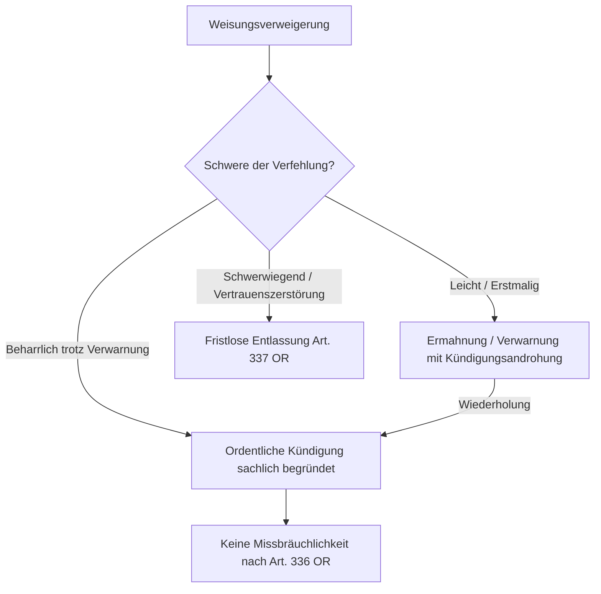

## Gesetzeswortlaut

> **Art. 321d OR — Weisungsrecht des Arbeitgebers**
>
> ---
>
> **Abs. 1 — Weisungsgewalt des Arbeitgebers**
>
> Der Arbeitgeber kann über die Ausführung der Arbeit und das Verhalten der Arbeitnehmer im Betrieb oder Haushalt allgemeine Anordnungen erlassen und ihnen besondere Weisungen erteilen.
>
> ---
>
> **Abs. 2 — Befolgungspflicht des Arbeitnehmers**
>
> Der Arbeitnehmer hat die allgemeinen Anordnungen des Arbeitgebers und die ihm erteilten besonderen Weisungen nach Treu und Glauben zu befolgen.

*Wortlaut geprüft gegen [Fedlex, SR 220](https://www.fedlex.admin.ch/eli/cc/27/317_321_377/de), Stand der Konsolidierung 1. Januar 2026.*

---

### Die Schichten des Weisungsrechts auf einen Blick

| Weisungsart | Regelungsgegenstand | Typische Beispiele | Schranke / Prüfmassstab |
|---|---|---|---|
| **Arbeitsleistungsweisung (Abs. 1 Alt. 1)** | Konkretisierung der vertraglich geschuldeten Arbeitspflicht (Art, Ort, Zeit, Methode) | Arbeitszeiten, Prioritätensetzung, Zuweisung konkreter Dossiers, Software-Einsatz | **Vertraglicher Rahmen**: Darf den Kernbereich der vereinbarten Funktion nicht einseitig abändern ([BGE 132 III 115 E. 5.2](https://entscheidsuche.ch/docs/CH_BGE/CH_BGE_004_BGE-132-III-115_2006.html#consideration_5.2)) |
| **Betriebliche Verhaltensordnung (Abs. 1 Alt. 2)** | Ordnung und reibungsloser Betrieb im Betrieb oder Haushalt | Rauch- und Alkoholverbot, Hygiene, IT-Sicherheitsrichtlinien, Meldepflichten | **Betriebsbezug**: Muss dem ordnungsgemässen Betriebsablauf oder der Sicherheit dienen; keine Reglementierung des Privatlebens |
| **Persönlichkeitsrelevante Weisung** | Massnahmen mit Eingriff in Integrität, Privatsphäre oder Grundrechte | Dresscode, Verdeckung von Tätowierungen, Test- und Impfvorgaben, Kontrollsysteme | **Verhältnismässigkeit & Güterabwägung (Art. 328 OR, Art. 26 ArGV 3)**: Eignung, Erforderlichkeit, Zumutbarkeit; mildere Massnahmen vorrangig |
| **Zielanweisung vs. Fachweisung** | Grad der Eigenverantwortung | Bei Fachkräften und Kadern: Beschränkung auf Zielvorgaben; bei Hilfskräften: detaillierte Fachanleitung | **Autonomie des Spezialisten**: Fachliche Weisungen dürfen die berufsständischen oder gesetzlichen Berufspflichten nicht verletzen |

---

## Überblick und Bedeutung

Art. 321d OR bildet das gesetzliche Fundament des **arbeitsrechtlichen Direktionsrechts** (Weisungsgewalt). Da der Arbeitsvertrag als Dauerschuldverhältnis die Arbeitspflicht regelmässig nur rahmenmässig umschreibt («Angestellter im Treuhandbereich», «Krankenschwester», «Kundenberater»), bedarf es einer laufenden einseitigen Konkretisierung durch den Arbeitgeber, um den Betrieb arbeitsteilig zu koordinieren und auf wandelnde Markt- oder Betriebsbedürfnisse auszurichten.

In der gerichtlichen Praxis ist das Weisungsrecht jedoch ein permanenter Brennpunkt: Das Direktionsrecht ist **kein unbeschränktes Herrschaftsrecht**. Es bewegt sich in einem permanenten Spannungsfeld zwischen:
1. der **Gestaltungsfreiheit des Arbeitgebers** (unternehmerische Organisationshoheit),
2. den **vertraglichen Schranken** (Verbot der einseitigen Vertragsabänderung; Abgrenzung zur Änderungskündigung),
3. dem **Persönlichkeitsschutz des Arbeitnehmers (Art. 328 OR)** sowie den zwingenden öffentlich-rechtlichen Schutzbestimmungen (Art. 6 ArG, Art. 26 ArGV 3).

### Prüfschema für die Rechtmässigkeit einer Weisung und die Rechtsfolgen

| Prüfschritt | Massgebende Frage | Kriterium / Beleg |
|---|---|---|
| **1. Formelle Kompetenz** | Ist die anordnende Person weisungsberechtigt? | Arbeitgeber, delegierte Linienvorgesetzte oder Dritte bei Personalverleih ([BGer 4C.176/2002](https://entscheidsuche.ch/docs/CH_BGer/CH_BGer_004_4C-176-2002_2002-09-19.html), [BGer 4A_344/2015](https://entscheidsuche.ch/docs/CH_BGer/CH_BGer_004_4A-344-2015_2015-12-10.html)) |
| **2. Sachlicher Geltungsbereich** | Betrifft die Weisung Arbeitsausführung oder Betriebsverhalten? | Weisungen ohne jeden Bezug zum Betrieb oder zur Arbeitsleistung sind unzulässige Eingriffe in die Privatsphäre |
| **3. Vertragliche Konformität** | Bleibt die Weisung im Rahmen des vereinbarten Aufgabenkreises? | Eine Weisung kann Pflichten nur konkretisieren, nicht den Vertrag einseitig verschlechtern ([BGE 132 III 115 E. 5.2](https://entscheidsuche.ch/docs/CH_BGE/CH_BGE_005_BGE-132-III-115_2006.html#consideration_5.2)) |
| **4. Verhältnismässigkeit & Schutz (Art. 328 OR)** | Ist der Eingriff in die Persönlichkeit sachlich gerechtfertigt und zumutbar? | Überwiegende betriebliche Schutz- und Organisationsinteressen; mildere Mittel ausgeschöpft ([BGer 4A_60/2026](https://opencaselaw.ch/bger/4A_60-2026), [BGE 130 II 425](https://entscheidsuche.ch/docs/CH_BGE/CH_BGE_004_BGE-130-II-425_2004.html#consideration_5)) |
| **5. Treu und Glauben (Abs. 2)** | Ist die Befolgung zumutbar oder durfte die Weisung in guten Treuen verweigert werden? | Keine Pflicht zur Befolgung rechtswidriger Weisungen; bei unklarer Rechtslage gilt das Vertrauensprinzip ([BGer 4C.357/2002](https://entscheidsuche.ch/docs/CH_BGer/CH_BGer_004_4C-357-2002_2003-04-04.html)) |

---

## Kommentierung

### A. Begriff, Rechtsnatur und Weisungsarten (Abs. 1)

Das Weisungsrecht ist ein einseitiges **Gestaltungsrecht** des Arbeitgebers. Es fliesst aus dem für den Arbeitsvertrag typischen Subordinationsverhältnis (Art. 319 OR). Der Arbeitgeber kann das Weisungsrecht formlos ausüben (mündlich, schriftlich, per E-Mail oder durch schlüssiges Verhalten) und an Vorgesetzte oder Dritte (z.B. Poliere auf Grossbaustellen oder Einsatzbetriebe beim Personalverleih) delegieren ([BGer 4C.176/2002 vom 19. September 2002, E. 2.1](https://entscheidsuche.ch/docs/CH_BGer/CH_BGer_004_4C-176-2002_2002-09-19.html); [BGer 4A_344/2015 vom 10. Dezember 2015, E. 4.1](https://entscheidsuche.ch/docs/CH_BGer/CH_BGer_004_4A-344-2015_2015-12-10.html)).

Das Gesetz unterscheidet in Abs. 1 zwei Dimensionen:

#### 1. Allgemeine Anordnungen vs. besondere Weisungen
- **Allgemeine Anordnungen**: Generell-abstrakte Regelungen, die sich an die gesamte Belegschaft oder eine Gruppe von Mitarbeitenden richten (Betriebsordnungen, Personalreglemente, IT-Richtlinien, Sicherheitsvorschriften, Spesenreglemente).
- **Besondere Weisungen**: Individuell-konkrete Anweisungen an einen einzelnen Arbeitnehmer bezüglich einer spezifischen Arbeitsaufgabe, Frist, Dringlichkeit oder Verhaltensweise.

#### 2. Arbeitsausführung (Arbeitsplatzbezogen) vs. Betriebsverhalten (Ordnungsvorschriften)
- **Weisungen über die Arbeitsausführung**: Sie legen fest, *wie*, *womit*, *in welcher Reihenfolge* und *wo* die vertraglich vereinbarte Arbeit zu leisten ist.
- **Weisungen über das Verhalten im Betrieb**: Sie sichern den störungsfreien Ablauf und das gedeihliche Zusammenleben der Belegschaft (z.B. Rauchverbote, Verbot privater Telefongespräche, Umgang mit Geldspenden oder Geschenken).

> **Merksatz.** Je höher die fachliche Qualifikation und die Hierarchiestufe des Mitarbeitenden, desto enger ist der Spielraum für detaillierte Fachweisungen. Bei leitenden Angestellten, Ärzten, Anwälten oder wissenschaftlichen Spezialisten beschränkt sich das Direktionsrecht typischerweise auf Zielanweisungen und organisatorische Rahmenbedingungen; die Art und Weise der Problemlösung verbleibt in ihrer fachlichen Autonomie.

---

### B. Schranken des Weisungsrechts: Vertrag, Gesetz und Persönlichkeitsschutz

Weisungen dürfen den bestehenden Rechtsrahmen nicht einseitig sprengen. Sie finden ihre absoluten Schranken an drei Pfeilern:

#### 1. Schranke des Arbeitsvertrags: Abgrenzung zur Änderungskündigung
Eine Weisung dient der **Konkretisierung**, nicht der **Abänderung** des Vertrags ([BGE 132 III 115 E. 5.2](https://entscheidsuche.ch/docs/CH_BGE/CH_BGE_005_BGE-132-III-115_2006.html#consideration_5.2)). Wesentliche Vertragspunkte (essentialia negotii) — wie Lohn, Pensum, Funktion, hierarchische Stellung und ein vertraglich fixierter Arbeitsort — können nicht auf dem Weisungsweg einseitig verändert werden.

##### Die Grenzkasuistik: Versetzung vs. Änderungskündigung
- **Anwendungsfall unzulässiger Weisung (Änderungskündigung zwingend)**: Einer Dozentin und Abteilungsleiterin an einer Fachhochschule wurde per Weisung sowohl das Pensum gekürzt als auch ein neuer Arbeitsort zugewiesen. Das Obergericht Aargau hielt fest: Da der Arbeitsort im Vertrag ausdrücklich festgeschrieben war und die Zuweisung des neuen Ortes mit einer Herabstufung und Pensumssenkung einherging, lag eine unzulässige Weisung vor. Eine solche Verschlechterung kann der Arbeitgeber nur auf dem Weg einer ordentlichen Änderungskündigung unter Einhaltung der Kündigungsfristen durchsetzen ([AG OG WBE.2015.314 vom 23. März 2016, E. II/1](https://entscheidsuche.ch/docs/AG_Gerichte/AG_OG_006_WBE-2015-314_2016-03-23.pdf)).
- **Verwerfungsfall (zulässige Versetzung kraft Mobilitätsklausel)**: Sieht der Arbeitsvertrag vor, dass der Arbeitnehmer «in der Regel im Betrieb X, bei betrieblicher Notwendigkeit jedoch an anderen Standorten der Schweiz» eingesetzt werden kann, deckt das Weisungsrecht eine vorübergehende oder dauerhafte Versetzung ab, sofern die Mehrbelastung (Arbeitsweg, Spesen) zumutbar ist und der Arbeitgeber die zusätzlichen Spesen nach Art. 327a OR übernimmt ([BL KG 400 16 46 vom 29. März 2016](https://entscheidsuche.ch/docs/BL_Gerichte/BL_KG_001_400-2016-46_2016-03-29.pdf)).

#### 2. Einseitige Überstundenkompensation ist unzulässig
Ein Arbeitgeber kann Überstunden nicht einseitig durch Weisung mit Freizeit ausgleichen:
> «Der Ausgleich von Überstundenarbeit durch Freizeit setzt jedenfalls das Einverständnis des Arbeitnehmers voraus. Die Kompensation kann – soweit die Parteien nichts anderes vereinbart haben – nicht einseitig angeordnet werden. Dies gilt im Übrigen (unter Vorbehalt des Rechtsmissbrauchs) selbst bei Kündigung des Arbeitsverhältnisses durch den Arbeitgeber und gleichzeitiger Freistellung des Arbeitnehmers.»
> ([BGer 4A_533/2018 vom 23. April 2019, E. 4.6](https://entscheidsuche.ch/docs/CH_BGer/CH_BGer_004_4A-533-2018_2019-04-23.html), unter Verweis auf [BGE 123 III 84 E. 5](https://entscheidsuche.ch/docs/CH_BGE/CH_BGE_005_BGE-123-III-84_1997.html#consideration_5)).

#### 3. Unzulässigkeit der Kostenabwälzung bei ärztlichen Gutachten
Verlangt der Arbeitgeber zur Überprüfung einer krankheitsbedingten Arbeitsunfähigkeit mehr als ein einfaches Arztzeugnis, greift Art. 327a OR:
- **Der Sachverhalt ([AG OG WKL.2017.8 vom 3. Mai 2018](https://entscheidsuche.ch/docs/AG_Gerichte/AG_OG_006_WKL-2017-8_2018-05-03.pdf))**: Ein seit Jahren angestellter Gemeindemitarbeiter erkrankte psychisch und reichte Zeugnisse seiner Psychiaterin ein. Der Gemeinderat beschloss am 31. Januar 2017, der Mitarbeiter habe auf eigene Kosten («zu eigenen Lasten») durch ein umfassendes fachärztliches Gutachten die vollständige Wiedererlangung seiner Arbeitsfähigkeit nachzuweisen, ansonsten das Dienstverhältnis aufgelöst werde. Der Mitarbeiter weigerte sich, die Kosten zu tragen, woraufhin ihm gekündigt wurde.
- **Die Weichenstellung des Obergerichts**: Das Obergericht Aargau qualifizierte die Weisung als rechtswidrig. Die Pflicht des Arbeitnehmers erschöpft sich in der Vorlage eines einfachen Zeugnisses. Will der Arbeitgeber eine vertrauensärztliche Begutachtung, hat er die Kosten zwingend selbst zu tragen. Die Weigerung, ein Gutachten auf eigene Rechnung beizubringen, stellte keine Pflichtverletzung dar; die Kündigung war mangels sachlichen Grundes ungerechtfertigt ([E. 3.6.2–3.6.3](https://entscheidsuche.ch/docs/AG_Gerichte/AG_OG_006_WKL-2017-8_2018-05-03.pdf)).

---

### C. Kasuistik: Gesundheitsschutz, Impf- und Testweisungen

Besonders eingriffsintensive Weisungen betreffen den Gesundheitsschutz und die körperliche Integrität der Arbeitnehmer. In den Jahren 2021–2026 hat das Bundesgericht in mehreren Grundsatzurteilen geklärt, unter welchen Voraussetzungen Weisungen zu Impfungen und Tests privatrechtlich verbindlich sind.

#### 1. Leitentscheid Swiss: Das Covid-19-Impfobligatorium für Flugpersonal
In den Leitentscheiden [BGer 4A_60/2026 vom 30. Juni 2026](https://opencaselaw.ch/bger/4A_60-2026) und [BGer 4A_612/2025 vom 27. Mai 2026](https://opencaselaw.ch/bger/4A_612-2025) beurteilte das Bundesgericht erstmals die Zulässigkeit eines arbeitgeberischen Impfobligatoriums im Privatrecht:

##### Der Sachverhalt
Die Fluggesellschaft Swiss International Air Lines (B.________ AG) führte im Spätsommer 2021 für das gesamte fliegende Personal (Piloten und Kabinenpersonal) ein Covid-19-Impfobligatorium ein. Zur Begründung verwies die Fluggesellschaft darauf, dass zahlreiche internationale Destinationen (namentlich die USA, Hongkong und diverse asiatische Staaten) strikte Einreise- und Quarantänevorschriften für ungeimpfte Besatzungsmitglieder erlassen hatten. Die weltweite Rotation («Kettenflugeinsatz»), bei der eine Crew nacheinander verschiedene Destinationen anfliegt, drohte bei ungeimpftem Personal zusammenzubrechen; zudem bestand eine Fürsorgepflicht gegenüber Passagieren und Crewkollegen (Art. 328 OR). Eine langjährige Flight Attendant verweigerte die Impfung aus persönlichen und gesundheitlichen Bedenken. Nach erfolgloser Abmahnung kündigte die Swiss das Arbeitsverhältnis ordentlich. Die Arbeitnehmerin klagte auf Entschädigung wegen missbräuchlicher Kündigung (Art. 336 Abs. 1 lit. a und lit. b OR).

##### Die massgebenden Erwägungen des Bundesgerichts
Das Bundesgericht wies die Klage der Flight Attendant vollumfänglich ab:
1. **Rechtsgrundlage in Art. 321d Abs. 1 OR**: Das Weisungsrecht umfasst Massnahmen zur Gewährleistung der betrieblichen Leistungsfähigkeit und des Gesundheitsschutzes der Belegschaft.
2. **Interessenabwägung**: Zwar tangiert eine Impfung das Recht auf körperliche Integrität (Art. 10 Abs. 2 BV, Art. 28 ZGB). Bei der Covid-19-Impfung handelt es sich jedoch um einen leichten medizinischen Eingriff. Dem stand das existenzielle betriebliche Interesse der Airline gegenüber, den internationalen Flugbetrieb aufrechtzuerhalten, Passagiere zu schützen und das Grounding ganzer Maschinen infolge Quarantäneauflagen zu verhindern.
3. **Massgeblicher Beurteilungszeitpunkt (*ex ante*)**: Ob eine Weisung verhältnismässig ist, bemisst sich nach der Sach- und Risikolage im **Zeitpunkt des Erlasses der Weisung** (*ex ante*) und nicht nach späteren epidemiologischen Entwicklungen ([E. 4.2.3](https://opencaselaw.ch/bger/4A_60-2026)).
4. **Kein Kündigungsmissbrauch bei beharrlicher Weisungsverweigerung**: Weigert sich ein Arbeitnehmer beharrlich, eine verhältnismässige und betrieblich notwendige Weisung zu befolgen, begeht er eine Pflichtverletzung nach Art. 321d Abs. 2 OR. Eine ordentliche Kündigung wegen dieser Vertragsverletzung stützt sich auf einen sachlichen Grund und ist nicht missbräuchlich ([E. 4.4.1](https://opencaselaw.ch/bger/4A_60-2026)).

#### 2. Spuck-Tests und fristlose Entlassung: Der Fall der Arbeitsagogin
Dass die Weigerung, an angeordneten Tests teilzunehmen, sogar eine fristlose Kündigung nach Art. 337 OR tragen kann, verdeutlicht ein Urteil des Obergerichts Zürich:

##### Der Sachverhalt ([ZH OG LA230021 vom 11. April 2024](https://entscheidsuche.ch/docs/ZH_Obergericht/ZH_OG_001_LA230021_2024-04-11.pdf))
Eine seit 2017 angestellte Arbeitsagogin in einer sozialen Einrichtung verweigerte im Oktober 2021 die Teilnahme an den vom Arbeitgeber angeordneten repetitiven Covid-19-Spuck-Tests für ungeimpftes Personal. Sie forderte, es müssten entweder alle Mitarbeitenden getestet werden oder niemand, und berief sich auf den arbeitsrechtlichen Gleichbehandlungsgrundsatz sowie das Grundrecht auf Privatsphäre. Der Arbeitgeber ermahnte sie am 19. Oktober 2021 schriftlich und sprach am 26. Oktober 2021 eine formelle Verwarnung mit Frist bis zum 29. Oktober aus, bei deren unbenutztem Ablauf am 1. November 2021 die fristlose Kündigung erfolgte. Die Klägerin forderte Schadenersatz und Pönale nach Art. 337c OR: Sie habe die Weisung in guten Treuen für rechtswidrig gehalten, da das Bundesgericht noch nicht entschieden hatte; der Arbeitgeber habe durch die Gewährung einer zweiten Abmahnung sein Kündigungsrecht verwirkt und hätte zwei Tage auf einen angekündigten Bundesratsbeschluss warten müssen.

##### Die Weichenstellung des Obergerichts
Das Obergericht Zürich schützte die fristlose Kündigung:
1. **Verhältnismässigkeit nicht-invasiver Tests**: Repetitive Speicheltests sind praktisch eingriffsfrei und zur Verhinderung von Infektionen im Betreuungsumfeld vollumfänglich verhältnismässig.
2. **Keine Verwirkung durch zweite Chance**: Der Arbeitgeber verwirkt sein Recht zur fristlosen Kündigung nicht dadurch, dass er dem Arbeitnehmer vor der Kündigung mehrfach ins Gewissen redet und zwei Verwarnungen statt nur einer ausspricht ([E. III/3.2.4](https://entscheidsuche.ch/docs/ZH_Obergericht/ZH_OG_001_LA230021_2024-04-11.pdf)).
3. **Kein Gutglaubensschutz bei blosser Rechtsunsicherheit**: Die blosse Tatsache, dass eine Rechtsfrage noch nicht höchstrichterlich entschieden war oder in den Medien kontrovers diskutiert wurde, berechtigt einen Arbeitnehmer nicht zur eigenmächtigen Weisungsverweigerung «in guten Treuen» ([E. III/2.4](https://entscheidsuche.ch/docs/ZH_Obergericht/ZH_OG_001_LA230021_2024-04-11.pdf)).

#### 3. Behindertenbetreuung und Erwähnung im Arbeitszeugnis
Verweigert ein Betreuer in einem Heim für schwer körperbehinderte Menschen mit respiratorischen Vorerkrankungen die Einhaltung von Masken- und Testweisungen und fragt er Klienten, ob er die Maske abnehmen dürfe, ist nicht nur die ordentliche Kündigung sachlich gerechtfertigt: Der Arbeitgeber ist berechtigt und nach dem Grundsatz der Zeugniswahrheit verpflichtet, den Kündigungsgrund («Beendigung wegen Differenzen bezüglich des Umgangs mit staatlichen und internen Vorgaben zur Pandemiebekämpfung») im qualifizierten Arbeitszeugnis zu erwähnen ([ZH AGer-Z 2024 Nr. 1, AH220121-L vom 3. Januar 2024](https://entscheidsuche.ch/docs/ZH_Obergericht/ZH_OG_999_AH220121-L_2024-01-03.pdf)).

---

### D. Betriebsverhalten, Dresscode, Tätowierungen und religiöse Symbole

Weisungen zum äusseren Erscheinungsbild, zur Dienstkleidung und zum Tragen von Symbolen greifen unmittelbar in das verfassungs- und zivilrechtlich geschützte Persönlichkeitsrecht ein (Art. 10 Abs. 2 BV, Art. 28 ZGB, Art. 328 OR).

#### Der Grundsatz: Erforderlichkeit eines sachlichen Berufsbezugs
Vorschriften über Kleidung, Haartracht, Bärte, Piercings oder Tätowierungen sind nach ständiger Praxis nur zulässig, wenn sie einen **direkten, sachlichen Bezug zur Arbeitsleistung** aufweisen:
1. **Sicherheit und Gesundheitsschutz**: Verbot von losem Schmuck oder offenen Haaren an rotierenden Industriemaschinen; Schutzhelmpflicht; sterile Schutzkleidung im Operationssaal oder in der Lebensmittelverarbeitung.
2. **Kundenkontakt und Unternehmensphilosophie (Corporate Identity)**: Verpflichtung zum Tragen einer Uniform bei Flugpersonal, Schalterpersonal oder im Sicherheitsdienst; gepflegter Business-Dresscode bei Bankkundenberatern.

#### Kasuistik: Das Abdecken von Tätowierungen mit religiöser Bedeutung
Im Grundsatzurteil [BGer 9C_301/2008 vom 2. Juli 2008](https://entscheidsuche.ch/docs/CH_BGer/CH_BGer_009_9C-301-2008_2008-07-02.html) beurteilte das Bundesgericht die Weisung einer Praktikumsinstitution an einen angehenden medizinischen Masseur:

##### Der Sachverhalt
Ein sehbehinderter Mann absolvierte eine von der Invalidenversicherung finanzierte Umschulung zum medizinischen Masseur. Er trug auf dem Handrücken und den Fingern markante Hakenkreuz-Tätowierungen (Swastika). Zwei Praktikumsbetriebe verlangten von ihm, die Tätowierungen während der Behandlung von Patienten mit einem Pflaster abzudecken, da Patienten die Behandlung ablehnen und das Zeichen mit dem Nationalsozialismus assoziieren würden. Der Masseur weigerte sich strikt und machte geltend, er gehöre der Religionsgemeinschaft des Jainismus an, deren heiliges Symbol die Swastika sei; die Weisung verletze seine Religionsfreiheit (Art. 15 BV, Art. 9 EMRK, Art. 18 UNO-Pakt II).

##### Die Kernaussage des Bundesgerichts
Das Bundesgericht hielt fest, dass der Arbeitgeber gestützt auf Art. 321d OR in den Schranken von Art. 328 OR Vorschriften über das Tragen von Kleidung und Gegenständen bei der Arbeit erlassen darf, soweit diese einen Bezug zur Arbeit oder zur Firmenphilosophie haben ([E. 4.1](https://entscheidsuche.ch/docs/CH_BGer/CH_BGer_009_9C-301-2008_2008-07-02.html)). Das Verlangen, eine Hakenkreuz-Tätowierung während der Massagebehandlung am Patienten mit einem Pflaster abzudecken, stellt einen **äusserst geringfügigen Eingriff** in die Persönlichkeit dar, der angesichts der berechtigten Erwartungshaltung der Patienten und des Betriebsinteresses vollkommen verhältnismässig und zumutbar war ([E. 5.1](https://entscheidsuche.ch/docs/CH_BGer/CH_BGer_009_9C-301-2008_2008-07-02.html)).

---

### E. IT-Nutzung, Social Media und Mitarbeiterüberwachung (Art. 26 ArGV 3 & DSG)

Weisungen zur Nutzung elektronischer Arbeitsmittel (Computer, Internet, E-Mail, Smartphones) und Kontrollsysteme am Arbeitsplatz berühren elementare Datenschutzinteressen.

#### 1. Verbot der Verhaltensüberwachung (Art. 26 ArGV 3)
Nach Art. 26 Abs. 1 ArGV 3 ist der Einsatz von Überwachungs- und Kontrollsystemen, die das Verhalten der Arbeitnehmer am Arbeitsplatz überwachen sollen, **strikt verboten**. 
Zulässig sind Kontrollsysteme nach Art. 26 Abs. 2 ArGV 3 nur, wenn sie aus anderen sachlichen Gründen erforderlich sind (Sicherheit, Arbeitsplanung, Leistungskontrolle) und die Gesundheit sowie Bewegungsfreiheit der Arbeitnehmer nicht beeinträchtigen ([BGE 130 II 425 E. 4.1](https://entscheidsuche.ch/docs/CH_BGE/CH_BGE_004_BGE-130-II-425_2004.html#consideration_4)).

##### Der GPS-Leitentscheid ([BGE 130 II 425](https://entscheidsuche.ch/docs/CH_BGE/CH_BGE_004_BGE-130-II-425_2004.html#consideration_4))
Ein Unternehmen für Feuerlöscherwartung stattete die Firmenfahrzeuge von 15 Servicetechnikern mit GPS-Satellitenortung aus, um Diebstähle zu verhindern, Touren zu optimieren und die Arbeitsberichte zu kontrollieren. Ein Techniker fühlte sich unter Dauerüberwachung und reichte Beschwerde beim Genfer Arbeitsinspektorat ein. Das Bundesgericht entschied:
- Ein Überwachungssystem ist verboten, wenn es primär auf die Überwachung des Verhaltens abzielt.
- Dient es legitimen Zwecken (Diebstahlschutz, Einsatzkoordination), muss es **erforderlich** und **schonend** ausgestaltet sein. Eine permanente Echtzeitortung jedes Fahrzeugs zur blossen Überwachung der Lenker ist unzulässig; zulässig ist hingegen eine nachträgliche stichprobenweise oder verdachtsbezogene Auswertung von Standzeiten.

#### 2. Social Media und Logfile-Auswertung: Der Fall «Inside Paradeplatz»
Wie weit Weisungen über Social Media reichen und wann Logfiles ausgewertet werden dürfen, zeigt ein wegweisender Fall aus der Bankbranche:

##### Der Sachverhalt ([ZH OG LA150002 vom 27. März 2015](https://entscheidsuche.ch/docs/ZH_Obergericht/ZH_OG_001_LA150002_2015-03-27.pdf))
Ein Senior-Kundenbetreuer und Kadermitglied einer Zürcher Bank verfasste während der Arbeitszeit auf der öffentlich zugänglichen Finanzplattform «Inside Paradeplatz» unter dem Pseudonym «F.» zwei Schmähkommentare zu einem Artikel über den CEO. Er schrieb unter anderem:
> «Wer an der Front arbeitet wird ausgenützt. [...] Da der oberste Chef keinen Rückgrat hat, fehlen auch den Chefs auf den tiefsten Stufen die Eier! Ich kann nur sagen, dass es mit der [Bank] schlecht steht und die Stimmung bei den Mitarbeitern beschissen ist.»

Die Bank veranlasste eine interne IT-Untersuchung: Anhand der IP-Adresse und der Proxy-Logfiles wurde der Arbeitsplatzrechner des Klägers identifiziert. Nach einer disziplinarischen Befragung wurde ihm ordentlich unter sofortiger Freistellung gekündigt. Der Kläger klagte auf Entschädigung wegen missbräuchlicher Kündigung (Art. 336 Abs. 1 lit. b OR, Meinungsäusserungsfreiheit) und rügte eine illegale Überwachung nach Art. 26 ArGV 3 und dem Datenschutzgesetz (DSG).

##### Die Weichenstellung des Obergerichts
Das Obergericht Zürich wies die Klage ab:
1. **Verbindlichkeit von Social-Media-Weisungen**: Weisungen, die privaten Stellungnahmen zu Bankthemen untersagen und vorsehen, dass interne Kritik nicht in die Öffentlichkeit getragen werden darf, sind nach Art. 321d OR vollumfänglich zulässig und verbindlich.
2. **Krasse Treuepflichtverletzung bei Kadermitarbeitern**: Zwar fallen auch polemische Äusserungen unter die Meinungsfreiheit. Bei Kadermitarbeitern greift jedoch eine erhöhte Treuepflicht (Art. 321a OR). Öffentliche Diffamierungen von Vorgesetzten («eierlos», «kein Rückgrat») verletzen diese Pflicht massiv und schliessen Kündigungsmissbrauch aus ([E. C/2.2](https://entscheidsuche.ch/docs/ZH_Obergericht/ZH_OG_001_LA150002_2015-03-27.pdf)).
3. **Rechtmässigkeit der Logfile-Auswertung bei konkretem Verdacht**: Eine permanente, anlasslose Personenüberwachung von Internet-Logdaten verstösst gegen Art. 26 ArGV 3. Liegt jedoch ein **konkreter Missbrauchsverdacht** vor, ist die gezielte, personengenaue Auswertung systembedingt vorhandener Logdaten zulässig und verhältnismässig ([E. C/3.2](https://entscheidsuche.ch/docs/ZH_Obergericht/ZH_OG_001_LA150002_2015-03-27.pdf)).

---

### F. Befolgungspflicht, Weisungsverweigerung und Treuepflicht (Abs. 2)

Gemäss Abs. 2 hat der Arbeitnehmer Weisungen nach **Treu und Glauben** zu befolgen.

#### 1. Remonstrationspflicht des Arbeitnehmers: Der Fall der Pflegeheim-Spenden
Hält ein Arbeitnehmer (insbesondere in leitender Funktion) eine Weisung für unzweckmässig oder rechtlich fragwürdig, darf er nicht einfach eigenmächtig den Gehorsam verweigern oder Untergebene zur Rebellion anstiften:

##### Der Sachverhalt ([BGer 4A_613/2010 vom 25. Januar 2011](https://entscheidsuche.ch/docs/CH_BGer/CH_BGer_004_4A-613-2010_2011-01-25.html))
Eine langjährige Stationsleiterin in einem Zürcher Alters- und Pflegeheim nahm von Angehörigen zweier verstorbener Patienten Geldspenden über Fr. 500.– und Fr. 300.– entgegen. Eine interne Weisung der Heimleitung aus dem Jahr 1996 sah vor, dass Geldspenden von Angehörigen unverzüglich abzuliefern seien und in die gemeinsame Personalkasse fliessen. Die Stationsleiterin behielt das Geld fünf Wochen lang zu Hause. Als die Heimleitung sie zur Rede stellte, schwieg sie, lehnte eine einvernehmliche Kündigung ab und verteilte stattdessen eine von ihrem Ehemann verfasste juristische Abhandlung an ihre unterstellten Pflegefachfrauen, wonach die Weisung der Heimleitung gesetzeswidrig sei. Die Heimleitung kündigte ihr ordentlich. Die Klägerin forderte Entschädigung wegen Kündigungsmissbrauchs und machte geltend, Geldgeschenke gehörten nach Art. 321b OR ihr persönlich.

##### Die massgebenden Erwägungen des Bundesgerichts
Das Bundesgericht bestätigte die Rechtmässigkeit der Kündigung:
1. **Regelung von Trinkgeldern und Spenden**: Art. 321b OR regelt nur Werte, die für den Arbeitgeber bestimmt sind. Das Weisungsrecht (Art. 321d OR) ermächtigt den Heimträger jedoch, im Interesse des Betriebsfriedens und zur Vermeidung von Bevorzugungen bei der Pflege zu bestimmen, dass persönliche Trinkgelder und Spenden in einen gemeinsamen Personalfonds abzuführen sind ([E. 4.2](https://entscheidsuche.ch/docs/CH_BGer/CH_BGer_004_4A-613-2010_2011-01-25.html)).
2. **Verletzung der Abmahnungs- und Remonstrationspflicht**: Hält eine Stationsleiterin eine Weisung für fehlerhaft, verpflichtet sie ihre Treuepflicht (Art. 321a OR), **zuerst mit der Geschäftsleitung das Gespräch zu suchen** (Remonstration). Eigenmächtig unterstellte Mitarbeiter auf eine angebliche Rechtswidrigkeit hinzuweisen und sie zur Nichtbefolgung zu motivieren, stellt eine schwere Treuepflichtverletzung dar ([E. 5](https://entscheidsuche.ch/docs/CH_BGer/CH_BGer_004_4A-613-2010_2011-01-25.html)).

#### 2. Die Pflicht zur Einhaltung dringlicher Weisungen: Der Fall Peking-Manager
Wann die vorsätzliche Missachtung einer Einzelweisung die sofortige fristlose Kündigung nach Art. 337 OR rechtfertigt, zeigt der Peking-Fall:

##### Der Sachverhalt ([BGer 4C.357/2002 vom 4. April 2003](https://entscheidsuche.ch/docs/CH_BGer/CH_BGer_004_4C-357-2002_2003-04-04.html))
Ein Manager war für ein Schweizer Unternehmen mit zwölfmonatiger Kündigungsfrist in Peking stationiert. Wegen Differenzen über Spesenabrechnungen legte ihm sein Vorgesetzter eine Aufhebungsvereinbarung vor. Der Vorgesetzte wies ihn am 18. September 1997 ausdrücklich an, Peking keinesfalls vor einer für Montag, den 22. September angesetzten Besprechung mit einem eigens aus der Schweiz anreisenden Delegierten zu verlassen. Der Manager reiste dennoch am Sonntag, 21. September eigenmächtig in die Schweiz ab, um den Geschäftsführer der Holding direkt zu konfrontieren. Die Arbeitgeberin kündigte fristlos. Der Kläger machte geltend, es habe zu seinen Persönlichkeitsrechten gehört, sich in der existenziellen Bedrohung an die oberste Führung zu wenden.

##### Die Entscheidung des Bundesgerichts
Das Bundesgericht schützte die fristlose Entlassung:
- Der Arbeitnehmer hat das Recht, bei Konflikten mit Vorgesetzten die nächsthöhere Hierarchiestufe anzurufen.
- Dieser Kontakt muss jedoch mit den betrieblichen Notwendigkeiten koordiniert werden. Da der Kollege eigens aus der Schweiz nach Peking reiste und für das Treffen in der Schweiz keine Dringlichkeit bestand, stellte die vorsätzliche Abreise entgegen der klaren Weisung eine schwere Pflichtverletzung dar, die nach vorangegangenen Spesenunregelmässigkeiten die fristlose Kündigung rechtfertigte ([E. 4.2–4.3](https://entscheidsuche.ch/docs/CH_BGer/CH_BGer_004_4C-357-2002_2003-04-04.html)).

---

### G. Der ungelöste Streit: Befolgungspflicht in Grenzfällen unklarer Weisungsrechtmässigkeit

Steht fest, dass eine Weisung offenkundig rechts- oder sittenwidrig ist (z.B. die Aufforderung zu Bilanzfälschungen oder Verstössen gegen Arbeitssicherheitsvorschriften), entfällt die Befolgungspflicht nach Abs. 2 von Gesetzes wegen. 

In der Praxis besteht jedoch ein **echter Widerspruch** zwischen der strengen Linie der kantonalen Gerichtspraxis und der schützenden Auffassung führender Arbeitsrechtler bezüglich sogenannter **Grenzfälle**, in denen die Rechtmässigkeit im Zeitpunkt der Erteilung objektiv zweifelhaft oder unklar ist ([AG OG WKL.2017.8 vom 3. Mai 2018, E. 3.6.2](https://entscheidsuche.ch/docs/AG_Gerichte/AG_OG_006_WKL-2017-8_2018-05-03.pdf)):

#### Die beiden unvereinbaren Linien im Detail

| Kriterium | Strenge Gehorsamslinie (Kantonale Praxis) | Schutzlehre der Doktrin (Rehbinder / Stöckli / Schnider) |
|---|---|---|
| **Ausgangspunkt** | Subordinationsprinzip und Notwendigkeit betrieblicher Handlungsfähigkeit | Gesetzmässigkeitsprinzip und Schranken des Art. 328 OR |
| **Schwelle für Verweigerung** | Nur bei **schweren, offenkundigen und leicht erkennbaren Fehlern** (Evidenztheorie) | Bei **jeder materiellen Rechtswidrigkeit**; dem Arbeitgeber fehlt die Rechtsmacht |
| **Massgebende Quellen** | Erziehungsrat SG (GVP 2011 Nr. 100); Kantonsgericht Baselland (810 15 238); Hinterberger (S. 178) | Berner Kommentar (*Rehbinder/Stöckli*, Art. 321d N 46); *Hirsiger* (S. 123); *Schnider* (S. 118 f.) |
| **Risikoverteilung** | Verweigert der Arbeitnehmer eine Weisung, deren Rechtswidrigkeit sich erst später herausstellt, riskiert er den Verlust der Stelle | Eine unzulässige Weisung verpflichtet nicht; die Nichtbefolgung darf unter keinen Umständen sanktioniert werden |

#### Der bundesgerichtliche Ausweg: Gutglaubensschutz nach Art. 336 Abs. 1 lit. d OR
Das Bundesgericht löst diesen Konflikt über den Grundsatz von Treu und Glauben:
1. **Keine fristlose Kündigung bei gutgläubiger Verweigerung**: Eine fristlose Entlassung ist ungerechtfertigt, wenn der Arbeitnehmer in guten Treuen berechtigte Gründe hatte, die Weisung für unzulässig zu halten ([BGer 4C.357/2002 E. 4.1](https://entscheidsuche.ch/docs/CH_BGer/CH_BGer_004_4C-357-2002_2003-04-04.html)).
2. **Strikter Massstab an den guten Glauben**: Der gute Glaube verlangt jedoch objektive, greifbare Anhaltspunkte. Blosse subjektive Zweifel, allgemeine Medienberichte oder hängige Normenkontrollverfahren genügen nicht ([ZH OG LA230021 E. III/2.4](https://entscheidsuche.ch/docs/ZH_Obergericht/ZH_OG_001_LA230021_2024-04-11.pdf)).

---

### H. Sanktionen bei Weisungsverweigerung

Missachtet der Arbeitnehmer eine verbindliche Weisung, stehen dem Arbeitgeber gestuft nach der Schwere der Verfehlung folgende Instrumente zur Verfügung:

#### 1. Verwarnung als zwingende Wirksamkeitsvoraussetzung
Bei leichten oder mittelschweren Verstössen (z.B. Zuspätkommen, Verweigerung von Arbeitskleidung, unpünktliche Rapporte) setzt eine spätere fristlose Entlassung zwingend eine **klare Verwarnung mit Kündigungsandrohung** voraus ([BGE 127 III 153 E. 1](https://entscheidsuche.ch/docs/CH_BGE/CH_BGE_005_BGE-127-III-153_2001-02-14.html#consideration_1); [BGE 142 III 579 E. 4.2](https://entscheidsuche.ch/docs/CH_BGE/CH_BGE_005_BGE-142-III-579_2016.html#consideration_4.2)).

#### 2. Keine Verwirkung bei zweiter Abmahnung
Spricht der Arbeitgeber nach einer ersten Verwarnung eine zweite Verwarnung aus, um dem Arbeitnehmer eine letzte Chance einzuräumen, verwirkt er dadurch keineswegs sein Recht zur fristlosen Kündigung ([ZH OG LA230021 E. III/3.2.4](https://entscheidsuche.ch/docs/ZH_Obergericht/ZH_OG_001_LA230021_2024-04-11.pdf)).

---

### I. Kasuistiktabelle: Grenzkasuistik des Weisungsrechts

| Sachverhalt | Beurteilung der Weisung | Konsequenz bei Verweigerung | Leitentscheid |
|---|---|---|---|
| Flight Attendant verweigert Covid-19-Impfung trotz Einreisevorschriften im Streckennetz | **Rechtmässig**: Betrieblich notwendig zur Sicherung des Flugbetriebs (*ex ante*) | Ordentliche Kündigung nicht missbräuchlich nach Art. 336 OR | [BGer 4A_60/2026](https://opencaselaw.ch/bger/4A_60-2026) |
| Arbeitnehmer soll auf eigene Kosten ein psychiatrisches Gutachten zur Arbeitsfähigkeit beibringen | **Rechtswidrig**: Kostenabwälzung verstösst gegen Art. 327a OR | Berechtigte Verweigerung; Kündigung unsachlich | [AG OG WKL.2017.8](https://entscheidsuche.ch/docs/AG_Gerichte/AG_OG_006_WKL-2017-8_2018-05-03.pdf) |
| Manager reist trotz Anweisung vor wichtigem Meeting eigenmächtig aus Peking ab | **Rechtmässig**: Sachlich begründeter Besprechungstermin geht vor | Fristlose Kündigung nach Art. 337 OR gerechtfertigt | [BGer 4C.357/2002](https://entscheidsuche.ch/docs/CH_BGer/CH_BGer_004_4C-357-2002_2003-04-04.html) |
| Stationsleiterin behält Geldspenden daheim und stiftet Team zur Weisungsverweigerung an | **Rechtmässig**: Weisung zum Spendenpool dient Betriebsfrieden | Ordentliche Kündigung wegen Treuepflichtverletzung geschützt | [BGer 4A_613/2010](https://entscheidsuche.ch/docs/CH_BGer/CH_BGer_004_4A-613-2010_2011-01-25.html) |
| Bankkader schmäht CEO öffentlich auf Onlineportal; Bank wertet IP-Logfiles aus | **Rechtmässig**: Social-Media-Policy verbindlich; Logfile-Auswertung bei Verdacht zulässig | Kündigung nicht missbräuchlich; kein Verstoss gegen ArGV 3 | [ZH OG LA150002](https://entscheidsuche.ch/docs/ZH_Obergericht/ZH_OG_001_LA150002_2015-03-27.pdf) |
| Arbeitsagogin verweigert Spuck-Tests und fordert Testung aller Mitarbeitenden | **Rechtmässig**: Nicht-invasiver Test zum Schutz vulnerabler Personen | Fristlose Kündigung nach zwei Verwarnungen geschützt | [ZH OG LA230021](https://entscheidsuche.ch/docs/ZH_Obergericht/ZH_OG_001_LA230021_2024-04-11.pdf) |
| Arbeitgeber ordnet einseitig Kompensation von Überstunden durch Freizeit an | **Rechtswidrig**: Kompensation setzt zwingend Einverständnis voraus | Weisung unverbindlich; Überstundenvergütung geschuldet | [BGer 4A_533/2018](https://entscheidsuche.ch/docs/CH_BGer/CH_BGer_004_4A-533-2018_2019-04-23.html) |
| Dozentin soll per Weisung Pensum gekürzt und an neuen Ort versetzt werden | **Rechtswidrig**: Abänderung von Kernpunkten nur via Änderungskündigung | Weisung unverbindlich; Entschädigung zugesprochen | [AG OG WBE.2015.314](https://entscheidsuche.ch/docs/AG_Gerichte/AG_OG_006_WBE-2015-314_2016-03-23.pdf) |
| Medizinischer Masseur verweigert Abdecken einer Hakenkreuz-Tätowierung | **Rechtmässig**: Zumutbarer geringfügiger Eingriff zum Schutz von Patienten | Sanktionen/Einstellung von Leistungen rechtmässig | [BGer 9C_301/2008](https://entscheidsuche.ch/docs/CH_BGer/CH_BGer_009_9C-301-2008_2008-07-02.html) |

---

## Praxisfragen

### 1. Darf der Arbeitnehmer die Befolgung verweigern, wenn die Rechtmässigkeit der Weisung unklar ist?
In der Praxis geraten Mitarbeitende oft in ein Dilemma: Befolgen sie die Weisung, erleiden sie möglicherweise irreversible Nachteile; verweigern sie die Befolgung, droht ihnen die fristlose Entlassung. 

Nach der Rechtsprechung trägt der Arbeitnehmer das Prognoserisiko:
- Ein Weigerungsrecht besteht sicher bei **offensichtlicher Rechtswidrigkeit** ([AG OG WKL.2017.8 E. 3.6.2](https://entscheidsuche.ch/docs/AG_Gerichte/AG_OG_006_WKL-2017-8_2018-05-03.pdf)).
- In Grenzfällen schützt ihn die Berufung auf den «guten Glauben» nur vor einer **fristlosen Entlassung nach Art. 337 OR**, nicht jedoch vor einer ordentlichen Kündigung. 
- Zudem verlangt das Bundesgericht zwingend, dass der Arbeitnehmer zuvor **remonstriert** (Bedenken vorbringt) und sachliche Lösungswege vorschlägt ([BGer 4A_613/2010 E. 5](https://entscheidsuche.ch/docs/CH_BGer/CH_BGer_004_4A-613-2010_2011-01-25.html)).

### 2. Darf die Weigerung, Weisungen zu befolgen, im Arbeitszeugnis erwähnt werden?
Grundsätzlich gilt für das Arbeitszeugnis das Wohlwollensgebot (Art. 330a OR). Das Wahrheitsgebot setzt dem Wohlwollen jedoch Grenzen:
- **Einmalige oder geringfügige Vorfälle** dürfen nicht erwähnt werden.
- Führt eine **beharrliche Weisungsverweigerung** jedoch zur Auflösung des Arbeitsverhältnisses und war sie für das Arbeitsverhältnis prägend (z.B. Weigerung von Schutzmassnahmen bei Pflegepersonal oder grobe Unbotmässigkeit von Kadern), ist die Aufnahme des Beendigungsgrundes im Arbeitszeugnis rechtens ([ZH AGer-Z 2024 Nr. 1, AH220121-L E. III/3.4](https://entscheidsuche.ch/docs/ZH_Obergericht/ZH_OG_999_AH220121-L_2024-01-03.pdf); [ZH OG LA150002 E. D/1](https://entscheidsuche.ch/docs/ZH_Obergericht/ZH_OG_001_LA150002_2015-03-27.pdf)).

---

### Die Merksätze für die Praxis

#### Für den Arbeitgeber
1. **Keine Vertragsänderung via Weisung**: Versetzungen an andere Orte, Lohnkürzungen, Pensumsanpassungen oder Funktionsherabstufungen bedürfen einer formellen Änderungskündigung oder einer vertraglichen Mobilitätsklausel.
2. **Kosten gehören zum Betrieb (Art. 327a OR)**: Wer vertrauensärztliche Untersuchungen, spezielle Schutzkleidung oder Hardware für das Homeoffice verlangt, muss die Kosten tragen. Eine Abwälzung auf den Arbeitnehmer macht die Weisung nichtig.
3. **Verwarnung vor Kündigung sauber dokumentieren**: Vor einer fristlosen Kündigung wegen Weisungsverweigerung muss mindestens eine unmissverständliche Verwarnung mit Androhung der Kündigung ergehen. Eine zweite Verwarnung schadet nicht, sondern belegt die Schonung.
4. **Überwachung verlangt Anlass und Reglement**: Ständige Verhaltensüberwachungen sind unzulässig (Art. 26 ArGV 3). Logfile-Auswertungen bedürfen eines konkreten Missbrauchsverdachts und einer vorgängigen Information der Belegschaft.

#### Für den Arbeitnehmer
1. **Eigenmächtiges Fernbleiben ist Arbeitsverweigerung**: Selbst bei Konflikten mit Vorgesetzten darf der Arbeitsplatz nicht eigenmächtig verlassen werden ([BGer 4C.357/2002](https://entscheidsuche.ch/docs/CH_BGer/CH_BGer_004_4C-357-2002_2003-04-04.html)).
2. **Zuerst remonstrieren, nicht rebellieren**: Wer eine Weisung für rechtswidrig hält, muss dies dem Vorgesetzten sachlich anzeigen. Untergebene Kollegen gegen den Arbeitgeber aufzuwiegeln, rechtfertigt die Entlassung ([BGer 4A_613/2010](https://entscheidsuche.ch/docs/CH_BGer/CH_BGer_004_4A-613-2010_2011-01-25.html)).
3. **Persönliche Bedenken begründen keinen Freipass**: Gesundheitsschutz- und Testweisungen dürfen nicht verweigert werden, nur weil man die Massnahmen für verfehlt hält oder Gerichtsverfahren noch hängig sind ([ZH OG LA230021](https://entscheidsuche.ch/docs/ZH_Obergericht/ZH_OG_001_LA230021_2024-04-11.pdf)).
