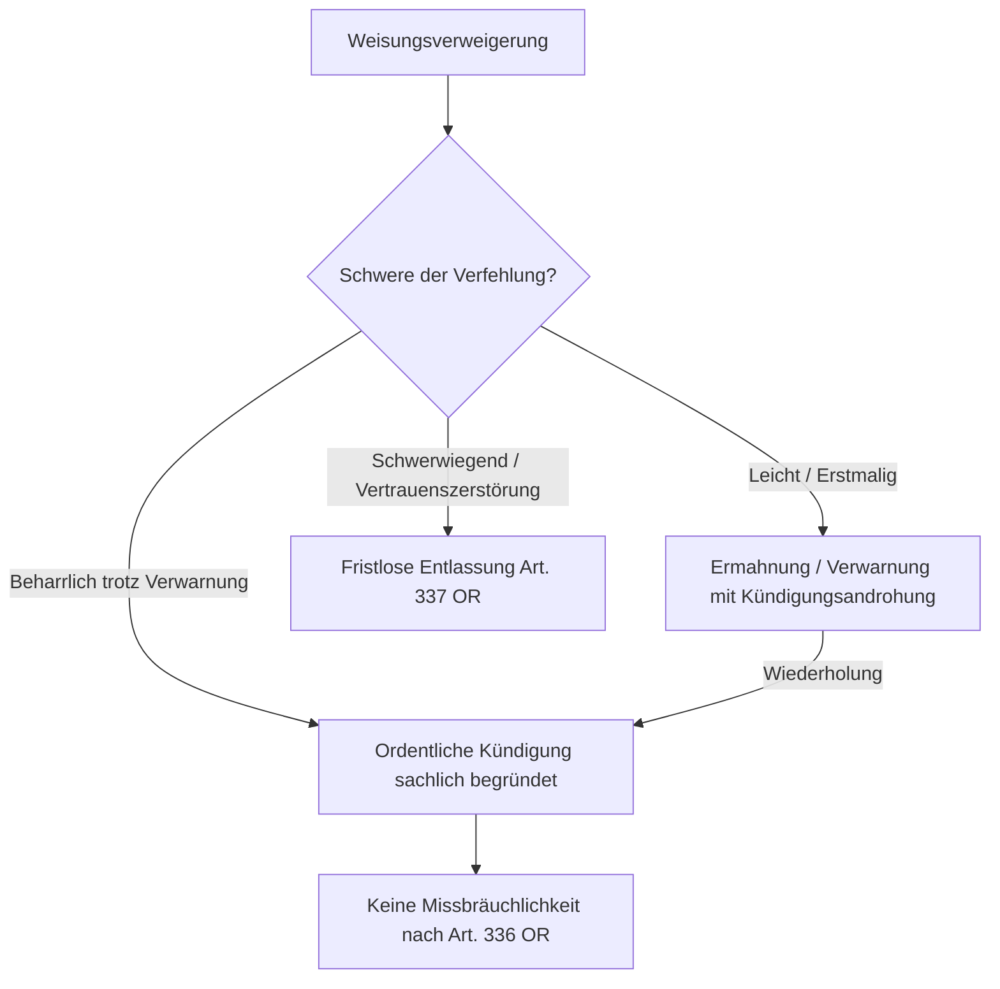

## Gesetzeswortlaut

> **Art. 321d OR — Weisungsrecht des Arbeitgebers**
>
> ---
>
> **Abs. 1 — Weisungsgewalt des Arbeitgebers**
>
> Der Arbeitgeber kann über die Ausführung der Arbeit und das Verhalten der Arbeitnehmer im Betrieb oder Haushalt allgemeine Anordnungen erlassen und ihnen besondere Weisungen erteilen.
>
> ---
>
> **Abs. 2 — Befolgungspflicht des Arbeitnehmers**
>
> Der Arbeitnehmer hat die allgemeinen Anordnungen des Arbeitgebers und die ihm erteilten besonderen Weisungen nach Treu und Glauben zu befolgen.

*Wortlaut geprüft gegen [Fedlex, SR 220](https://www.fedlex.admin.ch/eli/cc/27/317_321_377/de), Stand der Konsolidierung 1. Januar 2026.*

---

## Überblick und Bedeutung

Art. 321d OR bildet das gesetzliche Fundament des **arbeitsrechtlichen Direktionsrechts**. Da der Arbeitsvertrag als Dauerschuldverhältnis die Arbeitspflicht regelmässig nur rahmenmässig umschreibt («Angestellter im Treuhandbereich», «Krankenschwester», «Kundenberater»), bedarf es einer laufenden einseitigen Konkretisierung durch den Arbeitgeber.

Das Direktionsrecht ist jedoch **kein unbeschränktes Herrschaftsrecht**. Es bewegt sich in einem permanenten Spannungsfeld zwischen der unternehmerischen Organisationshoheit, den vertraglichen Schranken (Verbot der einseitigen Vertragsabänderung) und dem Persönlichkeitsschutz des Arbeitnehmers (Art. 328 OR) samt den zwingenden öffentlich-rechtlichen Schutzbestimmungen (Art. 6 ArG, Art. 26 ArGV 3).

### Prüfschema: die Merkmale in ihrer Prüfungsreihenfolge

Die Norm zerfällt in zwei Blöcke: Abs. 1 begründet die Weisungsbefugnis und begrenzt sie, Abs. 2 begründet die Befolgungspflicht und begrenzt sie. Die folgende Tabelle ist zugleich das Inhaltsverzeichnis der Kommentierung — jede Zeile findet sich unten als Abschnitt wieder, in derselben Reihenfolge.

| Nr. | Merkmal | Was zu prüfen ist | Behauptungs- und Beweislast | Abschnitt |
|---|---|---|---|---|
| **Abs. 1 — Die Weisungsbefugnis** ||||
| 1 | **Weisungskompetenz** | Besteht ein Arbeitsverhältnis mit Subordination, und ist die anordnende Person weisungsberechtigt (Delegation, Personalverleih)? | Arbeitgeber, der sich auf die Weisung beruft | [A](#a-merkmal-1-weisungskompetenz-und-subordination) |
| 2 | **Sachlicher Gegenstand** | Betrifft die Weisung die «Ausführung der Arbeit» oder das «Verhalten im Betrieb oder Haushalt» — oder das Privatleben? | Arbeitgeber (Betriebsbezug) | [B](#b-merkmal-2-sachlicher-gegenstand-arbeitsausführung-oder-betriebsverhalten) |
| 3 | **Schranke I: der Vertrag** | Konkretisiert die Weisung den Vertrag oder ändert sie ihn einseitig ab (essentialia negotii)? | Arbeitnehmer behauptet die Überschreitung; Auslegung des Vertrags | [C](#c-merkmal-3-schranke-i--der-vertrag-konkretisierung-statt-abänderung) |
| 4 | **Schranke II: zwingendes Recht** | Verstösst die Weisung gegen Art. 327a OR, ArG/ArGV 3, DSG, GlG oder Art. 361/362 OR? | Rechtsfrage; Tatsachen bei der jeweils behauptenden Partei | [D](#d-merkmal-4-schranke-ii--zwingendes-recht) |
| 5 | **Schranke III: Persönlichkeitsschutz (Art. 328 OR)** | Ist der Eingriff geeignet, erforderlich und zumutbar? Massgebend ist die Lage **ex ante** | Arbeitgeber trägt die Rechtfertigungslast für den Eingriff | [E](#e-merkmal-5-schranke-iii--persönlichkeitsschutz-und-verhältnismässigkeit-art-328-or) |
| **Abs. 2 — Die Befolgungspflicht** ||||
| 6 | **Befolgung «nach Treu und Glauben»** | Ist die Befolgung zumutbar? Wurde vorgängig remonstriert statt eigenmächtig verweigert? | Arbeitnehmer für die Unzumutbarkeit | [F](#f-merkmal-6-befolgung-nach-treu-und-glauben-und-die-remonstrationsobliegenheit) |
| 7 | **Grenze bei zweifelhafter Rechtmässigkeit** | Durfte der Arbeitnehmer die Weisung in guten Treuen für unzulässig halten? | Arbeitnehmer; objektive, greifbare Anhaltspunkte nötig | [G](#g-merkmal-7-die-grenze-der-befolgungspflicht-bei-zweifelhafter-rechtmässigkeit) |
| 8 | **Rechtsfolgen der Verweigerung** | Verwarnung, ordentliche Kündigung, fristlose Entlassung (Art. 337 OR), Erwähnung im Zeugnis | Arbeitgeber für die Schwere und die Abmahnung | [H](#h-rechtsfolgen-der-weisungsverweigerung) |

> **Grundsatz.** Die Merkmale 3 bis 5 sind **kumulative Schranken**: Eine Weisung ist nur verbindlich, wenn sie alle drei passiert. Wer eine Weisung angreift, sollte deshalb bestimmen, an welcher der drei Schranken sie scheitert — die Beweisthemen sind völlig verschieden (Vertragsauslegung, Normverstoss, Interessenabwägung).

---

## Kommentierung

### A. Merkmal 1: Weisungskompetenz und Subordination

**Was das Merkmal verlangt.** Das Weisungsrecht ist ein einseitiges **Gestaltungsrecht**, das aus dem für den Arbeitsvertrag typischen Subordinationsverhältnis (Art. 319 OR) fliesst. Es setzt kein Arbeitsverhältnis im Rechtssinne mit dem Anordnenden voraus, sondern eine wirksam abgeleitete Kompetenz: Der Arbeitgeber kann das Recht formlos ausüben (mündlich, schriftlich, per E-Mail oder durch schlüssiges Verhalten) und an Vorgesetzte oder Dritte delegieren — etwa an Poliere auf Grossbaustellen oder an Einsatzbetriebe beim Personalverleih ([BGer 4C.176/2002 vom 19. September 2002, E. 2.1](https://entscheidsuche.ch/docs/CH_BGer/CH_BGer_004_4C-176-2002_2002-09-19.html); [BGer 4A_344/2015 vom 10. Dezember 2015, E. 4.1](https://entscheidsuche.ch/docs/CH_BGer/CH_BGer_004_4A-344-2015_2015-12-10.html)).

**Praxislücke — und was daraus folgt.** Zu diesem Merkmal existiert kaum plastische publizierte Kasuistik: Die Weisungskompetenz wird in Prozessen fast nie bestritten, weil sie sich regelmässig von selbst versteht. Streitig wird sie praktisch nur im **Personalverleih** (wer haftet für die Weisung des Einsatzbetriebs?) und in **Konzernverhältnissen** (darf die Muttergesellschaft dem Arbeitnehmer der Tochter Weisungen erteilen?). Das ist selbst eine Information: Wer als Verteidigung hier ansetzen will, findet keine gefestigte Praxis vor, auf die er sich stützen könnte, und muss die Kompetenzkette aus dem Vertrag und der gelebten Organisation heraus bestreiten.

> **Merksatz.** Je höher die fachliche Qualifikation und die Hierarchiestufe, desto enger der Spielraum für detaillierte Fachweisungen. Bei leitenden Angestellten, Ärzten, Anwälten oder wissenschaftlichen Spezialisten beschränkt sich das Direktionsrecht typischerweise auf Zielanweisungen und organisatorische Rahmenbedingungen; die Art und Weise der Problemlösung verbleibt in ihrer fachlichen Autonomie.

---

### B. Merkmal 2: Sachlicher Gegenstand — Arbeitsausführung oder Betriebsverhalten

**Was das Merkmal verlangt.** Abs. 1 nennt zwei Regelungsgegenstände. Eine Weisung, die sich keinem von beiden zuordnen lässt, ist von der Norm nicht gedeckt — sie ist ein Eingriff in die Privatsphäre, ohne dass es auf die Verhältnismässigkeit (Merkmal 5) noch ankäme.

- **Weisungen über die Arbeitsausführung**: Sie legen fest, *wie*, *womit*, *in welcher Reihenfolge* und *wo* die vertraglich vereinbarte Arbeit zu leisten ist.
- **Weisungen über das Verhalten im Betrieb oder Haushalt**: Sie sichern den störungsfreien Ablauf und das Zusammenleben der Belegschaft (Rauchverbote, Verbot privater Telefongespräche, Umgang mit Geldspenden oder Geschenken).

Davon zu unterscheiden ist die **Form**, die für die Verbindlichkeit unerheblich ist:
- **Allgemeine Anordnungen**: generell-abstrakte Regelungen an die Belegschaft oder eine Gruppe (Betriebsordnungen, Personalreglemente, IT-Richtlinien, Spesenreglemente).
- **Besondere Weisungen**: individuell-konkrete Anweisungen an einen einzelnen Arbeitnehmer.

#### Die Schichten des Weisungsrechts auf einen Blick

| Weisungsart | Regelungsgegenstand | Typische Beispiele | Massgebende Schranke |
|---|---|---|---|
| **Arbeitsleistungsweisung (Abs. 1 Alt. 1)** | Konkretisierung der geschuldeten Arbeitspflicht (Art, Ort, Zeit, Methode) | Arbeitszeiten, Prioritätensetzung, Zuweisung konkreter Dossiers, Software-Einsatz | **Merkmal 3 — Vertrag**: kein einseitiger Eingriff in den Kernbereich der Funktion ([BGE 132 III 115 E. 5.2](https://entscheidsuche.ch/docs/CH_BGE/CH_BGE_005_BGE-132-III-115_2006.html#consideration_5.2)) |
| **Betriebliche Verhaltensordnung (Abs. 1 Alt. 2)** | Ordnung und reibungsloser Betrieb | Rauch- und Alkoholverbot, Hygiene, IT-Sicherheitsrichtlinien, Meldepflichten | **Merkmal 2 — Betriebsbezug**: keine Reglementierung des Privatlebens |
| **Persönlichkeitsrelevante Weisung** | Massnahmen mit Eingriff in Integrität, Privatsphäre oder Grundrechte | Dresscode, Verdeckung von Tätowierungen, Test- und Impfvorgaben, Kontrollsysteme | **Merkmal 5 — Art. 328 OR, Art. 26 ArGV 3**: Eignung, Erforderlichkeit, Zumutbarkeit |
| **Zielanweisung vs. Fachweisung** | Grad der Eigenverantwortung | Bei Fachkräften und Kadern Zielvorgaben; bei Hilfskräften detaillierte Anleitung | **Merkmal 1 — Autonomie des Spezialisten**: keine Verletzung berufsständischer Pflichten |

> **Merksatz.** Die Zuordnung entscheidet über die Beweisführung: Bei Weisungen zur Arbeitsausführung streitet man über den Vertrag, bei Verhaltensweisungen über den Betriebsbezug, bei persönlichkeitsrelevanten Weisungen über die Interessenabwägung. Wer die falsche Schranke angreift, argumentiert an der Sache vorbei.

---

### C. Merkmal 3: Schranke I — der Vertrag (Konkretisierung statt Abänderung)

**Was das Merkmal verlangt.** Eine Weisung dient der **Konkretisierung**, nicht der **Abänderung** des Vertrags. Weisungen sind nur zu befolgen, soweit sie rechtmässig sind, also namentlich keine Verpflichtungen enthalten, «die den vertraglichen Rahmen sprengen» ([BGE 132 III 115 E. 5.2](https://entscheidsuche.ch/docs/CH_BGE/CH_BGE_005_BGE-132-III-115_2006.html#consideration_5.2)). Wesentliche Vertragspunkte (essentialia negotii) — Lohn, Pensum, Funktion, hierarchische Stellung und ein vertraglich fixierter Arbeitsort — können nicht auf dem Weisungsweg einseitig verändert werden.

#### Anwendungsfall: Die unzulässige Weisung — Versetzung mit Herabstufung

> **Der Sachverhalt aus den Akten ([AG OG WBE.2015.314 vom 23. März 2016](https://entscheidsuche.ch/docs/AG_Gerichte/AG_OG_006_WBE-2015-314_2016-03-23.pdf)):**
> Einer Dozentin und Abteilungsleiterin an einer Fachhochschule wurde per Weisung sowohl das Pensum gekürzt als auch ein neuer Arbeitsort zugewiesen. Der Arbeitsort war im Vertrag ausdrücklich festgeschrieben; die Zuweisung des neuen Ortes ging mit einer Herabstufung und einer Pensumssenkung einher.

**Rückbindung.** Die Weisung scheiterte **an der Vertragsschranke** — nicht an der Verhältnismässigkeit. Eine solche Verschlechterung kann der Arbeitgeber nur auf dem Weg einer ordentlichen **Änderungskündigung** unter Einhaltung der Kündigungsfristen durchsetzen ([E. II/1](https://entscheidsuche.ch/docs/AG_Gerichte/AG_OG_006_WBE-2015-314_2016-03-23.pdf)).

#### Verwerfungsfall: Die zulässige Versetzung kraft Mobilitätsklausel

Sieht der Arbeitsvertrag vor, dass der Arbeitnehmer «in der Regel im Betrieb X, bei betrieblicher Notwendigkeit jedoch an anderen Standorten der Schweiz» eingesetzt werden kann, deckt das Weisungsrecht eine vorübergehende oder dauerhafte Versetzung ab, sofern die Mehrbelastung (Arbeitsweg, Spesen) zumutbar ist und der Arbeitgeber die zusätzlichen Spesen nach Art. 327a OR übernimmt ([BL KG 400 16 46 vom 29. März 2016](https://entscheidsuche.ch/docs/BL_Gerichte/BL_KG_001_400-2016-46_2016-03-29.pdf)).

**Rückbindung.** Hier war die Vertragsschranke gerade **nicht** überschritten, weil der Vertrag den Ortswechsel selbst vorsah. Die Gegenüberstellung zeigt die eigentliche Prüffrage: nicht ob versetzt wird, sondern ob der Vertrag den Ortswechsel bereits einschliesst.

#### Anwendungsfall: Einseitige Überstundenkompensation

> «Der Ausgleich von Überstundenarbeit durch Freizeit setzt jedenfalls das Einverständnis des Arbeitnehmers voraus. Die Kompensation kann – soweit die Parteien nichts anderes vereinbart haben – nicht einseitig angeordnet werden. Dies gilt im Übrigen (unter Vorbehalt des Rechtsmissbrauchs) selbst bei Kündigung des Arbeitsverhältnisses durch den Arbeitgeber und gleichzeitiger Freistellung des Arbeitnehmers.»
>
> — [BGer 4A_533/2018 vom 23. April 2019, E. 4.6](https://entscheidsuche.ch/docs/CH_BGer/CH_BGer_004_4A-533-2018_2019-04-23.html), unter Verweis auf [BGE 123 III 84 E. 5](https://entscheidsuche.ch/docs/CH_BGE/CH_BGE_005_BGE-123-III-84_1997.html#consideration_5)

**Rückbindung.** Die Anordnung scheitert an der Vertragsschranke, weil sie einen bereits entstandenen Vergütungsanspruch einseitig in einen Freizeitanspruch umwandelt — die Weisung ist unverbindlich, die Überstundenvergütung bleibt geschuldet.

> **Merksatz.** Versetzungen an andere Orte, Lohnkürzungen, Pensumsanpassungen und Funktionsherabstufungen bedürfen einer formellen Änderungskündigung oder einer vertraglichen Mobilitätsklausel. Wer sie per Weisung durchsetzt, verliert doppelt: Die Weisung ist unverbindlich, und die darauf gestützte Kündigung ist unsachlich.

---

### D. Merkmal 4: Schranke II — zwingendes Recht

**Was das Merkmal verlangt.** Selbst eine vertragskonforme Weisung ist unverbindlich, wenn sie gegen zwingendes Recht verstösst — Art. 19/20 OR, die relativ und absolut zwingenden Normen von Art. 361/362 OR, das Arbeitsgesetz samt Verordnungen, das Gleichstellungsgesetz oder das Datenschutzgesetz. Die praktisch häufigste Fallgruppe betrifft die **Kostentragung nach Art. 327a OR**.

#### Anwendungsfall: Das Gutachten auf eigene Kosten

> **Der Sachverhalt aus den Akten ([AG OG WKL.2017.8 vom 3. Mai 2018](https://entscheidsuche.ch/docs/AG_Gerichte/AG_OG_006_WKL-2017-8_2018-05-03.pdf)):**
> Ein seit Jahren angestellter Gemeindemitarbeiter erkrankte psychisch und reichte Zeugnisse seiner Psychiaterin ein. Der Gemeinderat beschloss am 31. Januar 2017, der Mitarbeiter habe **auf eigene Kosten** («zu eigenen Lasten») durch ein umfassendes fachärztliches Gutachten die vollständige Wiedererlangung seiner Arbeitsfähigkeit nachzuweisen, ansonsten das Dienstverhältnis aufgelöst werde. Der Mitarbeiter weigerte sich, die Kosten zu tragen, woraufhin ihm gekündigt wurde.

**Rückbindung.** Die Weisung scheiterte **an der Schranke des zwingenden Rechts**: Die Mitwirkungspflicht des Arbeitnehmers erschöpft sich in der Vorlage eines einfachen Arztzeugnisses. Will der Arbeitgeber eine vertrauensärztliche Begutachtung, hat er die Kosten nach Art. 327a OR zwingend selbst zu tragen. Die Weigerung stellte deshalb **keine Pflichtverletzung** dar; die Kündigung war mangels sachlichen Grundes ungerechtfertigt ([E. 3.6.2–3.6.3](https://entscheidsuche.ch/docs/AG_Gerichte/AG_OG_006_WKL-2017-8_2018-05-03.pdf)).

Der Entscheid ist zugleich der wichtigste Beleg dafür, dass eine an sich legitime Zielsetzung (Klärung der Arbeitsfähigkeit) die Weisung nicht rettet, wenn die **Modalität** rechtswidrig ist. Der Arbeitgeber hätte dasselbe Ziel rechtmässig erreichen können — auf eigene Rechnung.

> **Merksatz.** Wer vertrauensärztliche Untersuchungen, spezielle Schutzkleidung oder Hardware fürs Homeoffice verlangt, muss die Kosten tragen. Die Abwälzung macht die Weisung unverbindlich — und die auf ihre Nichtbefolgung gestützte Kündigung angreifbar.

---

### E. Merkmal 5: Schranke III — Persönlichkeitsschutz und Verhältnismässigkeit (Art. 328 OR)

**Was das Merkmal verlangt.** Greift die Weisung in Persönlichkeitsgüter ein, ist sie nur verbindlich, wenn sie **geeignet, erforderlich und zumutbar** ist. Es gilt eine Güterabwägung zwischen dem betrieblichen Interesse und dem betroffenen Persönlichkeitsgut; mildere Massnahmen gehen vor. Die Rechtfertigungslast trägt der Arbeitgeber.

Zwei Präzisierungen der neueren Praxis sind prozessentscheidend:

- **Massgeblicher Beurteilungszeitpunkt ist *ex ante***. Ob eine Weisung verhältnismässig ist, bemisst sich nach der Sach- und Risikolage **im Zeitpunkt ihres Erlasses** und nicht nach späteren Entwicklungen ([BGer 4A_60/2026 E. 4.2.3](https://entscheidsuche.ch/docs/CH_BGer/CH_BGer_004_4A-60-2026_2026-06-30.html)). Der Rückblick auf eine überholte Gefahrenlage entwertet die Weisung nicht rückwirkend.
- **Die Eingriffstiefe bemisst sich objektiv, nicht nach dem Empfinden des Betroffenen.** Das zeigt sich quer durch die drei folgenden Fallgruppen, die je ein anderes Persönlichkeitsgut betreffen.

#### 1. Eingriffe in die körperliche Integrität: Impf- und Testweisungen

> **Der Sachverhalt aus den Akten ([BGer 4A_60/2026 vom 30. Juni 2026](https://entscheidsuche.ch/docs/CH_BGer/CH_BGer_004_4A-60-2026_2026-06-30.html); [BGer 4A_612/2025 vom 27. Mai 2026](https://entscheidsuche.ch/docs/CH_BGer/CH_BGer_004_4A-612-2025_2026-05-27.html)):**
> Die Fluggesellschaft Swiss International Air Lines führte im Spätsommer 2021 für das gesamte fliegende Personal ein Covid-19-Impfobligatorium ein. Zahlreiche internationale Destinationen (namentlich die USA, Hongkong und diverse asiatische Staaten) hatten strikte Einreise- und Quarantänevorschriften für ungeimpfte Besatzungsmitglieder erlassen. Die weltweite Rotation («Kettenflugeinsatz»), bei der eine Crew nacheinander verschiedene Destinationen anfliegt, drohte bei ungeimpftem Personal zusammenzubrechen; zudem bestand eine Fürsorgepflicht gegenüber Passagieren und Crewkollegen (Art. 328 OR). Eine langjährige Flight Attendant verweigerte die Impfung aus persönlichen und gesundheitlichen Bedenken. Nach erfolgloser Abmahnung kündigte die Swiss ordentlich. Die Arbeitnehmerin klagte auf Entschädigung wegen missbräuchlicher Kündigung (Art. 336 Abs. 1 lit. a und lit. b OR).

Das Bundesgericht wies die Klage ab:
1. **Rechtsgrundlage in Art. 321d Abs. 1 OR**: Das Weisungsrecht umfasst Massnahmen zur Gewährleistung der betrieblichen Leistungsfähigkeit und des Gesundheitsschutzes der Belegschaft.
2. **Interessenabwägung**: Zwar tangiert eine Impfung das Recht auf körperliche Integrität (Art. 10 Abs. 2 BV, Art. 28 ZGB). Bei der Covid-19-Impfung handelt es sich jedoch um einen leichten medizinischen Eingriff. Dem stand das existenzielle betriebliche Interesse gegenüber, den internationalen Flugbetrieb aufrechtzuerhalten und das Grounding ganzer Maschinen infolge Quarantäneauflagen zu verhindern.

**Rückbindung.** Die Weisung passierte **die Schranke des Art. 328 OR** — und erst deshalb wurde die beharrliche Verweigerung zur Pflichtverletzung nach Abs. 2 (Abschnitt F), die eine ordentliche Kündigung sachlich trägt ([E. 4.4.1](https://entscheidsuche.ch/docs/CH_BGer/CH_BGer_004_4A-60-2026_2026-06-30.html)). Die Kausalkette läuft also über Merkmal 5 zu Merkmal 6; wäre die Weisung unverhältnismässig gewesen, wäre auch die Kündigung gefallen.

Noch klarer liegt der Fall bei praktisch eingriffsfreien Massnahmen:

> **Der Sachverhalt aus den Akten ([ZH OG LA230021 vom 11. April 2024](https://entscheidsuche.ch/docs/ZH_Obergericht/ZH_OG_001_LA230021_2024-04-11.pdf)):**
> Eine seit 2017 angestellte Arbeitsagogin in einer sozialen Einrichtung verweigerte im Oktober 2021 die Teilnahme an den angeordneten repetitiven Covid-19-Spuck-Tests für ungeimpftes Personal. Sie forderte, es müssten entweder alle Mitarbeitenden getestet werden oder niemand, und berief sich auf den arbeitsrechtlichen Gleichbehandlungsgrundsatz sowie das Grundrecht auf Privatsphäre. Der Arbeitgeber ermahnte sie am 19. Oktober 2021 schriftlich, sprach am 26. Oktober eine formelle Verwarnung mit Frist bis zum 29. Oktober aus und kündigte am 1. November 2021 fristlos.

**Rückbindung.** Repetitive Speicheltests sind praktisch eingriffsfrei und zum Schutz vulnerabler Betreuter vollumfänglich verhältnismässig — Merkmal 5 war erfüllt. Die weiteren Streitpunkte (Verwirkung durch zweite Verwarnung, Gutglaubensschutz) betreffen die Merkmale 7 und 8 und sind dort behandelt.

Ergänzend zur Reichweite bei besonders verletzlichen Betreuten: Verweigert ein Betreuer in einem Heim für schwer körperbehinderte Menschen mit respiratorischen Vorerkrankungen die Einhaltung von Masken- und Testweisungen und fragt er Klienten, ob er die Maske abnehmen dürfe, ist nicht nur die ordentliche Kündigung sachlich gerechtfertigt — der Arbeitgeber ist nach dem Grundsatz der Zeugniswahrheit sogar verpflichtet, den Kündigungsgrund im qualifizierten Arbeitszeugnis zu erwähnen ([ZH AGer-Z 2024 Nr. 1, AH220121-L vom 3. Januar 2024](https://entscheidsuche.ch/docs/ZH_Obergericht/ZH_OG_999_AH220121-L_2024-01-03.pdf); dazu Abschnitt H).

#### 2. Eingriffe in das äussere Erscheinungsbild: Dresscode und Symbole

**Der Massstab.** Vorschriften über Kleidung, Haartracht, Bärte, Piercings oder Tätowierungen sind nur zulässig, wenn sie einen **direkten sachlichen Bezug zur Arbeitsleistung** aufweisen — sei es aus Sicherheits- und Gesundheitsgründen (kein loser Schmuck an rotierenden Maschinen, sterile Kleidung im Operationssaal), sei es wegen Kundenkontakt und Corporate Identity (Uniformpflicht bei Flug- oder Schalterpersonal).

> **Der Sachverhalt aus den Akten ([BGer 9C_301/2008 vom 2. Juli 2008](https://entscheidsuche.ch/docs/CH_BGer/CH_BGer_009_9C-301-2008_2008-07-02.html)):**
> Ein sehbehinderter Mann absolvierte eine von der Invalidenversicherung finanzierte Umschulung zum medizinischen Masseur. Er trug auf dem Handrücken und den Fingern markante Hakenkreuz-Tätowierungen (Swastika). Zwei Praktikumsbetriebe verlangten, die Tätowierungen während der Behandlung von Patienten mit einem Pflaster abzudecken, da Patienten die Behandlung ablehnen und das Zeichen mit dem Nationalsozialismus assoziieren würden. Der Masseur weigerte sich strikt und machte geltend, er gehöre der Religionsgemeinschaft des Jainismus an, deren heiliges Symbol die Swastika sei; die Weisung verletze seine Religionsfreiheit (Art. 15 BV, Art. 9 EMRK, Art. 18 UNO-Pakt II).

**Rückbindung.** Auch hier entschied allein die Abwägung nach Merkmal 5: Der Arbeitgeber darf gestützt auf Art. 321d OR in den Schranken von Art. 328 OR Vorschriften über Kleidung und getragene Gegenstände erlassen, soweit sie Bezug zur Arbeit oder zur Firmenphilosophie haben ([E. 4.1](https://entscheidsuche.ch/docs/CH_BGer/CH_BGer_009_9C-301-2008_2008-07-02.html)). Das Abdecken mit einem Pflaster während der Behandlung war ein **äusserst geringfügiger Eingriff**, der angesichts der berechtigten Erwartungshaltung der Patienten verhältnismässig und zumutbar war ([E. 5.1](https://entscheidsuche.ch/docs/CH_BGer/CH_BGer_009_9C-301-2008_2008-07-02.html)). Bemerkenswert: Die religiöse Bedeutung des Symbols für den Träger änderte an der objektiven Geringfügigkeit des Eingriffs nichts.

#### 3. Eingriffe in die Privatsphäre am Arbeitsplatz: Überwachung und IT-Nutzung

**Der Massstab.** Nach Art. 26 Abs. 1 ArGV 3 ist der Einsatz von Überwachungs- und Kontrollsystemen, die das **Verhalten** der Arbeitnehmer am Arbeitsplatz überwachen sollen, strikt verboten. Zulässig sind Kontrollsysteme nach Abs. 2 nur, wenn sie aus anderen sachlichen Gründen erforderlich sind (Sicherheit, Arbeitsplanung, Leistungskontrolle) und Gesundheit sowie Bewegungsfreiheit nicht beeinträchtigen ([BGE 130 II 425 E. 4.1](https://entscheidsuche.ch/docs/CH_BGE/CH_BGE_004_BGE-130-II-425_2004.html#consideration_4)).

> **Der Sachverhalt aus den Akten ([BGE 130 II 425](https://entscheidsuche.ch/docs/CH_BGE/CH_BGE_004_BGE-130-II-425_2004.html#consideration_4)):**
> Ein Unternehmen für Feuerlöscherwartung stattete die Firmenfahrzeuge von 15 Servicetechnikern mit GPS-Satellitenortung aus, um Diebstähle zu verhindern, Touren zu optimieren und die Arbeitsberichte zu kontrollieren. Ein Techniker fühlte sich unter Dauerüberwachung und reichte Beschwerde beim Genfer Arbeitsinspektorat ein.

**Rückbindung.** Das Bundesgericht prüfte zweistufig, und beide Stufen gehören zu Merkmal 5: Ein System, das **primär** auf Verhaltensüberwachung zielt, ist schon nach Art. 26 Abs. 1 ArGV 3 verboten (Merkmal 4). Dient es legitimen Zwecken, muss es **erforderlich und schonend** ausgestaltet sein — eine permanente Echtzeitortung jedes Fahrzeugs zur blossen Lenkerüberwachung ist unzulässig, eine nachträgliche stichprobenweise oder verdachtsbezogene Auswertung von Standzeiten dagegen zulässig.

Dieselbe Zweiteilung trägt die Auswertung digitaler Spuren:

> **Der Sachverhalt aus den Akten ([ZH OG LA150002 vom 27. März 2015](https://entscheidsuche.ch/docs/ZH_Obergericht/ZH_OG_001_LA150002_2015-03-27.pdf)):**
> Ein Senior-Kundenbetreuer und Kadermitglied einer Zürcher Bank verfasste während der Arbeitszeit auf der öffentlich zugänglichen Finanzplattform «Inside Paradeplatz» unter dem Pseudonym «F.» zwei Schmähkommentare zu einem Artikel über den CEO: «Wer an der Front arbeitet wird ausgenützt. [...] Da der oberste Chef keinen Rückgrat hat, fehlen auch den Chefs auf den tiefsten Stufen die Eier! Ich kann nur sagen, dass es mit der [Bank] schlecht steht und die Stimmung bei den Mitarbeitern beschissen ist.» Die Bank veranlasste eine interne IT-Untersuchung: Anhand der IP-Adresse und der Proxy-Logfiles wurde sein Arbeitsplatzrechner identifiziert. Nach einer disziplinarischen Befragung wurde ihm ordentlich unter sofortiger Freistellung gekündigt. Er klagte wegen missbräuchlicher Kündigung (Art. 336 Abs. 1 lit. b OR) und rügte eine illegale Überwachung nach Art. 26 ArGV 3 und dem DSG.

**Rückbindung.** Drei Punkte, drei verschiedene Merkmale:
1. **Merkmal 2**: Weisungen, die private Stellungnahmen zu Bankthemen untersagen und interne Kritik nicht in die Öffentlichkeit tragen lassen, betreffen das Betriebsverhalten und sind nach Art. 321d OR verbindlich.
2. **Merkmal 5**: Eine permanente, anlasslose Personenüberwachung von Internet-Logdaten verstösst gegen Art. 26 ArGV 3. Liegt jedoch ein **konkreter Missbrauchsverdacht** vor, ist die gezielte, personengenaue Auswertung systembedingt vorhandener Logdaten erforderlich und verhältnismässig ([E. C/3.2](https://entscheidsuche.ch/docs/ZH_Obergericht/ZH_OG_001_LA150002_2015-03-27.pdf)).
3. **Merkmal 6 und die Treuepflicht**: Bei Kadermitarbeitern greift eine erhöhte Treuepflicht (Art. 321a OR); öffentliche Diffamierungen von Vorgesetzten verletzen sie massiv und schliessen Kündigungsmissbrauch aus ([E. C/2.2](https://entscheidsuche.ch/docs/ZH_Obergericht/ZH_OG_001_LA150002_2015-03-27.pdf)).

> **Merksatz.** Bei Merkmal 5 gewinnt, wer den *Zeitpunkt* und den *Anlass* beherrscht: Die Verhältnismässigkeit bemisst sich ex ante, und was anlasslos verboten ist (Dauerüberwachung), wird beim konkreten Verdacht zulässig. Umgekehrt rettet ein legitimer Zweck die Weisung nicht, wenn eine mildere Ausgestaltung möglich gewesen wäre.

---

### F. Merkmal 6: Befolgung «nach Treu und Glauben» und die Remonstrationsobliegenheit

**Was das Merkmal verlangt.** Abs. 2 verpflichtet zur Befolgung «nach Treu und Glauben». Daraus folgt zweierlei: Die Befolgungspflicht endet dort, wo die Befolgung unzumutbar wird — und der Arbeitnehmer, der eine Weisung für fehlerhaft hält, muss dies **zuerst gegenüber dem Arbeitgeber vorbringen** (Remonstration), statt eigenmächtig zu handeln.

#### Anwendungsfall: Die Stationsleiterin und die Pflegeheim-Spenden

> **Der Sachverhalt aus den Akten ([BGer 4A_613/2010 vom 25. Januar 2011](https://entscheidsuche.ch/docs/CH_BGer/CH_BGer_004_4A-613-2010_2011-01-25.html)):**
> Eine langjährige Stationsleiterin in einem Zürcher Alters- und Pflegeheim nahm von Angehörigen zweier verstorbener Patienten Geldspenden über Fr. 500.– und Fr. 300.– entgegen. Eine interne Weisung der Heimleitung aus dem Jahr 1996 sah vor, dass Geldspenden von Angehörigen unverzüglich abzuliefern seien und in die gemeinsame Personalkasse fliessen. Die Stationsleiterin behielt das Geld fünf Wochen lang zu Hause. Als die Heimleitung sie zur Rede stellte, schwieg sie, lehnte eine einvernehmliche Kündigung ab und verteilte stattdessen eine von ihrem Ehemann verfasste juristische Abhandlung an ihre unterstellten Pflegefachfrauen, wonach die Weisung gesetzeswidrig sei. Die Heimleitung kündigte ordentlich. Die Klägerin machte geltend, Geldgeschenke gehörten nach Art. 321b OR ihr persönlich.

**Rückbindung.** Der Fall trennt sauber zwei Merkmale:
1. **Merkmal 2 (Gegenstand)**: Art. 321b OR regelt nur Werte, die für den Arbeitgeber bestimmt sind. Das Weisungsrecht ermächtigt den Heimträger jedoch, im Interesse des Betriebsfriedens und zur Vermeidung von Bevorzugungen bei der Pflege die Ablieferung von Trinkgeldern und Spenden in einen gemeinsamen Fonds anzuordnen ([E. 4.2](https://entscheidsuche.ch/docs/CH_BGer/CH_BGer_004_4A-613-2010_2011-01-25.html)).
2. **Merkmal 6 (Treu und Glauben)**: Hält eine Stationsleiterin eine Weisung für fehlerhaft, verpflichtet sie ihre Treuepflicht (Art. 321a OR), **zuerst mit der Geschäftsleitung das Gespräch zu suchen**. Unterstellte eigenmächtig auf eine angebliche Rechtswidrigkeit hinzuweisen und zur Nichtbefolgung zu motivieren, ist eine schwere Treuepflichtverletzung ([E. 5](https://entscheidsuche.ch/docs/CH_BGer/CH_BGer_004_4A-613-2010_2011-01-25.html)).

#### Anwendungsfall: Die eigenmächtige Abreise aus Peking

> **Der Sachverhalt aus den Akten ([BGer 4C.357/2002 vom 4. April 2003](https://entscheidsuche.ch/docs/CH_BGer/CH_BGer_004_4C-357-2002_2003-04-04.html)):**
> Ein Manager war für ein Schweizer Unternehmen mit zwölfmonatiger Kündigungsfrist in Peking stationiert. Wegen Differenzen über Spesenabrechnungen legte ihm sein Vorgesetzter eine Aufhebungsvereinbarung vor. Der Vorgesetzte wies ihn am 18. September 1997 ausdrücklich an, Peking keinesfalls vor einer für Montag, den 22. September angesetzten Besprechung mit einem eigens aus der Schweiz anreisenden Delegierten zu verlassen. Der Manager reiste dennoch am Sonntag, 21. September eigenmächtig in die Schweiz ab, um den Geschäftsführer der Holding direkt zu konfrontieren. Die Arbeitgeberin kündigte fristlos. Der Kläger machte geltend, es habe zu seinen Persönlichkeitsrechten gehört, sich in der existenziellen Bedrohung an die oberste Führung zu wenden.

**Rückbindung.** Das Recht, bei Konflikten die nächsthöhere Hierarchiestufe anzurufen, besteht — es muss aber mit den betrieblichen Notwendigkeiten koordiniert werden. Da der Kollege eigens aus der Schweiz anreiste und für das Treffen in der Schweiz keine Dringlichkeit bestand, war die vorsätzliche Abreise entgegen der klaren Weisung eine schwere Pflichtverletzung, die nach vorangegangenen Spesenunregelmässigkeiten die fristlose Kündigung rechtfertigte ([E. 4.2–4.3](https://entscheidsuche.ch/docs/CH_BGer/CH_BGer_004_4C-357-2002_2003-04-04.html)). Gescheitert ist der Manager nicht daran, *dass* er sich beschweren wollte, sondern daran, *wie*.

> **Merksatz.** Zuerst remonstrieren, nicht rebellieren. Wer eine Weisung für rechtswidrig hält, muss dies dem Vorgesetzten sachlich anzeigen und Lösungswege vorschlagen. Kollegen gegen den Arbeitgeber aufzuwiegeln oder den Arbeitsplatz eigenmächtig zu verlassen, kostet die Stelle — unabhängig davon, ob die Weisung rechtmässig war.

---

### G. Merkmal 7: Die Grenze der Befolgungspflicht bei zweifelhafter Rechtmässigkeit

**Was das Merkmal verlangt.** Steht fest, dass eine Weisung offenkundig rechts- oder sittenwidrig ist (Aufforderung zu Bilanzfälschungen, Verstösse gegen Arbeitssicherheitsvorschriften), entfällt die Befolgungspflicht von Gesetzes wegen. Der Streit betrifft die **Grenzfälle**, in denen die Rechtmässigkeit im Zeitpunkt der Erteilung objektiv zweifelhaft ist — und hier liegt ein echter, nicht harmonisierbarer Gegensatz vor ([AG OG WKL.2017.8 E. 3.6.2](https://entscheidsuche.ch/docs/AG_Gerichte/AG_OG_006_WKL-2017-8_2018-05-03.pdf)).

#### Die beiden unvereinbaren Linien

| Kriterium | Strenge Gehorsamslinie (kantonale Praxis) | Schutzlehre der Doktrin (Rehbinder / Stöckli / Schnider) |
|---|---|---|
| **Ausgangspunkt** | Subordinationsprinzip und Notwendigkeit betrieblicher Handlungsfähigkeit | Gesetzmässigkeitsprinzip und Schranken des Art. 328 OR |
| **Schwelle für Verweigerung** | Nur bei **schweren, offenkundigen und leicht erkennbaren Fehlern** (Evidenztheorie) | Bei **jeder materiellen Rechtswidrigkeit**; dem Arbeitgeber fehlt die Rechtsmacht |
| **Massgebende Quellen** | Erziehungsrat SG (GVP 2011 Nr. 100); Kantonsgericht Baselland (810 15 238); Hinterberger (S. 178) | Berner Kommentar (*Rehbinder/Stöckli*, Art. 321d N 46); *Hirsiger* (S. 123); *Schnider* (S. 118 f.) |
| **Risikoverteilung** | Verweigert der Arbeitnehmer eine Weisung, deren Rechtswidrigkeit sich erst später herausstellt, riskiert er den Verlust der Stelle | Eine unzulässige Weisung verpflichtet nicht; die Nichtbefolgung darf unter keinen Umständen sanktioniert werden |

**Warum der Widerspruch echt ist — und nicht durch Sachverhaltsnuancen erklärbar.** Beide Linien beurteilen denselben Sachverhaltstyp (zweifelhafte Weisung, Arbeitnehmer verweigert) und gelangen zu gegensätzlichen Ergebnissen, weil sie unterschiedliche **Massstäbe** anlegen: Die eine verteilt das Prognoserisiko auf den Arbeitnehmer, die andere auf den Arbeitgeber. Es handelt sich nicht um eine Frage der Eingriffsintensität oder der Branche.

#### Der bundesgerichtliche Ausweg — und seine Grenze

Das Bundesgericht löst den Konflikt nicht dogmatisch, sondern über Treu und Glauben:

1. **Keine fristlose Kündigung bei gutgläubiger Verweigerung**: Eine fristlose Entlassung ist ungerechtfertigt, wenn der Arbeitnehmer in guten Treuen berechtigte Gründe hatte, die Weisung für unzulässig zu halten ([BGer 4C.357/2002 E. 4.1](https://entscheidsuche.ch/docs/CH_BGer/CH_BGer_004_4C-357-2002_2003-04-04.html)).
2. **Der Gutglaubensschutz reicht bis zur Rachekündigung.** In [BGE 132 III 115 E. 5.2](https://entscheidsuche.ch/docs/CH_BGE/CH_BGE_005_BGE-132-III-115_2006.html#consideration_5.2) hielt das Bundesgericht bei zweifelhaften Massnahmen zur Produktivitätssteigerung ausdrücklich fest, es erscheine «sogar zweifelhaft, ob der Kläger verpflichtet gewesen wäre, entsprechende Weisungen zu befolgen». Dem Arbeitnehmer, der sich den Weisungen zwar unterzog, aber **dagegen remonstrierte**, sei zugute zu halten, dass er sich in guten Treuen auf Ansprüche aus dem Arbeitsverhältnis berief — die deswegen ausgesprochene Kündigung erfüllte den Missbrauchstatbestand der **Rachekündigung** (Art. 336 Abs. 1 lit. d OR).
3. **Strikter Massstab an den guten Glauben**: Er verlangt objektive, greifbare Anhaltspunkte. Blosse subjektive Zweifel, allgemeine Medienberichte oder hängige Normenkontrollverfahren genügen nicht ([ZH OG LA230021 E. III/2.4](https://entscheidsuche.ch/docs/ZH_Obergericht/ZH_OG_001_LA230021_2024-04-11.pdf)).

**Der praktisch entscheidende Punkt** liegt im Vergleich von Ziff. 2 und Ziff. 3: In BGE 132 III 115 hatte der Arbeitnehmer die Weisung **befolgt und dagegen remonstriert** — und war geschützt. In ZH OG LA230021 hatte die Arbeitnehmerin die Weisung **verweigert** — und verlor. Die Praxis belohnt damit den Weg «erst befolgen, dann anfechten» und bestraft die Selbsthilfe, ohne dass dies je als Regel formuliert worden wäre.

> **Merksatz.** In Grenzfällen schützt der gute Glaube nur vor der **fristlosen** Entlassung, nicht vor der ordentlichen Kündigung — und auch das nur, wenn objektive Anhaltspunkte vorliegen. Der sichere Weg ist: Weisung unter ausdrücklichem Vorbehalt befolgen, schriftlich remonstrieren, die Rechtmässigkeit anschliessend gerichtlich klären lassen. Wer verweigert, trägt das volle Prognoserisiko.

---

### H. Rechtsfolgen der Weisungsverweigerung

**Was zu prüfen ist.** Missachtet der Arbeitnehmer eine verbindliche Weisung, hängt die zulässige Sanktion von der Schwere der Verfehlung und vom Vorliegen einer Abmahnung ab.

- **Verwarnung als Wirksamkeitsvoraussetzung**: Bei leichten oder mittelschweren Verstössen (Zuspätkommen, Verweigerung von Arbeitskleidung, unpünktliche Rapporte) setzt eine spätere fristlose Entlassung zwingend eine klare Verwarnung mit Kündigungsandrohung voraus ([BGE 127 III 153 E. 1](https://entscheidsuche.ch/docs/CH_BGE/CH_BGE_005_BGE-127-III-153_2001-02-14.html#consideration_1); [BGE 142 III 579 E. 4.2](https://entscheidsuche.ch/docs/CH_BGE/CH_BGE_005_BGE-142-III-579_2016.html#consideration_4.2)).
- **Keine Verwirkung durch eine zweite Chance**: Spricht der Arbeitgeber nach einer ersten Verwarnung eine zweite aus, verwirkt er sein Recht zur fristlosen Kündigung nicht ([ZH OG LA230021 E. III/3.2.4](https://entscheidsuche.ch/docs/ZH_Obergericht/ZH_OG_001_LA230021_2024-04-11.pdf)).
- **Erwähnung im Arbeitszeugnis**: Für das Zeugnis gilt das Wohlwollensgebot (Art. 330a OR), begrenzt durch das Wahrheitsgebot. Einmalige oder geringfügige Vorfälle dürfen nicht erwähnt werden. Führt eine **beharrliche** Weisungsverweigerung zur Auflösung und war sie für das Arbeitsverhältnis prägend, ist die Aufnahme des Beendigungsgrundes rechtens ([ZH AGer-Z 2024 Nr. 1, AH220121-L E. III/3.4](https://entscheidsuche.ch/docs/ZH_Obergericht/ZH_OG_999_AH220121-L_2024-01-03.pdf); [ZH OG LA150002 E. D/1](https://entscheidsuche.ch/docs/ZH_Obergericht/ZH_OG_001_LA150002_2015-03-27.pdf)).

> **Merksatz.** Vor einer fristlosen Kündigung wegen Weisungsverweigerung muss mindestens eine unmissverständliche Verwarnung mit Kündigungsandrohung ergehen. Eine zweite Verwarnung schadet dem Arbeitgeber nicht — sie belegt im Gegenteil die Schonung und entkräftet den Vorwurf, er habe die Kündigung gesucht.

---

### I. Kasuistiktabelle: Grenzkasuistik über alle Merkmale

| Sachverhalt | Entscheidendes Merkmal | Beurteilung der Weisung | Konsequenz bei Verweigerung | Leitentscheid |
|---|---|---|---|---|
| Flight Attendant verweigert Covid-19-Impfung trotz Einreisevorschriften im Streckennetz | 5 — Verhältnismässigkeit *ex ante* | **Rechtmässig** | Ordentliche Kündigung nicht missbräuchlich | [BGer 4A_60/2026](https://entscheidsuche.ch/docs/CH_BGer/CH_BGer_004_4A-60-2026_2026-06-30.html) |
| Arbeitsagogin verweigert Spuck-Tests und fordert Testung aller Mitarbeitenden | 5 — nicht-invasiver Eingriff | **Rechtmässig** | Fristlose Kündigung nach zwei Verwarnungen geschützt | [ZH OG LA230021](https://entscheidsuche.ch/docs/ZH_Obergericht/ZH_OG_001_LA230021_2024-04-11.pdf) |
| Medizinischer Masseur verweigert Abdecken einer Hakenkreuz-Tätowierung | 5 — geringfügiger Eingriff, Patienteninteresse | **Rechtmässig** | Sanktionen / Einstellung von Leistungen rechtmässig | [BGer 9C_301/2008](https://entscheidsuche.ch/docs/CH_BGer/CH_BGer_009_9C-301-2008_2008-07-02.html) |
| Bank wertet IP-Logfiles nach Schmähkommentaren des Kaders aus | 5 — Anlass statt Dauerüberwachung | **Rechtmässig** | Kündigung nicht missbräuchlich; kein Verstoss gegen ArGV 3 | [ZH OG LA150002](https://entscheidsuche.ch/docs/ZH_Obergericht/ZH_OG_001_LA150002_2015-03-27.pdf) |
| Permanente GPS-Echtzeitortung von Servicefahrzeugen zur Lenkerkontrolle | 4/5 — Art. 26 ArGV 3 | **Rechtswidrig** | Verbot durch Arbeitsinspektorat | [BGE 130 II 425](https://entscheidsuche.ch/docs/CH_BGE/CH_BGE_004_BGE-130-II-425_2004.html#consideration_4) |
| Manager reist trotz Anweisung vor wichtigem Meeting eigenmächtig aus Peking ab | 6 — Treu und Glauben | **Rechtmässig** | Fristlose Kündigung nach Art. 337 OR gerechtfertigt | [BGer 4C.357/2002](https://entscheidsuche.ch/docs/CH_BGer/CH_BGer_004_4C-357-2002_2003-04-04.html) |
| Stationsleiterin behält Geldspenden daheim und stiftet Team zur Verweigerung an | 6 — Remonstration statt Selbsthilfe | **Rechtmässig** | Ordentliche Kündigung wegen Treuepflichtverletzung geschützt | [BGer 4A_613/2010](https://entscheidsuche.ch/docs/CH_BGer/CH_BGer_004_4A-613-2010_2011-01-25.html) |
| Arbeitnehmer soll auf eigene Kosten ein psychiatrisches Gutachten beibringen | 4 — Art. 327a OR | **Rechtswidrig** | Berechtigte Verweigerung; Kündigung unsachlich | [AG OG WKL.2017.8](https://entscheidsuche.ch/docs/AG_Gerichte/AG_OG_006_WKL-2017-8_2018-05-03.pdf) |
| Arbeitgeber ordnet einseitig Kompensation von Überstunden durch Freizeit an | 3 — Vertrag | **Rechtswidrig** | Weisung unverbindlich; Überstundenvergütung geschuldet | [BGer 4A_533/2018](https://entscheidsuche.ch/docs/CH_BGer/CH_BGer_004_4A-533-2018_2019-04-23.html) |
| Dozentin soll per Weisung Pensum gekürzt und an neuen Ort versetzt werden | 3 — Vertrag | **Rechtswidrig** | Weisung unverbindlich; Entschädigung zugesprochen | [AG OG WBE.2015.314](https://entscheidsuche.ch/docs/AG_Gerichte/AG_OG_006_WBE-2015-314_2016-03-23.pdf) |
| Versetzung an anderen Standort gestützt auf vertragliche Mobilitätsklausel | 3 — Vertrag deckt den Ortswechsel | **Rechtmässig** | Befolgungspflicht; Spesen nach Art. 327a OR | [BL KG 400 16 46](https://entscheidsuche.ch/docs/BL_Gerichte/BL_KG_001_400-2016-46_2016-03-29.pdf) |
| Arbeitnehmer remonstriert gegen zweifelhafte Produktivitätsweisungen und wird entlassen | 7 — Gutglaubensschutz | Weisung **zweifelhaft** | Kündigung missbräuchlich (Rachekündigung, Art. 336 Abs. 1 lit. d OR) | [BGE 132 III 115 E. 5.2](https://entscheidsuche.ch/docs/CH_BGE/CH_BGE_005_BGE-132-III-115_2006.html#consideration_5.2) |

---

### J. Die Merksätze für die Praxis

#### Für den Arbeitgeber

1. **Keine Vertragsänderung via Weisung** (Merkmal 3): Versetzungen, Lohnkürzungen, Pensumsanpassungen und Funktionsherabstufungen bedürfen einer Änderungskündigung oder einer vertraglichen Mobilitätsklausel.
2. **Kosten gehören zum Betrieb** (Merkmal 4, Art. 327a OR): Vertrauensärztliche Untersuchungen, Schutzkleidung und Homeoffice-Hardware gehen zu Lasten des Arbeitgebers; die Abwälzung macht die Weisung unverbindlich.
3. **Die Begründung im Zeitpunkt des Erlasses dokumentieren** (Merkmal 5): Weil die Verhältnismässigkeit *ex ante* beurteilt wird, ist die damalige Risikolage aktenmässig festzuhalten. Ein Jahr später lässt sich die Ausgangslage nicht mehr rekonstruieren.
4. **Verwarnung sauber dokumentieren** (Merkmal 8): Vor einer fristlosen Kündigung braucht es eine unmissverständliche Verwarnung mit Kündigungsandrohung. Eine zweite schadet nicht.
5. **Überwachung braucht Anlass und Reglement** (Merkmale 4/5): Ständige Verhaltensüberwachung ist unzulässig (Art. 26 ArGV 3); Logfile-Auswertungen bedürfen eines konkreten Missbrauchsverdachts und vorgängiger Information der Belegschaft.

#### Für den Arbeitnehmer

1. **Die richtige Schranke wählen** (Merkmale 3–5): Bestimmen Sie, ob die Weisung am Vertrag, am zwingenden Recht oder an der Verhältnismässigkeit scheitert. Die Beweisthemen sind völlig verschieden — die pauschale Rüge «unzumutbar» trägt keine dieser drei Linien.
2. **Zuerst remonstrieren, nicht rebellieren** (Merkmal 6): Bedenken sachlich und schriftlich anzeigen. Kollegen zur Nichtbefolgung zu motivieren, rechtfertigt die Entlassung ([BGer 4A_613/2010](https://entscheidsuche.ch/docs/CH_BGer/CH_BGer_004_4A-613-2010_2011-01-25.html)).
3. **Eigenmächtiges Fernbleiben ist Arbeitsverweigerung** (Merkmal 6): Auch bei Konflikten mit Vorgesetzten darf der Arbeitsplatz nicht eigenmächtig verlassen werden ([BGer 4C.357/2002](https://entscheidsuche.ch/docs/CH_BGer/CH_BGer_004_4C-357-2002_2003-04-04.html)).
4. **Persönliche Bedenken sind kein Freipass** (Merkmal 7): Gesundheitsschutz- und Testweisungen dürfen nicht verweigert werden, nur weil man sie für verfehlt hält oder Verfahren noch hängig sind ([ZH OG LA230021](https://entscheidsuche.ch/docs/ZH_Obergericht/ZH_OG_001_LA230021_2024-04-11.pdf)). Der schützende Weg ist: unter Vorbehalt befolgen und remonstrieren ([BGE 132 III 115 E. 5.2](https://entscheidsuche.ch/docs/CH_BGE/CH_BGE_005_BGE-132-III-115_2006.html#consideration_5.2)).
