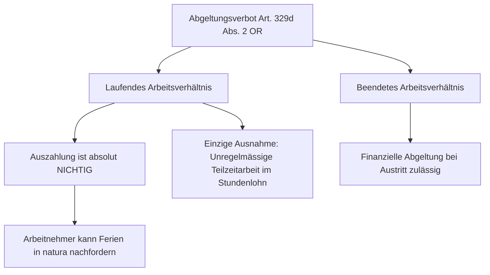

## Gesetzeswortlaut

> **Art. 329d OR — Freizeit und Ferien / Ferien / Lohn**
>
> ¹ Der Arbeitgeber hat dem Arbeitnehmer für die Ferien den gesamten darauf entfallenden Lohn und eine angemessene Entschädigung für ausfallenden Naturallohn zu entrichten.
>
> ² Die Ferien dürfen während der Dauer des Arbeitsverhältnisses nicht durch Geldleistungen oder andere Vergünstigungen abgegolten werden.
>
> ³ Leistet der Arbeitnehmer während der Ferien entgeltliche Arbeit für einen Dritten und werden dadurch die berechtigten Interessen des Arbeitgebers verletzt, so kann dieser den Ferienlohn verweigern und bereits bezahlten Ferienlohn zurückverlangen.

## Überblick und Bedeutung

Art. 329d OR sichert die **finanzielle Gleichstellung des Arbeitnehmers während der Ferien**. Er soll während der Ferienzeit wirtschaftlich so gestellt sein, wie wenn er die normale Arbeitsleistung erbracht hätte (*Grundsatz des Lohnausfalls*).

Absatz 2 statuiert das **strikte Abgeltungsverbot**: Der Erholungszweck der Ferien ist von übergeordneter Bedeutung und darf während des laufenden Arbeitsverhältnisses nicht durch finanzielle Abfindungen ausgehebelt werden ([BGE 129 III 493 E. 3](https://entscheidsuche.ch/docs/CH_BGE/CH_BGE_005_BGE-129-III-493_2003.html#consideration_3)).

## Berechnung des Ferienlohns (Abs. 1)

Der Ferienlohn umfasst:
- Den **vertraglichen Grundlohn** (Monats-, Wochen- oder Stundenlohn);
- Regelmässige Zulagen (z.B. Schichtzulagen, Nachtzuschläge, Pikettpauschalen);
- Den Durchschnitt variabler Lohnbestandteile (Provisionen, Umsatzbeteiligungen, [BGE 130 III 19](https://entscheidsuche.ch/docs/CH_BGE/CH_BGE_005_BGE-130-III-19_2003.html));
- Eine angemessene Vergütung für entfallenden Naturallohn (Kost und Logis).

## Das strikte Abgeltungsverbot und Ausnahmen (Abs. 2)

### 1. Grundsatz: Absolute Nichtigkeit der Auszahlung
Jede Vereinbarung während des laufenden Arbeitsverhältnisses, mit welcher der Ferienanspruch mit Geld abgegolten wird, ist **nichtig**. Wurde der Ferienlohn ausbezahlt, kann der Arbeitnehmer gleichwohl verlangen, die Ferien in natura zu beziehen.

### 2. Ausnahme bei unregelmässiger Teilzeitarbeit (Stundenlohn)
Nach strenger bundesgerichtlicher Praxis ist die laufende Auszahlung des Ferienlohns im Stundenlohn **nur unter drei kumulativen Voraussetzungen** rechtsgültig ([BGE 129 III 493 E. 3.1](https://entscheidsuche.ch/docs/CH_BGE/CH_BGE_005_BGE-129-III-493_2003.html#consideration_3.1)):
1. **Sehr unregelmässige Beschäftigung**: Eine Vorausberechnung der Ferienabwesenheit ist praktisch unmöglich (bei regelmässiger Teilzeit ist die laufende Auszahlung stets unzulässig).
2. **Schriftlicher Arbeitsvertrag**: Der Ferienlohnzuschlag muss im Vertrag **in Prozenten und in Franken** separat ausgewiesen sein (z.B. Grundlohn CHF 30.00 + 8.33 % Ferienentschädigung = CHF 2.50).
3. **Laufende Lohnabrechnungen**: In **jeder einzelnen Lohnabrechnung** muss der Ferienlohnzuschlag betragsmässig (CHF) und prozentual (%) separat deklariert werden. Die Klausel «Ferienlohn inbegriffen» ist ungültig und begründet eine doppelte Zahlungspflicht des Arbeitgebers ([BGE 129 III 493 E. 3.3](https://entscheidsuche.ch/docs/CH_BGE/CH_BGE_005_BGE-129-III-493_2003.html#consideration_3.3)).

### Prozentsätze für Ferienentschädigung:
- Bei 4 Wochen Ferien: **8.33 %**
- Bei 5 Wochen Ferien: **10.64 %**
- Bei 6 Wochen Ferien: **13.04 %**

## Praxisfragen aus der Gerichtspraxis

### 1. Rechtsmissbrauchseinwand bei Rückforderung
- Verlangt ein Arbeitnehmer nach Beendigung des Arbeitsverhältnisses den Ferienlohn nochmals ein, weil dieser in den Monatsabrechnungen nicht separat ausgewiesen war, handelt er nach ständiger Praxis **grundsätzlich nicht rechtsmissbräuchlich** ([BGE 129 III 493 E. 5](https://entscheidsuche.ch/docs/CH_BGE/CH_BGE_005_BGE-129-III-493_2003.html#consideration_5)).
- Der zwingende Schutzcharakter von Art. 329d OR darf nicht über Art. 2 Abs. 2 ZGB untergraben werden, es sei denn, der Arbeitnehmer hat die vertragliche Formulierung als Kaderperson selbst verfasst oder die Doppelforderung bewusst provoziert.
