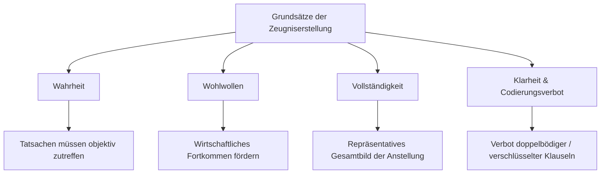

## Gesetzeswortlaut

> **Art. 330a OR — Arbeitszeugnis**
>
> ¹ Der Arbeitnehmer kann jederzeit vom Arbeitgeber ein Zeugnis verlangen, das sich über die Art und Dauer des Arbeitsverhältnisses sowie über seine Leistungen und sein Verhalten ausspricht.
>
> ² Auf besonderes Verlangen des Arbeitnehmers hat sich das Zeugnis auf Angaben über die Art und Dauer des Arbeitsverhältnisses zu beschränken.

## Überblick und Bedeutung

Art. 330a OR begründet den **gesetzlichen Anspruch des Arbeitnehmers auf Ausstellung eines Arbeitszeugnisses**. Das Arbeitszeugnis hat eine doppelte Funktion:
1. **Förderung des wirtschaftlichen Fortkommens** des Arbeitnehmers bei der Bewerbung auf dem Arbeitsmarkt.
2. **Zuverlässige Information künftiger Arbeitgeber** über die berufliche Qualifikation, Erfahrung und Persönlichkeit des Bewerbers ([BGE 129 III 177 E. 3.2](https://entscheidsuche.ch/docs/CH_BGE/CH_BGE_005_BGE-129-III-177_2003.html#consideration_3.2); [BGE 136 III 510 E. 4.1](https://entscheidsuche.ch/docs/CH_BGE/CH_BGE_005_BGE-136-III-510_2010.html#consideration_4.1)).

Der Anspruch ist **einseitig zwingend** (Art. 362 OR) und kann vertraglich weder im Voraus wegbedungen noch eingeschränkt werden. Er verjährt nach Art. 127 OR innerhalb von **10 Jahren** ab Beendigung des Arbeitsverhältnisses.

## Zeugnisarten (Abs. 1 und 2)

Das Gesetz unterscheidet zwei Zeugnisformen:

### 1. Qualifiziertes Arbeitszeugnis (Vollzeugnis, Abs. 1)
Das Vollzeugnis ist der **Regelfall**. Es muss zwingend vier Kernbereiche umfassen:
- **Art und Funktion**: Genaue Bezeichnung der Position, Hauptaufgaben und Kompetenzen.
- **Dauer**: Beginn und Ende des Arbeitsverhältnisses (inkl. relevanter Funktionswechsel).
- **Leistung**: Fachwissen, Arbeitsqualität, Einsatzbereitschaft, Arbeitsmenge und erzielte Erfolge.
- **Verhalten**: Auftreten gegenüber Vorgesetzten, Kollegen, Mitarbeitenden und Kunden.

Der Arbeitnehmer kann auch während des laufenden Arbeitsverhältnisses **jederzeit ein Zwischenzeugnis** verlangen (z.B. bei Vorgesetztenwechsel, Reorganisation oder Bewerbungsabsichten).

### 2. Einfaches Arbeitszeugnis (Arbeitsbestätigung, Abs. 2)
Nur auf **ausdrückliches, besonderes Verlangen** des Arbeitnehmers darf sich das Zeugnis auf Art und Dauer der Beschäftigung beschränken ([BGE 129 III 177 E. 3.3](https://entscheidsuche.ch/docs/CH_BGE/CH_BGE_005_BGE-129-III-177_2003.html#consideration_3.3)). Ein eigenmächtiges Ausstellen einer blossen Bestätigung durch den Arbeitgeber ist unzulässig. Der Arbeitnehmer kann auch kumulativ neben einem Vollzeugnis eine Arbeitsbestätigung verlangen ([Obergericht Zürich RU180008](https://entscheidsuche.ch/docs/ZH_Obergericht/ZH_OG_001_RU180008_2018-06-27.pdf)).

## Die vier fundamentalen Grundsätze der Zeugniserstellung

1. **Grundsatz der Wahrheit**: Alle Aussagen müssen den Tatsachen entsprechen. Unwahre Lobpreisungen (Gefälligkeitszeugnisse) sind unzulässig und können den Aussteller haftpflichtig machen gegenüber gutgläubigen Dritterwerbern.
2. **Grundsatz des Wohlwollens**: Das Zeugnis ist in wohlwollendem Ton abzufassen, um dem Arbeitnehmer keine unnötigen Hürden bei der Stellensuche zu bereiten. **Kollisionsregel**: Im Konfliktfall geht die **Wahrheit dem Wohlwollen vor** ([BGE 136 III 510 E. 4.1](https://entscheidsuche.ch/docs/CH_BGE/CH_BGE_005_BGE-136-III-510_2010.html#consideration_4.1)).
3. **Grundsatz der Vollständigkeit**: Das Zeugnis muss ein ausgewogenes und getreues Gesamtbild der gesamten Anstellungsdauer widerspiegeln. Einmalige Verfehlungen oder isolierte Vorfälle dürfen nicht erwähnt werden, es sei denn, sie prägen das Gesamtbild massgeblich.
4. **Grundsatz der Klarheit und Codierungsverbot**: Zeugnisse müssen unmissverständlich formuliert sein. **Geheimcodes und doppeldeutige Floskeln** (z.B. «Er bemühte sich stets, den Anforderungen zu genügen» = ungenügende Leistung; «Er war ein geselliger Kollege» = Alkoholproblem) sind widerrechtlich ([Verwaltungsgericht Zürich VB.2014.00534](https://entscheidsuche.ch/docs/ZH_Verwaltungsgericht/ZH_VG_001_-VB-2014-00534_2015-09-16.html)).

## Erwähnung heikler Tatsachen

### 1. Krankheit und Absenzen
Krankheitsbedingte Absenzen dürfen im Zeugnis **nur ausnahmsweise** erwähnt werden ([BGE 136 III 510 E. 4.1](https://entscheidsuche.ch/docs/CH_BGE/CH_BGE_005_BGE-136-III-510_2010.html#consideration_4.1)):
- wenn die Krankheit die Eignung zur Aufgabenerfüllung grundsätzlich in Frage stellte und den sachlichen Kündigungsgrund bildete;
- wenn die Absenz im Verhältnis zur Gesamtdauer der Anstellung erheblich ins Gewicht fiel (z.B. über 1 Jahr Absenz bei 2-jähriger Anstellung, [BGE 136 III 510 E. 4.4](https://entscheidsuche.ch/docs/CH_BGE/CH_BGE_005_BGE-136-III-510_2010.html#consideration_4.4));
- Reine Mutterschafts- und Schwangerschaftsurlaube sind als solche zu bezeichnen und nicht als Krankheit zu deklarieren ([Verwaltungsgericht Zürich VB.2019.00414](https://entscheidsuche.ch/docs/ZH_Verwaltungsgericht/ZH_VG_001_-VB-2019-00414_2019-11-19.html)).

### 2. Kündigungsgrund und Beendigungsmodalitäten
Der Kündigungsgrund gehört grundsätzlich **nur auf Wunsch des Arbeitnehmers** ins Zeugnis. Eine arbeitgeberseitige Erwähnung ist nur zulässig, wenn das Arbeitsverhältnis wegen schwerwiegender Verfehlungen fristlos aufgelöst wurde oder der Kündigungsgrund für die Gesamtbeurteilung unerlässlich ist.

## Praxisfragen und gerichtliche Durchsetzung

### 1. Die Zeugnisberichtigungsklage
- Bei Uneinigkeit über den Inhalt steht dem Arbeitnehmer die **Zeugnisberichtigungsklage** (Leistungsklage nach Art. 330a OR) beim Arbeitsgericht offen ([Obergericht Zürich LA210033](https://entscheidsuche.ch/docs/ZH_Obergericht/ZH_OG_001_LA210033_2022-09-20.pdf)).
- **Wichtig für das Rechtsbegehren**: Der Kläger darf nicht bloss abstrakt «ein besseres Zeugnis» fordern, sondern muss im Rechtsbegehren den **genauen, formulierten Wortlaut des verlangten Zeugnisses** einreichen ([BVGE 2012/22 E. 2](https://entscheidsuche.ch/docs/CH_BVGer/CH_BVGE_001_BVGE-2012-22_2012-06-27.pdf)).

### 2. Beweislastverteilung vor Gericht
- **Durchschnittliche Leistung**: Wird eine durchschnittliche Beurteilung («zur vollen Zufriedenheit») bescheinigt, trägt der Arbeitnehmer die Beweislast für eine überdurchschnittliche Leistung («stets zur vollsten Zufriedenheit»).
- **Unterdurchschnittliche Qualifikation**: Bescheinigt der Arbeitgeber eine ungenügende oder unterdurchschnittliche Leistung, trägt der **Arbeitgeber die Beweislast** für die behaupteten Mängel.
- **Bindung an Zwischenzeugnisse**: Weicht das Schlusszeugnis ohne sachlichen Grund massiv negativ vom früheren Zwischenzeugnis ab, muss der Arbeitgeber die angebliche Leistungsverschlechterung substantiieren und beweisen ([Kantonsgericht Basel-Landschaft 810 23 48](https://entscheidsuche.ch/docs/BL_Gerichte/BL_KG_003_810-23-48_2023-11-15.pdf)).
