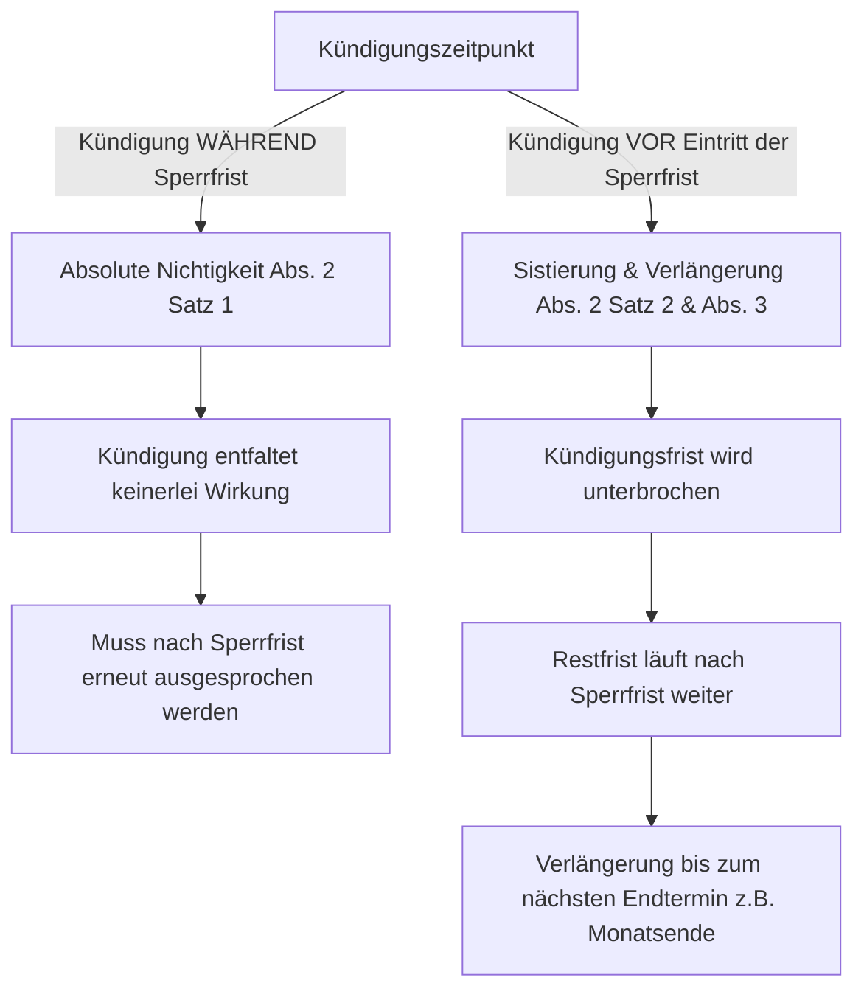

## Gesetzeswortlaut

> **Art. 336c OR — Kündigung zur Unzeit / Durch den Arbeitgeber**
>
> ¹ Nach Ablauf der Probezeit darf der Arbeitgeber das Arbeitsverhältnis nicht kündigen:
> a. während die andere Partei schweizerischen obligatorischen Militär- oder Schutzdienst oder schweizerischen Zivildienst leistet, sowie, sofern die Dienstleistung mehr als elf Tage dauert, während vier Wochen vorher und nachher;
> b. während der Arbeitnehmer ohne eigenes Verschulden durch Krankheit oder durch Unfall ganz oder teilweise an der Arbeitsleistung verhindert ist, und zwar im ersten Dienstjahr während 30 Tagen, ab zweitem bis und mit fünftem Dienstjahr während 90 Tagen und ab sechstem Dienstjahr während 180 Tagen;
> c. während der Schwangerschaft und in den 16 Wochen nach der Niederkunft einer Arbeitnehmerin;
> c^bis. vor dem Ende des verlängerten Mutterschaftsurlaubs nach Artikel 329f Absatz 2;
> c^ter. zwischen dem Beginn des Urlaubs nach Artikel 329f Absatz 3 und dem letzten bezogenen Urlaubstag, längstens aber während drei Monaten ab dem Ende der Sperrfrist nach Buchstabe c;
> c^quater. solange der Anspruch auf Betreuungsurlaub nach Artikel 329i besteht, längstens aber während sechs Monaten ab dem Tag, an dem die Rahmenfrist zu laufen beginnt;
> c^quinquies. während des Urlaubs nach Artikel 329g^bis;
> d. während der Arbeitnehmer mit Zustimmung des Arbeitgebers an einer von der zuständigen Bundesbehörde angeordneten Dienstleistung für eine Hilfsaktion im Ausland teilnimmt.
>
> ² Die Kündigung, die während einer der in Absatz 1 festgesetzten Sperrfristen erklärt wird, ist nichtig; ist dagegen die Kündigung vor Beginn einer solchen Frist erfolgt, aber die Kündigungsfrist bis dahin noch nicht abgelaufen, so wird deren Ablauf unterbrochen und erst nach Beendigung der Sperrfrist fortgesetzt.
>
> ³ Gilt für die Beendigung des Arbeitsverhältnisses ein Endtermin, wie das Ende eines Monats oder einer Arbeitswoche, und fällt dieser nicht mit dem Ende der fortgesetzten Kündigungsfrist zusammen, so verlängert sich diese bis zum nächstfolgenden Endtermin.

## Überblick und Bedeutung

Art. 336c OR begründet den **zeitlichen Kündigungsschutz (Kündigungssperren zur Unzeit)** zugunsten des Arbeitnehmers. Zweck der Norm ist es, den Arbeitnehmer in Phasen besonderer Schutzbedürftigkeit (Krankheit, Unfall, Schwangerschaft/Mutterschaft, Militärdienst) vor dem Verlust des Arbeitsplatzes zu bewahren, da eine Stellensuche in diesen Situationen verunmöglicht oder unzumutbar erschwert ist ([BGE 128 III 212 E. 2c](https://entscheidsuche.ch/docs/CH_BGE/CH_BGE_005_BGE-128-III-212_2002.html#consideration_2.c)).

Der Schutz von Art. 336c OR ist **einseitig zwingend** (Art. 362 OR) und gilt ausschliesslich für arbeitgeberseitige Kündigungen. Kündigt der Arbeitnehmer selbst, finden die Sperrfristen keine Anwendung (vorbehaltlich Art. 336d OR).

## Anwendungsbereich und Voraussetzungen (Abs. 1)

1. **Ablauf der Probezeit**: Der Sperrfristenschutz greift **erst nach Ablauf der Probezeit** ([BGE 134 III 108](https://entscheidsuche.ch/docs/CH_BGE/CH_BGE_005_BGE-134-III-108_2008.html)). Während der Probezeit ausgesprochene Kündigungen sind auch bei Krankheit oder Unfall gültig.
2. **Krankheit und Unfall (Abs. 1 lit. b)**:
   - **Staffelung nach Dienstjahren**:
     - 1. Dienstjahr: **30 Tage**
     - 2. bis und mit 5. Dienstjahr: **90 Tage**
     - ab 6. Dienstjahr: **180 Tage**
   - **Teilarbeitsunfähigkeit**: Auch eine teilweise Arbeitsunfähigkeit löst den **vollen** Sperrfristenschutz in Tagen aus (keine proportionale Kürzung der Sperrtage).
3. **Schwangerschaft und Mutterschaft (Abs. 1 lit. c–c^quinquies)**:
   - Während der gesamten Schwangerschaft und in den **16 Wochen nach der Niederkunft**.
   - Ergänzt durch die neueren Schutzfristen bei verlängertem Mutterschaftsurlaub (lit. c^bis), Urlaub des überlebenden Elternteils (lit. c^ter / lit. c^quinquies) und Betreuungsurlaub für gesundheitlich schwer beeinträchtigte Kinder (lit. c^quater, max. 6 Monate).

## Rechtsfolgen einer Kündigung zur Unzeit (Abs. 2 und 3)

Das Gesetz unterscheidet strikt zwei Konstellationen:

### 1. Kündigung während der Sperrfrist: Absolute Nichtigkeit
Wird die Kündigung ausgesprochen, während bereits eine Sperrfrist läuft, ist sie **von Gesetzes wegen absolut nichtig** ([BGE 128 III 212 E. 3a](https://entscheidsuche.ch/docs/CH_BGE/CH_BGE_005_BGE-128-III-212_2002.html#consideration_3.a)). Sie entfaltet keine Rechtswirkung und wird auch nach Ablauf der Sperrfrist nicht automatisch wirksam. Der Arbeitgeber muss die Kündigung nach Beendigung der Sperrfrist unter Einhaltung der vertraglichen Kündigungsfrist **formgültig wiederholen**.

### 2. Kündigung vor Beginn der Sperrfrist: Sistierung und Verlängerung
Erfolgt die Kündigung vor Eintritt des Verhinderungsgrundes, ist sie gültig. Tritt während der laufenden Kündigungsfrist eine Sperrfrist ein:
1. **Unterbrechung**: Der Ablauf der Kündigungsfrist wird für die Dauer der Verhinderung (maximal bis zur gesetzlichen Höchstdauer) unterbrochen.
2. **Fortsetzung**: Nach Wegfall der Arbeitsunfähigkeit bzw. Ablauf der maximalen Sperrfrist läuft die restliche Kündigungsfrist weiter.
3. **Endterminverlängerung (Abs. 3)**: Fällt das Ende der fortgesetzten Kündigungsfrist nicht auf einen vertraglichen Endtermin (z.B. Monatsende), verlängert sich das Arbeitsverhältnis automatisch bis zum nächstfolgenden Endtermin ([Kantonsgericht St. Gallen BZ.2004.47](https://entscheidsuche.ch/docs/SG_Gerichte/SG_KG_002_BZ-2004-47_2005-01-06.pdf)).

## Praxisfragen aus der Gerichtspraxis

### 1. Arbeitsplatzbezogene Arbeitsunfähigkeit
- **Grundsatz**: Eine rein arbeitsplatzbezogene Arbeitsunfähigkeit (z.B. Blockade ausschliesslich gegenüber dem konkreten Vorgesetzten oder Betrieb bei voller Leistungsfähigkeit für andere Arbeitgeber) löst **keinen Sperrfristenschutz nach Art. 336c OR** aus ([BGer 4A_395/2021 E. 3](https://entscheidsuche.ch/docs/CH_BGer/CH_BGer_004_4A-395-2021_2022-04-04.html); [BVGE 2017 I/1](https://entscheidsuche.ch/docs/CH_BVGer/CH_BVGE_001_BVGE-2017-I-1_2017-03-16.pdf)).
- **Begründung**: Da der Arbeitnehmer auf dem allgemeinen Arbeitsmarkt vermittelbar und voll einsatzfähig ist, besteht keine Benachteiligung bei der Stellensuche, womit der Schutzzweck von Art. 336c OR entfällt.

### 2. Mehrere Verhinderungsfälle und Rückfall (Krankheit vs. neues Ereignis)
- Tritt während der Kündigungsfrist eine **neue, voneinander unabhängige Krankheit** oder ein Unfall ein, wird für jedes neue Ereignis eine **separate Sperrfrist** ausgelöst.
- Handelt es sich dagegen um einen **Rückfall** oder eine Fortdauer derselben Grundkrankheit, läuft keine neue Frist; es wird lediglich das noch verbleibende Restkontingent der ursprünglichen Sperrfrist aufgebraucht ([Kantonsgericht St. Gallen BO.2016.47](https://entscheidsuche.ch/docs/SG_Gerichte/SG_KG_002_BO-2016-47_2017-06-09.pdf)).
- Der Übergang in ein neues Dienstjahr während einer andauernden Krankheit eröffnet **keine neue Sperrfrist**.
