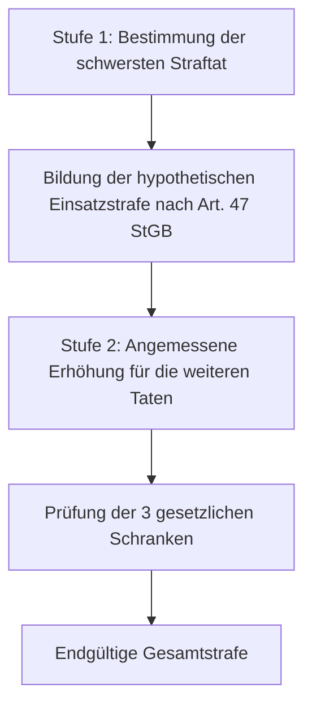
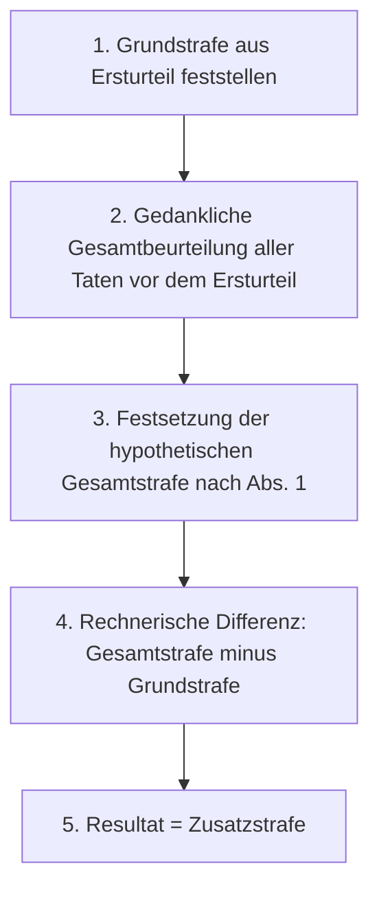

## Gesetzeswortlaut

> **Art. 49 StGB — Konkurrenzen**
>
> 1 Hat der Täter durch eine oder mehrere Handlungen die Voraussetzungen für mehrere gleichartige Strafen erfüllt, so verurteilt ihn das Gericht zu der Strafe der schwersten Straftat und erhöht sie angemessen. Es darf jedoch das Höchstmass der angedrohten Strafe nicht um mehr als die Hälfte erhöhen. Dabei ist es an das gesetzliche Höchstmass der Strafart gebunden.
>
> 2 Hat das Gericht eine Tat zu beurteilen, die der Täter begangen hat, bevor er wegen einer andern Tat verurteilt worden ist, so bestimmt es die Zusatzstrafe in der Weise, dass der Täter nicht schwerer bestraft wird, als wenn die strafbaren Handlungen gleichzeitig beurteilt worden wären.
>
> 3 Hat der Täter eine oder mehrere Taten vor Vollendung des 18. Altersjahres begangen, so dürfen diese bei der Bildung der Gesamtstrafe nach den Absätzen 1 und 2 nicht stärker ins Gewicht fallen, als wenn sie für sich allein beurteilt worden wären.
{: .gesetzeszitat}

*Wortlaut geprüft gegen [Fedlex, SR 311.0](https://www.fedlex.admin.ch/eli/cc/54/757_781_799/de), Stand der Konsolidierung 12. Juni 2026.*

### Die Konkurrenzregeln auf einen Blick

| Bestimmung | Anwendungsbereich / Konstellation | Gesetzliche Methode | Schranken und Rechtsfolgen |
|---|---|---|---|
| **Art. 49 Abs. 1 StGB** | Gleichzeitige Konkurrenz mehrerer Delikte (Idealkonkurrenz oder Realkonkurrenz) | Asperationsprinzip: Strafe für die schwerste Straftat (Einsatzstrafe) bestimmen und für weitere Delikte angemessen schärfen | Gilt nur bei gleichartigen Strafen («konkrete Methode»); max. +50 % des angedrohten Höchstmasses; gebunden an absolutes Höchstmass der Strafart (z.B. Art. 40 StGB); Kumulation bei Ungleichartigkeit |
| **Art. 49 Abs. 2 StGB** | Retrospektive Konkurrenz: Tat begangen vor einer früheren Verurteilung (Ersturteil) | Differenzmethode: Bildung einer hypothetischen Gesamtstrafe für alle Taten abzüglich der rechtskräftigen Grundstrafe | Keine Reformatio des Ersturteils; Gleichartigkeit der Strafen erforderlich; Stichtag ist Tag des erstinstanzlichen Sachurteils bzw. Strafbefehls |
| **Art. 49 Abs. 3 StGB** | Jugendstraftaten (vor Vollendung des 18. Altersjahrs) im Zusammentreffen mit Erwachsenendelikten | Begrenzungsgebot: Keine Mehrbelastung bei Gesamtstrafenbildung | Taten dürfen nicht schwerer wiegen, als wenn sie isoliert nach Jugendstrafrecht (JStG) geahndet worden wären |

---

## Überblick und Bedeutung

Art. 49 StGB regelt die richterliche Strafzumessung bei **Tatmehrheit und Konkurrenzen**. Das Schweizer Recht unterscheidet im Grundsatz drei Modelle zur Bewältigung von Mehrfachtaten:
1. **Kumulationsprinzip (Addition)**: Sämtliche Einzelstrafen werden rechnerisch zusammengezählt.
2. **Absorptionsprinzip (Verschluckung)**: Die schwerste Strafe schliesst alle leichteren Strafen vollständig aus.
3. **Asperationsprinzip (Schärfung)**: Das Gericht setzt eine Einsatzstrafe für das schwerste Delikt fest und schärft diese für die weiteren Straftaten angemessen.

Das schweizerische Strafgesetzbuch folgt bei gleichartigen Strafen dem **Asperationsprinzip** (Abs. 1). Dahinter steht die kriminalpolitische Wertung, dass die blosse Addition von Strafen ab einer gewissen Höhe unverhältnismässig hart wirkt, weil der Strafempfindungs- und Sühnewert weiterer Strafzeiteinheiten degressiv abnimmt («abnehmender Grenznutzen der Strafe»). Umgekehrt würde eine blosse Absorption dazu führen, dass Nebendelikte sanktionslos blieben. 

Art. 49 StGB verankert diesen Ausgleich nicht nur für das gleichzeitige Urteil (Abs. 1), sondern dehnt ihn über die **Zusatzstrafe bei retrospektiver Konkurrenz** (Abs. 2) auch auf den Fall aus, dass Delikte zufällig in getrennten Verfahren beurteilt werden. Der Täter soll durch eine verfahrensbedingte Spaltung der Urteile weder benachteiligt noch ungerechtfertigt begünstigt werden ([BGE 142 IV 265 E. 2.3](https://entscheidsuche.ch/docs/CH_BGE/CH_BGE_006_BGE-142-IV-265_2016.html#consideration_2.3)).

Flankiert wird die Bestimmung durch das Gebot der **konkreten Gleichartigkeit**: Eine Gesamtstrafe darf nur gebildet werden, wenn für die einzelnen Delikte im konkreten Fall dieselbe Strafart (nur Freiheitsstrafen oder nur Geldstrafen) gewählt wird ([BGE 144 IV 217 E. 2.2](https://entscheidsuche.ch/docs/CH_BGE/CH_BGE_006_BGE-144-IV-217_2018.html#consideration_2.2); [BGE 144 IV 313 E. 1.1](https://entscheidsuche.ch/docs/CH_BGE/CH_BGE_006_BGE-144-IV-313_2018.html#consideration_1.1)). Treffen ungleichartige Strafen zusammen, schliesst das Gesetz eine Asperation aus; es gilt zwingend das Kumulationsprinzip ([BGE 137 IV 57 E. 4.3](https://entscheidsuche.ch/docs/CH_BGE/CH_BGE_006_BGE-137-IV-57_2011.html#consideration_4.3)).

---

### Prüfschema: Die Konkurrenzprüfung in ihrer logischen Reihenfolge

Die nachfolgende Tabelle fasst die dogmatische Prüfungsreihenfolge zusammen. Jede Zeile bildet zugleich einen Hauptabschnitt der vorliegenden Kommentierung:

| Nr. | Prüfungsstufe / Merkmal | Was zu prüfen ist | Behauptungs- und Beweislast / Rechtsnatur | Abschnitt |
|---|---|---|---|---|
| 1 | **Vorfrage: Konkurrenzform & Handlungseinheit** | Abgrenzung echte Konkurrenz (Ideal- oder Realkonkurrenz) vs. unechte Konkurrenz (Spezialität, Subsidiarität, Konsumtion); Vorliegen natürlicher oder juristischer Handlungseinheiten | Gericht von Amtes wegen; materiellrechtliche Auslegungsfrage | [A](#a-vorfrage-konkurrenzform-und-handlungseinheiten) |
| 2 | **Gleichzeitige Konkurrenz: Gleichartigkeit (Abs. 1)** | Erfüllung der Voraussetzungen für mehrere Strafen; Vorliegen *konkret gleichartiger* Sanktionen (Freiheitsstrafe/Freiheitsstrafe oder Geldstrafe/Geldstrafe); Ausschluss der Umwandlung zur Gesamtsanktion | Gericht von Amtes wegen; Anforderung an Strafartenwahl gemäss Art. 41 StGB | [B.1](#1-tatbestandsvoraussetzung-gleichartige-strafen-konkrete-methode) |
| 3 | **Gleichzeitige Konkurrenz: Asperationsmethode (Abs. 1)** | Ermittlung der schwersten Tat; Festsetzung der hypothetischen Einsatzstrafe; angemessene Erhöhung (Schärfung) für Nebendelikte; Verbot der Einheitsstrafe | Gericht; begründungspflichtig nach Art. 50 StGB | [B.2](#2-das-zweistufige-berechnungsmodell-einsatzstrafe-und-asperation) |
| 4 | **Gleichzeitige Konkurrenz: Gesetzliche Schranken (Abs. 1)** | Einhaltung der 50 %-Schärfungsgrenze des angedrohten Höchstsatzes; Bindung an das absolute Höchstmass der Strafart (Art. 40 StGB); Kumulationsobergrenze (BGE 143 IV 145) | Gericht von Amtes wegen; gesetzliche Obergrenzen | [B.3](#3-die-drei-gesetzlichen-obergrenzen-der-gesamtstrafe) |
| 5 | **Retrospektive Konkurrenz: Zäsur & Stichtag (Abs. 2)** | Tat begangen *vor* einer früheren Verurteilung; massgebender Zäsurzeitpunkt (Datum des erstinstanzlichen Sachurteils bzw. Strafbefehls); Ausschluss von Nachtaten | Aktenkundig (Strafregister und Urteilsdaten); Rüge bei fehlerhafter Stichtagswahl | [C.1](#1-voraussetzungen-der-retrospektiven-konkurrenz-und-zäsurwirkung) |
| 6 | **Retrospektive Konkurrenz: Zusatzstrafenbildung (Abs. 2)** | Berechnung nach der Differenzmethode: Bildung der hypothetischen Gesamtstrafe abzüglich Grundstrafe; Verbot der Reformation des Ersturteils; Gleichartigkeit | Gericht; rechnerische und ermessensbezogene Begründung | [C.2](#2-methodik-der-zusatzstrafe-die-differenzmethode) |
| 7 | **Teilweise retrospektive Konkurrenz (Abs. 2)** | Konstellation mit Taten teils vor und teils nach dem Ersturteil; Stufenweises Vorgehen nach BGE 145 IV 1 | Gericht von Amtes wegen | [C.3](#3-teilweise-retrospektive-konkurrenz-und-seriendelikte) |
| 8 | **Schutz von Jugendtaten (Abs. 3)** | Begrenzungsgebot für vor Vollendung des 18. Altersjahrs verübte Taten; Trennung von Jugend- und Erwachsenenstrafrecht | Geburtsdatum aktenkundig; Verbot der unzulässigen Schlechterstellung | [D](#d-schutz-von-jugendtaten-art-49-abs-3-stgb) |
| 9 | **Begründungspflicht (Art. 50 StGB)** | Transparente Darlegung von Einsatzstrafe, Einzelstrafen und Asperationszuschlag im Urteil; Kognition des Bundesgerichts | Gericht von Amtes wegen; Formrüge bei Verletzung der Begründungspflicht | [E](#e-begründungspflicht-bei-konkurrenzen-art-50-stgb) |

---

## Kommentierung

### A. Vorfrage: Konkurrenzform und Handlungseinheiten

#### 1. Abgrenzung echte vs. unechte Konkurrenz
Art. 49 StGB gelangt nur zur Anwendung, wenn **echte Konkurrenz** vorliegt. Verletzt der Täter durch sein Verhalten zwar dem Wortlaut nach mehrere Strafgesetze, schöpft aber eine Bestimmung den Unrechtsgehalt des gesamten Verhaltens bereits vollständig ab, liegt **unechte Konkurrenz** (Gesetzeskonkurrenz) vor. In diesem Fall verdrängt die vorrangige Norm die übrigen Tatbestände; eine Asperation nach Art. 49 StGB findet nicht statt:
- **Spezialität**: Die speziellere Bestimmung enthält alle Merkmale der allgemeinen Bestimmung und weist ein zusätzliches qualifizierendes Merkmal auf (z.B. Mord gemäss Art. 112 StGB gegenüber vorsätzlicher Tötung gemäss Art. 111 StGB; Tätigwerden als qualifizierter Banden- oder Gewerbsmässigkeitstäter).
- **Subsidiarität**: Eine Bestimmung greift nach ihrem Wortlaut oder Sinn nur ein, wenn kein schwererer Tatbestand erfüllt ist (formelle Subsidiarität, z.B. Art. 126 Abs. 1 StGB gegenüber Art. 123 StGB; oder materielle Subsidiarität, z.B. Gefährdungsdelikte gegenüber vollendeten Verletzungsdelikten).
- **Konsumtion**: Ein Tatbestand schliesst ein typisches, regelmässig mitverwirklichtes Begleitdelikt mit ein, sofern dessen Unwert im Hauptdelikt mitabgegolten ist (z.B. Verdrängung der Nötigung nach Art. 181 StGB durch Raub nach Art. 140 StGB, soweit die Gewalt oder Drohung nicht über das für den Raub Erforderliche hinausgeht; Verdrängung der Sachbeschädigung bei Tötungsdelikten hinsichtlich der Kleidung des Opfers).

Echte Konkurrenz liegt hingegen vor, wenn mehrere verletzte Normen **unterschiedliche Schutzgüter** schützen oder der Unrechtsgehalt einer Tat durch die Verurteilung nach der anderen Norm nicht voll erfasst wird. Echte Konkurrenz tritt entweder als **Idealkonkurrenz** (Verletzung mehrerer Bestimmungen oder mehrfache Verletzung derselben Bestimmung durch ein und dieselbe Handlung) oder als **Realkonkurrenz** (Verletzung durch mehrere selbständige Handlungen) auf. Beide Konkurrenzformen werden in Art. 49 Abs. 1 StGB gleichbehandelt.

#### 2. Handlungseinheiten und Deliktsserien
Von Realkonkurrenz abzugrenzen sind Handlungen, die zu einer Einheit verschmelzen:
- **Natürliche Handlungseinheit**: Mehrere gleichartige Einzelakte, die auf einem einheitlichen Willensentschluss beruhen und in einem derart engen zeitlichen und räumlichen Zusammenhang stehen, dass sie sich bei objektiver Betrachtung als ein zusammengehörendes Geschehen darstellen (z.B. mehrere Faustschläge während einer Schlägerei, fortgesetztes Leeren mehrerer Kassenfächer hintereinander).
- **Tatbestandliche / juristische Handlungseinheit**: Der gesetzliche Tatbestand umschreibt von vornherein ein mehraktiges oder dauerndes Verhalten als ein einziges Delikt (z.B. Dauerdelikte wie Freiheitsberaubung nach Art. 183 StGB; gewerbsmässige Begehung nach Art. 139 Ziff. 2 oder Art. 146 Ziff. 2 StGB). Die Rechtsfigur des fortgesetzten Delikts ist im schweizerischen Strafrecht seit Inkrafttreten des revidierten Allgemeinen Teils per 1. Januar 2007 aufgegeben worden.

---

#### 3. Kasuistik zur Konkurrenzabgrenzung: Angewandt vs. Verworfen

##### Angewandt: Echte Konkurrenz zwischen Einbruchdiebstahl, Sachbeschädigung und Hausfriedensbruch
Zwei Täter brachen nachts die Eingangstüre eines Juweliergeschäfts mit Brecheisen auf, schlugen im Verkaufsraum zwei Vitrinen ein und entwendeten Schmuck im Gesamtwert von Fr. 85'000. Der an den Vitrinen und der Eingangstüre angerichtete Sachschaden belief sich auf Fr. 12'000. Die Verteidigung machte geltend, die Sachbeschädigung (Art. 144 StGB) und der Hausfriedensbruch (Art. 186 StGB) seien blosse Mittel zur Ausführung des Diebstahls und würden durch Art. 139 StGB konsumiert. Das Bundesgericht verwarf diesen Einwand und bestätigte seine ständige Praxis ([BGE 123 IV 113 E. 3h](https://entscheidsuche.ch/docs/CH_BGE/CH_BGE_006_BGE-123-IV-113_1997-06-20.html)): Zwischen Diebstahl, Sachbeschädigung und Hausfriedensbruch besteht beim Einbruchdiebstahl **echte Realkonkurrenz**. Art. 139 StGB schützt das fremde Gewahrsam und Eigentum an der beweglichen Beute; Art. 144 StGB schützt demgegenüber die Sachsubstanz des beschädigten Gebäudes oder Mobiliars, und Art. 186 StGB schützt den Hausfrieden. Weil der Sachschaden die Beute an Wert oft sogar übersteigt, wäre eine straflose Konsumtion mit dem Unrechtsausgleich unvereinbar. Die Strafen sind nach Art. 49 Abs. 1 StGB zu einer Gesamtstrafe zu verbinden.

##### Angewandt: Echte Gesetzeskonkurrenz zwischen Betrug und Urkundenfälschung
Ein Geschäftsführer reichte einer Bank im Rahmen eines Kreditgesuchs gefälschte Jahresrechnungen und fingierte Debitorenlisten ein, woraufhin die Bank ein Darlehen von Fr. 2.4 Millionen auszahlte, das infolge Konkurses uneinbringlich wurde. Der Angeklagte rügte, die Urkundenfälschung (Art. 251 StGB) habe ausschliesslich als Täuschungsmittel für den Betrug (Art. 146 StGB) gedient und trete im Wege der Konsumtion zurück. Das Bundesgericht stellte klar ([BGE 129 IV 53 E. 3](https://entscheidsuche.ch/docs/CH_BGE/CH_BGE_006_BGE-129-IV-53_2003.html#consideration_3)): Zwischen Urkundenfälschung und Betrug besteht grundsätzlich **echte Gesetzeskonkurrenz**. Art. 251 StGB schützt das überindividuelle Vertrauen der Allgemeinheit in die Zuverlässigkeit und Echtheit des Beweisverkehrs mit Urkunden; Art. 146 StGB schützt das individuelle Vermögen. Da beide Normen voneinander unabhängige Rechtsgüter schützen, erfasst der Betrugsvorwurf das Unrecht der Urkundenfälschung nicht. Beide Bestimmungen sind nebeneinander anzuwenden und die Strafen nach Art. 49 Abs. 1 StGB zu asperieren.

##### Angewandt: Echte Konkurrenz zwischen Fahren in fahrunfähigem Zustand und Verkehrsregelverletzung
Ein Fahrzeuglenker steuerte seinen Personenwagen mit einer Blutalkoholkonzentration von 1.8 Promille und geriet auf einer kurvenreichen Ausserortsstrecke wegen übersetzter Geschwindigkeit auf die Gegenfahrbahn, wo es zu einer Streifkollision kam. Das Bundesgericht bestätigte die echte Konkurrenz zwischen Art. 91 Abs. 1 SVG (Fahren in fahrunfähigem Zustand) und Art. 90 Abs. 2 SVG (grobe Verletzung der Verkehrsregeln) ([BGE 126 IV 80 E. 1](https://entscheidsuche.ch/docs/CH_BGE/CH_BGE_006_BGE-126-IV-80_2000.html#consideration_1)): Art. 91 SVG sanktioniert das Führen eines Motorfahrzeugs im Zustand verminderter Fahrfähigkeit als abstraktes Gefährdungsdelikt unabhängig von der konkreten Fahrweise; Art. 90 SVG erfasst demgegenüber die konkrete Gefährdung durch den Fahrfehler. Beide Normen stehen nebeneinander in echter Konkurrenz.

##### Verworfen: Unechte Konkurrenz (Konsumtion) von Nötigung und Tätlichkeit bei Raub
Drei Täter drängten einen Passanten in eine Unterführung, packten ihn an den Armen und bedrohten ihn mit vorgehaltenem Klappmesser mit dem Tode, falls er sein Portemonnaie nicht aushändige. Nachdem der Passant die Geldbörse herausgegeben hatte, flüchteten die Täter. Das erstinstanzliche Gericht verurteilte die Täter wegen Raubes (Art. 140 Ziff. 1 StGB) sowie zusätzlich in echter Konkurrenz wegen Nötigung (Art. 181 StGB) und Tätlichkeiten (Art. 126 StGB). Das Bundesgericht hob den Entscheid auf ([BGE 141 IV 437 E. 3.2](https://entscheidsuche.ch/docs/CH_BGE/CH_BGE_006_BGE-141-IV-437_2015.html)): Die Gewaltanwendung und die Todesdrohung dienten ausschliesslich der Ermöglichung des Gewahrsamsbruchs an der Geldbörse. Weil Art. 140 StGB die Nötigungsmittel (Gewalt, Androhung gegenwärtiger Gefahr für Leib und Leben) tatbestandlich umschreibt, werden Art. 181 StGB und Art. 126 StGB durch den Raub vollständig **konsumiert**, sofern die Einwirkung zeitlich und sachlich nicht über das zur Beuteerlangung Erforderliche hinausging. Eine Asperation entfällt.

##### Verworfen: Unechte Konkurrenz von Drohung bei vollendeter Nötigung
Ein Beschuldigter forderte von seinem ehemaligen Geschäftspartner schriftlich und telefonisch die Rückgabe von Geschäftsakten und kündigte an, falls dieser die Unterlagen nicht bis Freitag herausgebe, werde er dessen Familie «einheizen und das Wohnhaus abbrennen». Der Geschäftspartner übergab die Akten daraufhin aus Furcht. Die Anklage forderte Schuldsprüche wegen Nötigung (Art. 181 StGB) und Drohung (Art. 180 StGB). Das Gericht verwarf echte Konkurrenz: Führte die Drohung dazu, dass das Opfer der Nötigungshandlung nachgab, geht der Auffangtatbestand von Art. 180 StGB im vollendeten Nötigungsdelikt im Wege der **materiellen Subsidiarität/Konsumtion** auf, sofern die Drohung keinen eigenständigen, über den Nötigungserfolg hinausgehenden Terrorisierungscharakter entfaltete.

---

#### 4. Kasuistiktabelle: Echte vs. unechte Konkurrenz

| Konstellation / Lebenssachverhalt | Beteiligte Straftatbestände | Konkurrenzverhältnis | Begründung / Tragende Erwägung | Leitentscheid |
|---|---|---|---|---|
| Einbruch in Geschäftsräume mittels Brecheisen; Vitrinen zerschlagen; Schmuck entwendet | Art. 139, Art. 144, Art. 186 StGB | **Echte Realkonkurrenz** | Getrennte Schutzgüter: Gewahrsam/Eigentum vs. Sachsubstanz vs. Hausrecht; Sachschaden oft höher als Beutewert | [BGE 123 IV 113 E. 3h](https://entscheidsuche.ch/docs/CH_BGE/CH_BGE_006_BGE-123-IV-113_1997-06-20.html) |
| Einreichung gefälschter Bilanzen und Debitorenlisten zur Erlangung eines Millionenbankkredits | Art. 146, Art. 251 StGB | **Echte Gesetzeskonkurrenz** | Urkundenfälschung schützt überindividuellen Urkundenbeweisverkehr; Betrug schützt individuelles Vermögen | [BGE 129 IV 53 E. 3](https://entscheidsuche.ch/docs/CH_BGE/CH_BGE_006_BGE-129-IV-53_2003.html#consideration_3) |
| Führen eines Motorfahrzeugs mit 1.8 Promille und massive Geschwindigkeitsüberschreitung mit Kollision | Art. 90 Abs. 2, Art. 91 Abs. 1 SVG | **Echte Konkurrenz** | Art. 91 SVG = abstraktes Gefährdungsdelikt (Zustand); Art. 90 SVG = konkrete Gefährdung durch Fahrfehler | [BGE 126 IV 80 E. 1](https://entscheidsuche.ch/docs/CH_BGE/CH_BGE_006_BGE-126-IV-80_2000.html#consideration_1) |
| Überfall auf Passanten unter Vorhalt eines Messers; Entwendung der Geldbörse | Art. 140, Art. 181, Art. 126 StGB | **Unechte Konkurrenz (Konsumtion)** | Raub umschreibt Nötigungsmittel als Tatbestandsbestandteil; Nötigung und Tätlichkeit sind mitabgegolten | [BGE 141 IV 437 E. 3.2](https://entscheidsuche.ch/docs/CH_BGE/CH_BGE_006_BGE-141-IV-437_2015.html) |
| Drohung mit Brandstiftung zur Durchsetzung der Herausgabe von Geschäftsakten; Opfer gibt nach | Art. 180, Art. 181 StGB | **Unechte Konkurrenz (Subsidiarität)** | Art. 180 StGB tritt hinter den vollendeten Nötigungserfolg zurück, sofern keine weitergehende Einschüchterung vorliegt | BGE 134 IV 216 / st. Praxis |
| Mehrfache Tötung zweier Personen durch Schüsse am selben Ort innerhalb weniger Minuten | Mehrfacher Mord (Art. 112 StGB) | **Echte Realkonkurrenz** | Höchstpersönliche Rechtsgüter (Leib und Leben): Jedes Opfer begründet ein eigenständiges Delikt | [BGE 141 IV 61 E. 6](https://entscheidsuche.ch/docs/CH_BGE/CH_BGE_006_BGE-141-IV-61_2015.html#consideration_6) |

> **Leitsatz.** Echte Konkurrenz setzt voraus, dass die verletzten Normen unterschiedliche Rechtsgüter schützen oder der Unrechtsgehalt des Verhaltens durch die Anwendung eines einzelnen Tatbestands nicht vollständig abgegolten wird; bei Verletzung höchstpersönlicher Rechtsgüter mehrerer Personen ist eine Handlungseinheit stets ausgeschlossen.

---

### B. Gleichzeitige Konkurrenz (Abs. 1) — Das Asperationsprinzip

#### 1. Tatbestandsvoraussetzung: Gleichartige Strafen («Konkrete Methode»)
Die Bildung einer Gesamtstrafe nach Art. 49 Abs. 1 StGB setzt zwingend voraus, dass der Täter durch eine oder mehrere Handlungen «die Voraussetzungen für mehrere gleichartige Strafen erfüllt» hat. Nach der vom Bundesgericht begründeten und gefestigten **«konkreten Methode»** beurteilt sich die Gleichartigkeit nicht nach den im Gesetz abstrakt angedrohten Strafrahmen, sondern nach der vom Richter **im konkreten Einzelfall gewählten Sanktionsart** ([BGE 144 IV 217 E. 2.2](https://entscheidsuche.ch/docs/CH_BGE/CH_BGE_006_BGE-144-IV-217_2018.html#consideration_2.2); [BGE 144 IV 313 E. 1.1](https://entscheidsuche.ch/docs/CH_BGE/CH_BGE_006_BGE-144-IV-313_2018.html#consideration_1.1)):
1. **Keine Gesamtfreiheitsstrafe bei Geldstrafen-Delikten**: Wählt das Gericht für eine Tat eine Geldstrafe und für eine andere eine Freiheitsstrafe, dürfen diese nicht zu einer einheitlichen Freiheitsstrafe zusammengezogen werden.
2. **Kumulationsgebot bei Ungleichartigkeit**: Treffen Geldstrafen und Freiheitsstrafen aufeinander, sind sie zwingend **kumulativ nebeneinander** auszusprechen ([BGE 137 IV 57 E. 4.3](https://entscheidsuche.ch/docs/CH_BGE/CH_BGE_006_BGE-137-IV-57_2011.html#consideration_4.3)).
3. **Verbot der Zwangsumwandlung zur Gesamtstrafe**: Das Gericht darf nicht eine für sich allein mit Geldstrafe zu ahndende Tat in eine Freiheitsstrafe «umwandeln», nur um eine Asperation zu ermöglichen oder weil die Addition mehrerer Geldstrafen die Höchstgrenze von Art. 34 StGB übersteigen würde ([BGE 144 IV 313 E. 1.1.2](https://entscheidsuche.ch/docs/CH_BGE/CH_BGE_006_BGE-144-IV-313_2018.html#consideration_1.1.2)).
4. **Mehrere Geldstrafen**: Das Bundesgericht stellte klar, dass auch mehrere Geldstrafen de lege lata nicht über das gesetzliche Höchstmass von Art. 34 Abs. 1 StGB hinaus zu einer einheitlichen Gesamtgeldstrafe verschmolzen werden können; auch hier gilt das Kumulationsprinzip ([BGE 144 IV 217 E. 3.6](https://entscheidsuche.ch/docs/CH_BGE/CH_BGE_006_BGE-144-IV-217_2018.html#consideration_3.6)).
5. **Bussen**: Bussen (Übertretungsstrafrecht, Art. 106 StGB) sind gegenüber Vergehen und Verbrechen stets ungleichartig und werden ausnahmslos kumulativ ausgesprochen.

---

#### 2. Das zweistufige Berechnungsmodell: Einsatzstrafe und Asperation
Liegen für mehrere Taten konkret gleichartige Strafen vor, erfolgt die Gesamtstrafenbildung in einem strikten zweistufigen Verfahren:

- **Schritt 1: Bestimmung der schwersten Straftat und Einsatzstrafe**:
  - Massgebend für die Schwerste Tat ist primär die abstrakt schwerste Strafdrohung des Gesetzes. Bei gleichem abstraktem Strafrahmen entscheidet diejenige Tat, die nach den konkreten Tatumständen das schwerste Verschulden offenbart.
  - Für diese Tat bildet das Gericht nach den allgemeinen Grundsätzen von Art. 47 StGB (Tat- und Täterkomponenten) die **hypothetische Einsatzstrafe**.
- **Schritt 2: Angemessene Erhöhung (Asperation)**:
  - Das Gericht erhöht die Einsatzstrafe um einen angemessenen Betrag zur Abgeltung der weiteren Straftaten.
  - Das Ausmass der Erhöhung bemisst sich nach dem Unrechtsgehalt der weiteren Delikte sowie nach deren sachlichem und zeitlichem Zusammenhang mit der Haupttat: Je enger der Zusammenhang (z.B. einheitlicher Entschluss, Serie binnen weniger Stunden), desto geringer fällt die Asperationswirkung aus; je unabhängiger und heterogener die Taten, desto stärker nähert sich der Zuschlag der hypothetischen Einzelstrafe an.
- **Striktes Verbot der Einheitsstrafe**:
  - Das Gericht darf unter keinen Umständen eine globale Einheitsstrafe nach freiem Ermessen «aus einem Guss» festlegen, ohne die Einsatzstrafe und die Asperationszuschläge getrennt zu benennen. Das Bundesgericht verlangt, dass die hypothetischen Einzelstrafen für alle Delikte zumindest gedanklich gebildet und im Urteil transparent begründet werden ([BGE 144 IV 217 E. 3.5](https://entscheidsuche.ch/docs/CH_BGE/CH_BGE_006_BGE-144-IV-217_2018.html#consideration_3.5); [BGE 144 IV 313 E. 1.1.1](https://entscheidsuche.ch/docs/CH_BGE/CH_BGE_006_BGE-144-IV-313_2018.html#consideration_1.1.1)).

---

#### 3. Die drei gesetzlichen Obergrenzen der Gesamtstrafe
Die durch Asperation gebildete Gesamtstrafe wird durch drei absolute Schranken begrenzt:

1. **Die relative Schärfungsgrenze (+50 %)**: Das Gericht darf das Höchstmass der für die schwerste Tat angedrohten Strafe um höchstens die Hälfte erhöhen (Art. 49 Abs. 1 Satz 2 StGB).
   - *Beispiel*: Droht das schwerste Delikt Freiheitsstrafe bis zu 5 Jahren an, beträgt die absolute Obergrenze infolge Konkurrenz 7.5 Jahre (5 Jahre + 2.5 Jahre).
2. **Die absolute Strafartengrenze**: Das Gericht ist zwingend an das gesetzliche Höchstmass der Strafart gebunden (Art. 49 Abs. 1 Satz 3 StGB).
   - Bei zeitiger Freiheitsstrafe bildet Art. 40 StGB mit **20 Jahren** die absolute Höchstgrenze. Ein Überschreiten von 20 Jahren ist nur zulässig, wenn das Gesetz für eine der Taten ausdrücklich lebenslängliche Freiheitsstrafe vorsieht (Art. 141 IV 61 E. 6).
   - Bei Geldstrafe bildet Art. 34 Abs. 1 StGB (Höchstgrenze der Tagessätze) die absolute Schranke.
3. **Das Kumulationsverbot als Obergrenze (BGE 143 IV 145)**:
   - Die Gesamtstrafe nach Asperationsprinzip darf **niemals höher sein als die Summe der hypothetischen Einzelstrafen** ([BGE 143 IV 145 E. 8.2.3](https://entscheidsuche.ch/docs/CH_BGE/CH_BGE_006_BGE-143-IV-145_2017.html#consideration_8.2.3)). Das Asperationsprinzip soll den Täter begünstigen; es darf ihn unter keinen Umständen schlechter stellen als das reine Kumulationsprinzip.
   - *Beispiel*: Setzt das Gericht für Tat A eine hypothetische Strafe von 6 Monaten und für Tat B von 2 Monaten an, darf die Gesamtstrafe höchstens 8 Monate betragen. Jeder Zuschlag von mehr als 2 Monaten verletzt Bundesrecht.

---

#### 4. Kasuistik zu Abs. 1: Angewandt vs. Verworfen

##### Angewandt: Korrekte Asperation bei Betäubungsmittelvergehen und Geldwäscherei
Ein Täter handelte über mehrere Monate hinweg mit insgesamt 1.2 kg Kokain und wusch die Erlöse in Höhe von Fr. 95'000 durch Einzahlungen auf Konten Dritter und Kryptotransaktionen. Das Obergericht des Kantons Bern stufte die qualifizierte Widerhandlung gegen das BetmG (Art. 19 Abs. 1 i.V.m. Abs. 2 lit. a BetmG) als schwerstes Delikt ein und setzte dafür eine hypothetische Einsatzstrafe von 36 Monaten Freiheitsstrafe fest. Unter Berücksichtigung der Geldwäscherei (Art. 305bis Ziff. 1 StGB) asperierte das Gericht die Einsatzstrafe um 8 Monate auf insgesamt 44 Monate Freiheitsstrafe. Das Bundesgericht schützte die Zumessung ([BE OG SK 2025 203 vom 11.12.2025](https://entscheidsuche.ch/docs/BE_ZivilStraf/BE_OG_005_SK-2025-203_2025-12-11.pdf)): Das zweistufige Vorgehen war methodisch einwandfrei; die Schärfung um 8 Monate trug dem engen wirtschaftlichen Konnex zwischen Drogenhandel und Geldwäscherei sachgerecht Rechnung und hielt die Obergrenzen von Art. 49 Abs. 1 StGB ein.

##### Angewandt: Zulässige Asperation von Geldstrafen im Sexualstrafrecht
Ein Beschuldigter verbreitete in mehreren Chats auf dem Messenger-Dienst Telegram kinder- und jugendpornografische Videodateien. Für das schwerste Video setzte das Obergericht des Kantons Aargau eine Einsatzstrafe von 90 Tagessätzen fest. In Anwendung des Asperationsprinzips nach Art. 49 Abs. 1 StGB erhöhte es diese Einsatzstrafe für die weiteren verbreiteten Videos um 90 Tagessätze auf insgesamt 180 Tagessätze à Fr. 70.00 ([AG OG SST.2025.237 vom 19.05.2026](https://entscheidsuche.ch/docs/AG_Gerichte/AG_OG_008_SST-2025-237_2026-05-19.pdf)). Die Asperation war zulässig, weil für alle Einzeltaten konkret dieselbe Strafart (Geldstrafe) gewählt wurde und das Höchstmass von Art. 34 Abs. 1 StGB nicht überschritten wurde.

##### Verworfen: Unzulässige Einheitsstrafe und Verschmelzung von Geld- und Freiheitsstrafe
Ein Beschuldigter wurde wegen Betrugs und mehrfacher SVG-Widerhandlungen zu einer bedingten Freiheitsstrafe von 24 Monaten und einer unbedingten Geldstrafe verurteilt. Die kantonale Vorinstanz hatte für den Betrug Freiheitsstrafe und für die SVG-Delikte abstrakt Geldstrafe als angemessen erachtet, die Strafen jedoch in eine Gesamtfreiheitsstrafe einfliessen lassen, ohne hypothetische Einzelstrafen transparent auszuweisen. Das Bundesgericht hob das Urteil auf ([BGE 144 IV 313 E. 1.1](https://entscheidsuche.ch/docs/CH_BGE/CH_BGE_006_BGE-144-IV-313_2018.html#consideration_1.1)): Geldstrafe und Freiheitsstrafe sind nicht gleichartig. Die Bildung einer Einheitsstrafe «aus einem Guss» verstösst gegen Bundesrecht; das Gericht ist verpflichtet, die Sanktionsart für jeden Normverstoss gesondert festzulegen und ungleichartige Strafen kumulativ nebeneinander auszufällen.

##### Verworfen: Überschreiten der Kumulationsobergrenze bei Tatmehrheit
Ein Beschuldigter wurde wegen gewerbsmässigen Betrugs und Widerhandlungen gegen das Ausländergesetz verurteilt. Das erstinstanzliche Bundesstrafgericht ermittelte für die Ausländerdelikte hypothetische Einzelstrafen von 3 und 4 Monaten, erhöhte die für den Betrug festgesetzte Einsatzstrafe infolge Konkurrenz jedoch um 12 Monate. Das Bundesgericht korrigierte den Entscheid ([BGE 143 IV 145 E. 8.2.3](https://entscheidsuche.ch/docs/CH_BGE/CH_BGE_006_BGE-143-IV-145_2017.html#consideration_8.2.3)): Das Asperationsprinzip darf unter keinen Umständen zu einer Strafe führen, die höher ist als die rein rechnerische Addition aller hypothetischen Einzelstrafen (hier maximal 7 Monate Erhöhung). Eine Schärfung über das Kumulationsmass hinaus verletzt das Willkür- und Asperationsverbot.

---

#### 5. Kasuistiktabelle: Asperationsberechnung und Grenzziehungen

| Konstellation | Einsatzstrafe (Schwerste Tat) | Nebendelikte | Zulässige Gesamtstrafe | Fehlerhafte Praxis / Kassationsgrund | Entscheid |
|---|---|---|---|---|---|
| Betrug (Schwerste Tat) neben mehrfacher Urkundenfälschung | 24 Monate Freiheitsstrafe | Urkundenfälschungen (hypothetisch je 6 Monate) | Asperation auf 30 bis 34 Monate Freiheitsstrafe | Unzulässig: Pauschale Einheitsstrafe ohne Ausweisung der Einsatzstrafe | [BGE 144 IV 313](https://entscheidsuche.ch/docs/CH_BGE/CH_BGE_006_BGE-144-IV-313_2018.html) |
| Qualifizierte BetmG-Widerhandlung neben Geldwäscherei | 36 Monate Freiheitsstrafe | Geldwäscherei Fr. 95'000 (hypothetisch 12 Monate) | Asperation auf 44 Monate Freiheitsstrafe | Keine Verletzung; Erhöhung um 8 Monate trägt Konnex Rechnung | [BE OG SK 2025 203](https://entscheidsuche.ch/docs/BE_ZivilStraf/BE_OG_005_SK-2025-203_2025-12-11.pdf) |
| Freiheitsstrafen-Delikt neben Übertretung / Geldstrafen-Delikt | 18 Monate Freiheitsstrafe | SVG-Delikt (Tatstrafe: 30 Tagessätze Geldstrafe) | **Kumulation**: 18 Monate FS *neben* 30 Tagessätzen GS | **Verstoss gegen konkrete Methode**: Umwandlung der Geldstrafe in 30 Tage FS zur Asperation | [BGE 144 IV 217](https://entscheidsuche.ch/docs/CH_BGE/CH_BGE_006_BGE-144-IV-217_2018.html) |
| Mehrfache Delinquenz mit geringen Einzelstrafen | 6 Monate Freiheitsstrafe | Zwei Nebendelikte (hypothetisch je 2 Monate) | Maximal **10 Monate** Freiheitsstrafe | **Verletzung Kumulationsgrenze**: Schärfung auf 12 Monate überschreitet die Summe (6 + 2 + 2 = 10) | [BGE 143 IV 145](https://entscheidsuche.ch/docs/CH_BGE/CH_BGE_006_BGE-143-IV-145_2017.html) |
| Mehrfache Tötungsdelikte (zwei vollendete Morde) | Lebenslängliche Freiheitsstrafe | Zweiter Mord (Art. 112 StGB) | **Lebenslängliche Freiheitsstrafe** | Keine Bindung an 20 Jahre gemäss Art. 40 StGB, wenn ein Delikt lebenslänglich vorsieht | [BGE 141 IV 61](https://entscheidsuche.ch/docs/CH_BGE/CH_BGE_006_BGE-141-IV-61_2015.html) |

> **Leitsatz.** Die Bildung einer Gesamtstrafe nach Art. 49 Abs. 1 StGB verlangt zwingend konkret gleichartige Strafen; das Gericht hat die hypothetische Einsatzstrafe der schwersten Tat und die Asperationsanteile transparent auszuweisen, wobei die Gesamtstrafe durch die 50 %-Grenze, das Höchstmass der Strafart und das Kumulationsmass absolut begrenzt wird.

---

### C. Retrospektive Konkurrenz und Zusatzstrafenbildung (Abs. 2)

#### 1. Voraussetzungen der retrospektiven Konkurrenz und Zäsurwirkung
Hat das Gericht eine Tat zu beurteilen, die der Täter begangen hat, **bevor er wegen einer andern Tat verurteilt worden ist**, so bestimmt es eine **Zusatzstrafe** (*peine complémentaire*) (Art. 49 Abs. 2 StGB). 

Die Bestimmung bezweckt die Gleichbehandlung: Der Täter soll durch die getrennte Aburteilung im Gesamtergebnis nicht schwerer bestraft werden, als wenn alle strafbaren Handlungen in einem einzigen Verfahren gleichzeitig nach Abs. 1 beurteilt worden wären ([BGE 142 IV 265 E. 2.3](https://entscheidsuche.ch/docs/CH_BGE/CH_BGE_006_BGE-142-IV-265_2016.html#consideration_2.3)).

- **Der massgebende Stichtag (Zäsurwirkung des Ersturteils)**:
  - Massgebend für die Frage, ob eine Vortat vorliegt, ist der **Tag des erstinstanzlichen Sachurteils** des früheren Verfahrens ([BGE 138 IV 113 E. 3.4.2](https://entscheidsuche.ch/docs/CH_BGE/CH_BGE_006_BGE-138-IV-113_2012.html#consideration_3.4.2)). Auf diesen Tag kommt es an, weil das Gericht an der erstinstanzlichen Hauptverhandlung letztmals neue Tatsachen und Vorwürfe prozessual einbeziehen konnte.
  - Das Datum des Eintritts der formellen Rechtskraft oder ein nachfolgender Berufungsentscheid sind für die Zäsurwirkung unbeachtlich ([BGE 138 IV 113 E. 3.4.3](https://entscheidsuche.ch/docs/CH_BGE/CH_BGE_006_BGE-138-IV-113_2012.html#consideration_3.4.3)).
  - Bei Verurteilungen durch **Strafbefehl** bildet das Datum des **Erlasses des Strafbefehls** durch die Staatsanwaltschaft den massgebenden Zäsurzeitpunkt.
- **Ausschluss von Taten nach der Zäsur**:
  - Delikte, die nach dem Zäsurzeitpunkt verübt wurden, sind **Nachtaten**. Sie fallen nicht unter Art. 49 Abs. 2 StGB. Der Täter wurde durch das Ersturteil eindringlich gewarnt; wer danach erneut delinquiert, hat das Privileg der Asperation verwirkt. Für Nachtaten ist zwingend eine **vollkommen selbständige Strafe** auszufällen ([BGE 145 IV 1 E. 1.2](https://entscheidsuche.ch/docs/CH_BGE/CH_BGE_006_BGE-145-IV-1_2019.html#consideration_1.2)).

---

#### 2. Methodik der Zusatzstrafe: Die Differenzmethode
Die Zumessung der Zusatzstrafe erfolgt nach der vom Bundesgericht verbindlich vorgeschriebenen **Differenzmethode** ([BGE 142 IV 265 E. 2.4](https://entscheidsuche.ch/docs/CH_BGE/CH_BGE_006_BGE-142-IV-265_2016.html#consideration_2.4)):

1. **Rechtskraft der Grundstrafe**: Art. 49 Abs. 2 StGB erlaubt keine materielle Überprüfung oder Erhöhung der im Ersturteil rechtskräftig ausgesprochenen Grundstrafe. Das Ersturteil bleibt in Rechtskraft und Vollzug unberührt ([BGE 142 IV 265 E. 2.4.1](https://entscheidsuche.ch/docs/CH_BGE/CH_BGE_006_BGE-142-IV-265_2016.html#consideration_2.4.1)).
2. **Hypothetische Gesamtstrafe**: Der Richter ermittelt, welche Gesamtstrafe er nach Art. 49 Abs. 1 StGB ausgesprochen hätte, wenn er die alten und die neuen Taten gleichzeitig hätte beurteilen können.
3. **Differenzbildung**: Von dieser hypothetischen Gesamtstrafe zieht das Gericht die Grundstrafe des Ersturteils rechnerisch ab. Der verbleibende Betrag bildet die **Zusatzstrafe**.
4. **Erfordernis der Gleichartigkeit**: Die Zusatzstrafe setzt voraus, dass die neu auszusprechende Strafe und die Grundstrafe **konkret gleichartig** sind ([BGE 137 IV 57 E. 4.3](https://entscheidsuche.ch/docs/CH_BGE/CH_BGE_006_BGE-137-IV-57_2011.html#consideration_4.3)). Zu einer Geldstrafe als Grundstrafe kann keine Freiheitsstrafe als Zusatzstrafe gebildet werden; in diesem Fall ist eine selbständige Freiheitsstrafe kumulativ auszufällen.
5. **Zusatzstrafe von Null (Strafbefreiung)**: Ergibt die gedankliche Gesamtbetrachtung, dass die neu zu beurteilenden Vortaten die Grundstrafe unter Asperationsgesichtspunkten nicht erhöht hätten (weil sie im Unrechtsgehalt der schweren Ersttat völlig verblassen), lautet das Urteil auf Schuldspruch, jedoch unter Verzicht auf eine Zusatzstrafe («Zusatzstrafe: keine»).

---

#### 3. Teilweise retrospektive Konkurrenz und Seriendelikte

##### Das dreistufige Modell bei Vor- und Nachtaten (BGE 145 IV 1)
Muss das Gericht mehrere Taten beurteilen, von denen einige *vor* und andere *nach* dem Ersturteil begangen wurden (**teilweise retrospektive Konkurrenz**), verlangt das Bundesgericht folgendes Vorgehen ([BGE 145 IV 1 E. 1.3](https://entscheidsuche.ch/docs/CH_BGE/CH_BGE_006_BGE-145-IV-1_2019.html#consideration_1.3)):
1. **Schritt 1**: Das Gericht scheidet die vor dem Ersturteil begangenen Taten aus und bildet hierfür unter Einbezug der Grundstrafe die **Zusatzstrafe nach Art. 49 Abs. 2 StGB** (sofern Gleichartigkeit vorliegt).
2. **Schritt 2**: Für die nach dem Ersturteil begangenen Nachtaten setzt das Gericht eine **völlig unabhängige Strafe** fest (gegebenenfalls unter Asperation mehrerer Nachtaten untereinander nach Art. 49 Abs. 1 StGB).
3. **Schritt 3**: Die Zusatzstrafe für die Vortaten und die unabhängige Strafe für die Nachtaten werden **rechnerisch addiert** (Kumulation).

##### Seriendelikte und Gewerbsmässigkeit über den Zäsurzeitpunkt hinaus
Einen heiklen Sonderfall bilden Delikte mit mehraktiger oder gewerbsmässiger Verwirklichung (z.B. gewerbsmässiger Diebstahl, gewerbsmässiger Betrug, Betäubungsmittelhandel), deren Einzelhandlungen sich über das Datum des Ersturteils hinweg erstrecken.
- Das Obergericht des Kantons Zürich stellte hierzu klar: Liegt der letzte Einzelakt eines gewerbsmässigen Delikts *nach* dem Ersturteil, ist das Delikt erst nach dem Zäsurzeitpunkt vollendet worden. Wegen der tatbestandlichen Einheit des gewerbsmässigen Delikts scheidet eine Aufspaltung in Vor- und Nachtaten aus; Art. 49 Abs. 2 StGB findet **keine Anwendung** und es ist eine **selbständige Strafe** auszufällen ([ZH OG SB250457 vom 02.02.2026](https://entscheidsuche.ch/docs/ZH_Obergericht/ZH_OG_002_SB250457_2026-02-02.pdf)).

---

#### 4. Kasuistik zu Abs. 2: Angewandt vs. Verworfen

##### Angewandt: Verbot der Aufstockung der rechtskräftigen Grundstrafe
A. war am 15. März 2014 wegen schweren Raubes und Geiselnahme rechtskräftig zu einer Freiheitsstrafe von 9 Jahren verurteilt worden. Zwei Jahre später wurden weitere Taten (ein früherer Einbruchdiebstahl und Betrug) bekannt, die er im Januar 2014 verübt hatte. Die Vorinstanz würdigte alle Taten neu, erachtete eine Gesamtstrafe von 10.5 Jahren als schuldangemessen und sprach das Urteil als «Freiheitsstrafe von 10.5 Jahren, unter Anrechnung der 9 Jahre des Ersturteils» aus. Das Bundesgericht hob den Entscheid auf ([BGE 142 IV 265 E. 2.4.1](https://entscheidsuche.ch/docs/CH_BGE/CH_BGE_006_BGE-142-IV-265_2016.html#consideration_2.4.1)): Das Gericht darf die Grundstrafe weder aufheben noch reformieren. Die korrekte Dispositivfassung muss zwingend auf eine eigenständige **Zusatzstrafe** (hier: Zusatzstrafe von 1.5 Jahren Freiheitsstrafe zum Urteil vom 15. März 2014) lauten.

##### Angewandt: Dreistufige Ausscheidung bei teilweise retrospektiver Konkurrenz
Ein Täter wurde am 10. September 2023 wegen Diebstahls zu 6 Monaten Freiheitsstrafe verurteilt. Im Juni 2024 stand er erneut vor Gericht wegen zweier Betrügereien vom Mai 2023 (Vortaten) und eines Raubdelikts vom Dezember 2023 (Nachtat). Das erstinstanzliche Gericht bildete eine Gesamtfreiheitsstrafe für alle drei neuen Delikte und zog die Vorstrafe pauschal ab. Das kantonale Appellationsgericht korrigierte die Methodik gemäss BGE 145 IV 1: Für die Betrügereien vor September 2023 wurde nach Art. 49 Abs. 2 StGB eine Zusatzstrafe von 3 Monaten zur Grundstrafe von 6 Monaten gebildet. Für den nach der Zäsur verübten Raub wurde separat eine Einsatzstrafe von 18 Monaten festgesetzt. Die Endstrafe belief sich somit auf 21 Monate Freiheitsstrafe (3 Monate Zusatzstrafe + 18 Monate selbständige Strafe).

##### Verworfen: Keine Zusatzfreiheitsstrafe zu einer Geldstrafen-Grundstrafe
Ein Beschuldigter war mit Strafbefehl vom 4. Mai 2022 wegen einfacher Verkehrsregelverletzung zu einer Geldstrafe von 40 Tagessätzen verurteilt worden. Nachträglich wurde ein vor diesem Datum verübter gewerbsmässiger Diebstahl angeklagt, für den zwingend eine Freiheitsstrafe von 14 Monaten auszufällen war. Die Vorinstanz sprach die 14 Monate als «Zusatzstrafe zum Strafbefehl vom 4. Mai 2022» aus. Das Bundesgericht verwarf dies ([BGE 137 IV 57 E. 4.3](https://entscheidsuche.ch/docs/CH_BGE/CH_BGE_006_BGE-137-IV-57_2011.html#consideration_4.3)): Das Erfordernis der konkreten Gleichartigkeit gilt auch bei Art. 49 Abs. 2 StGB uneingeschränkt. Eine Freiheitsstrafe kann keine Zusatzstrafe zu einer Geldstrafe sein; die Freiheitsstrafe ist als selbständige Sanktion kumulativ neben die Geldstrafe zu setzen.

##### Verworfen: Keine Zusatzstrafe bei Gewerbsmässigkeit mit Handlungen nach Ersturteil
Ein Serienbetrüger eröffnete im Internet gefälschte Verkaufskanäle für Luxusuhren und kassierte Vorauszahlungen. Zwischen der fünften und sechsten Täuschungshandlung erging gegen ihn ein rechtskräftiger Strafbefehl wegen Urkundenfälschung. Er beantragte für die ersten fünf Taten eine Zusatzstrafe zum Strafbefehl. Das Obergericht Zürich verwarf den Antrag ([ZH OG SB250457 vom 02.02.2026](https://entscheidsuche.ch/docs/ZH_Obergericht/ZH_OG_002_SB250457_2026-02-02.pdf)): Gewerbsmässiger Betrug bildet eine tatbestandliche Einheit. Weil die Delinquenz nach der Zäsur ununterbrochen fortgesetzt wurde, gilt die Gesamttat als nach dem Strafbefehl verübt. Eine künstliche Aufspaltung des Tatbestands in eine Zusatzstrafe und eine Reststrafe ist unzulässig.

---

#### 5. Kasuistiktabelle: Konstellationen der retrospektiven Konkurrenz

| Konstellation | Ersturteil (Grundstrafe) | Neu zu beurteilende Taten | Rechtsfolge / Sanktionsbildung | Leitentscheid |
|---|---|---|---|---|
| Reine Vortaten; gleiche Strafart | 12 Monate Freiheitsstrafe | Einbruchdiebstahl vor Ersturteil (Einsatzstrafe 8 Monate) | **Zusatzstrafe**: Hypothetische Gesamtstrafe 16 Monate minus 12 Monate Grundstrafe = **4 Monate Zusatzstrafe** | [BGE 142 IV 265](https://entscheidsuche.ch/docs/CH_BGE/CH_BGE_006_BGE-142-IV-265_2016.html) |
| Reine Vortaten; ungleichartige Strafart | 60 Tagessätze Geldstrafe | Raub vor Ersturteil (Sanktion: 2 Jahre Freiheitsstrafe) | **Selbständige Strafe**: Keine Zusatzstrafe; 2 Jahre Freiheitsstrafe kumulativ neben Geldstrafe | [BGE 137 IV 57](https://entscheidsuche.ch/docs/CH_BGE/CH_BGE_006_BGE-137-IV-57_2011.html) |
| Teilweise retrospektive Konkurrenz (Vortat + Nachtat) | 8 Monate Freiheitsstrafe | Tat 1 (vor Ersturteil) & Tat 2 (nach Ersturteil) | **Dreistufiges Modell**: Zusatzstrafe für Tat 1 + selbständige Strafe für Tat 2; rechnerische Addition beider Werte | [BGE 145 IV 1](https://entscheidsuche.ch/docs/CH_BGE/CH_BGE_006_BGE-145-IV-1_2019.html) |
| Delinquenz nach erstinstanzlichem Urteil, aber vor Berufungsentscheid | Urteil Bezirksgericht am 1. März; Berufungsentscheid am 1. Nov. | Neue Straftat am 15. Mai | **Selbständige Strafe**: Zäsurwirkung tritt mit dem erstinstanzlichen Sachurteil (1. März) ein; Tat vom Mai ist Nachtat | [BGE 138 IV 113](https://entscheidsuche.ch/docs/CH_BGE/CH_BGE_006_BGE-138-IV-113_2012.html) |
| Gewerbsmässiges Delikt überschreitet Urteilsdatum | Strafbefehl am 10. Juni | Betrugsserie von März bis August | **Selbständige Strafe**: Tatbestandliche Einheit schliesst Aufspaltung aus; Vollendung liegt nach dem Zäsurdatum | [ZH OG SB250457](https://entscheidsuche.ch/docs/ZH_Obergericht/ZH_OG_002_SB250457_2026-02-02.pdf) |

> **Leitsatz.** Bei retrospektiver Konkurrenz bestimmt sich die Zusatzstrafe streng nach der Differenzmethode aus der hypothetischen Gesamtstrafe abzüglich der unantastbaren Grundstrafe; Zäsurzeitpunkt ist der Tag des erstinstanzlichen Urteils, und ungleichartige Strafen schliessen eine Zusatzstrafenbildung aus.

---

### D. Schutz von Jugendtaten (Art. 49 Abs. 3 StGB)

#### 1. Normzweck und Geltungsbereich
Art. 49 Abs. 3 StGB bezweckt den Schutz von heranwachsenden Tätern, die im Grenzbereich zwischen Jugend- und Erwachsenenstrafrecht delinquieren. Hat der Täter eine oder mehrere Taten **vor Vollendung des 18. Altersjahres** begangen, dürfen diese bei der Bildung einer Gesamtstrafe nach den Absätzen 1 und 2 **nicht stärker ins Gewicht fallen, als wenn sie für sich allein beurteilt worden wären**.

#### 2. Kriminalpolitische Ratio und Trennungsprinzip
- **Eigenständigkeit des Jugendstrafrechts**: Jugendstraftaten unterstehen dem Jugendstrafgesetz (JStG; Art. 3 Abs. 1 JStG). Im Jugendstrafrecht stehen Schutz, Erziehung und spezialpräventive Massnahmen im Vordergrund; die Höchstdauer eines Freiheitsentzugs beträgt gemäss Art. 25 JStG in der Regel maximal ein Jahr, bei schweren Verbrechen nach Vollendung des 16. Altersjahres höchstens vier Jahre.
- **Verbot der Kontamination**: Würde eine vor Vollendung des 18. Altersjahres verübte Tat in Anwendung des Erwachsenenstrafrechts (Art. 49 Abs. 1 oder 2 StGB) unbesehen als schwere Einsatzstrafe oder mit vollem Asperationszuschlag gewertet, würde der Täter um das Sonderprivileg des Jugendstrafrechts gebracht.
- **Rechtsfolge**: Das Gericht darf die Jugendtaten nur in dem Ausmass strafschärfend berücksichtigen, wie sie bei isolierter Verurteilung nach Jugendstrafrecht maximal hätten wiegen können. Bildet die Jugendtat das schwerste Delikt, scheidet sie als Einsatzstrafe für eine Gesamtfreiheitsstrafe nach Erwachsenenstrafrecht aus; es ist primär eine Sanktion nach Jugendstrafrecht auszufällen, neben die eine Strafe für die Erwachsenentat tritt.

---

### E. Begründungspflicht bei Konkurrenzen (Art. 50 StGB)

Die Strafzumessung bei Konkurrenzen unterliegt nach Art. 50 StGB einer gesteigerten **richterlichen Begründungspflicht**. Das Bundesgericht hebt Urteile regelmässig auf, wenn Vorinstanzen die Zumessungsschritte nicht überprüfbar darlegen ([BGE 144 IV 313 E. 1.2](https://entscheidsuche.ch/docs/CH_BGE/CH_BGE_006_BGE-144-IV-313_2018.html#consideration_1.2)):

1. **Ausweisung der Einsatzstrafe**: Das Gericht muss im Urteil ausdrücklich bezeichnen, welche Tat es als die schwerste erachtet und welche hypothetische Einsatzstrafe es hierfür festsetzt.
2. **Begründung der Schärfungsfaktoren**: Das Gericht muss nachvollziehbar darlegen, welche Umstände der weiteren Delikte (Schwere, Anzahl, Verschulden) zu welchem Ausmass der Erhöhung geführt haben. Zwar verlangt das Bundesgericht keine mathematische Formel oder prozentuale Aufschlüsselung jedes Einzeldelikts; aus den Erwägungen muss jedoch klar hervorgehen, welcher Strafanteil auf die Asperation entfällt.
3. **Wahl der Strafart**: Erkennt das Gericht anstelle einer Geldstrafe auf eine Freiheitsstrafe, um eine Gesamtfreiheitsstrafe zu bilden, bedarf dies gemäss Art. 41 Abs. 2 StGB einer besonderen Begründung. Der blosse Hinweis auf Zweckmässigkeit oder Tatmehrheit reicht nicht aus ([BGE 144 IV 313 E. 1.1.1](https://entscheidsuche.ch/docs/CH_BGE/CH_BGE_006_BGE-144-IV-313_2018.html#consideration_1.1.1)).

---

## Kantonale Praxisfragen

### 1. Dauer- und Gewerbsmässigkeitsdelikte über den Zäsurzeitpunkt
In der kantonalen Gerichtspraxis (insbesondere Obergerichte Zürich, Bern, Basel-Landschaft) stellt sich regelmässig die Frage, wie zu verfahren ist, wenn eine Serie gewerbsmässiger Taten durch einen Strafbefehl unterbrochen wird:
- *Praxislinie Zürich*: Das Obergericht Zürich verneint die Anwendbarkeit von Art. 49 Abs. 2 StGB strikt, wenn der letzte Einzelakt nach dem Strafbefehl liegt ([ZH OG SB250457 vom 02.02.2026](https://entscheidsuche.ch/docs/ZH_Obergericht/ZH_OG_002_SB250457_2026-02-02.pdf)). Wegen der Einheit des Tatbestands wird die gesamte Tat als Nachtat gewertet; der Täter erhält eine selbständige Strafe ohne Zusatzstrafenvorteil.
- *Verteidigungseinwand*: Die Verteidigung rügt in solchen Fällen regelmässig eine unzulässige Ungleichbehandlung und verlangt die faktische Aufspaltung des Deliktszeitraums in eine Vor-Zäsur-Phase (Zusatzstrafe) und eine Nach-Zäsur-Phase (selbständige Strafe), um das Asperationsprivileg für die früheren Handlungen zu wahren. Die Gerichte verwerfen dies jedoch unter Verweis auf das Verbot der Aufspaltung materiellrechtlicher Handlungseinheiten.

### 2. Scheingenauigkeit vs. Begründungstiefe bei Asperationszuschlägen
Zwischen den kantonalen Strafgerichten besteht eine anhaltende Diskrepanz hinsichtlich der Detaillierung des Asperationszuschlags:
- Einige Obergerichte (z.B. Bern, Luzern) weisen für jedes Nebendelikt den genauen Zeitzuschlag in Monaten aus (z.B. «Erhöhung um 4 Monate für Delikt B, um 2 Monate für Delikt C»).
- Andere Gerichte (z.B. Zürich II. Strafkammer, St. Gallen) nennen eine globale Gesamterhöhung für alle Nebendelikte zusammen («die Einsatzstrafe von 24 Monaten wird für die Nebendelikte angemessen um insgesamt 8 Monate auf 32 Monate erhöht»).
Das Bundesgericht toleriert die globale Bezifferung, solange die Wertung nachvollziehbar ist; sobald jedoch Zweifel bestehen, ob die Kumulationsobergrenze ([BGE 143 IV 145](https://entscheidsuche.ch/docs/CH_BGE/CH_BGE_006_BGE-143-IV-145_2017.html)) gewahrt wurde, führt das Fehlen von Einzelwerten zur Kassation.

### 3. Zusammentreffen von Vorstrafenwiderruf (Art. 46 Abs. 1) und Zusatzstrafe (Art. 49 Abs. 2)
Begeht der Täter während der Probezeit einer bedingten Vorstrafe ein neues Delikt, das zugleich vor einer anderen Verurteilung liegt, treffen Art. 46 Abs. 1 StGB und Art. 49 Abs. 2 StGB zusammen:
- Der Widerruf einer bedingten Strafe führt nicht zur Bildung einer Gesamtstrafe mit der neuen Strafe, es sei denn, die Voraussetzungen von Art. 46 Abs. 1 Satz 2 StGB (Gesamtstrafe bei Widerruf) sind erfüllt.
- Das Obergericht Solothurn und das Appellationsgericht Basel-Stadt trennen strikt: Zunächst ist über den Widerruf der Vorstrafe zu entscheiden; erst anschliessend wird die Zusatzstrafe zur zweiten Grundstrafe bemessen ([SO OG STBER.2025.19 vom 03.12.2025](https://entscheidsuche.ch/docs/SO_Omni/SO_OG_006_STBER-2025-19_2025-12-03.html); [BS APG SB.2025.39 vom 09.01.2026](https://entscheidsuche.ch/docs/BS_Omni/BS_APG_001_SB-2025-39_2026-01-09.html)).

---

## Praxishinweise

**Für die beschuldigte Person und ihre Verteidigung:**

1. **Urteil auf Einheitsstrafen prüfen**: Rügen Sie im Rechtsmittelverfahren sofort, wenn die Vorinstanz keine hypothetische Einsatzstrafe für die schwerste Tat ausgewiesen hat; eine Einheitsstrafe ohne erkennbare Einsatzstrafe verletzt Art. 49 Abs. 1 und Art. 50 StGB und führt zwingend zur Aufhebung des Urteils ([BGE 144 IV 313 E. 1.1](https://entscheidsuche.ch/docs/CH_BGE/CH_BGE_006_BGE-144-IV-313_2018.html#consideration_1.1)).
2. **Kumulationsobergrenze nachrechnen**: Berechnen Sie die Summe der hypothetischen Einzelstrafen für alle Delikte. Übersteigt die vom Gericht nach Asperationsprinzip gebildete Gesamtstrafe diese Summe, liegt ein Verstoss gegen das Kumulationsverbot vor ([BGE 143 IV 145 E. 8.2.3](https://entscheidsuche.ch/docs/CH_BGE/CH_BGE_006_BGE-143-IV-145_2017.html#consideration_8.2.3)).
3. **Zäsurzeitpunkt bei Zusatzstrafen kontrollieren**: Bestehen Sie bei retrospektiver Konkurrenz (Art. 49 Abs. 2 StGB) strikt auf dem Datum des erstinstanzlichen Sachurteils als Zäsur; eine Heranziehung des späteren Berufungsurteils oder des Rechtskraftdatums benachteiligt den Klienten und ist bundesrechtswidrig ([BGE 138 IV 113 E. 3.4.2](https://entscheidsuche.ch/docs/CH_BGE/CH_BGE_006_BGE-138-IV-113_2012.html#consideration_3.4.2)).
4. **Ungleichartigkeit der Strafarten verteidigen**: Wehren Sie sich dagegen, dass Geldstrafendelikte «der Einfachheit halber» in eine Gesamtfreiheitsstrafe einbezogen werden; Geldstrafen sind kumulativ nebeneinander auszusprechen ([BGE 144 IV 217 E. 3.6](https://entscheidsuche.ch/docs/CH_BGE/CH_BGE_006_BGE-144-IV-217_2018.html#consideration_3.6)).

**Für die Staatsanwaltschaft:**

1. **Anträge transparent gliedern**: Beantragen Sie bei Tatmehrheit im Plädoyer oder in der Anklageschrift ausdrücklich eine bezifferte Einsatzstrafe für das schwerste Delikt sowie den konkreten Asperationszuschlag für jedes weitere Vergehen/Verbrechen.
2. **Strafregister- und Vorakten rechtzeitig beiziehen**: Prüfen Sie bei jeder Anklageerhebung anhand des Urteilsdatums früherer Strafbefehle oder Urteile, ob Taten vor der Zäsur liegen; stellen Sie für Vortaten einen förmlichen Antrag auf Ausfällung einer Zusatzstrafe gemäss Art. 49 Abs. 2 StGB unter exakter Bezeichnung der Grundstrafe.
3. **Keine Asperation von Übertretungsbussen**: Stellen Sie für Bussen aus SVG- oder BetmG-Übertretungen stets eigenständige Kumulationsanträge; Übertretungen dürfen nicht in die Asperation von Vergehen und Verbrechen einfliessen.

**Für das Gericht / die Verfahrensleitung:**

1. **Stufenfolge der Strafartenwahl einhalten**: Prüfen Sie für jedes Delikt autonom, ob eine Geldstrafe oder eine Freiheitsstrafe schuldangemessen ist. Nur wenn für alle Taten dieselbe Sanktionsart gewählt wird, darf nach Abs. 1 oder Abs. 2 asperiert werden.
2. **Rechtskraft des Ersturteils respektieren**: Ändern Sie bei der Bildung einer Zusatzstra nach Art. 49 Abs. 2 StGB das Dispositiv des Ersturteils nicht ab; die Grundstrafe darf weder formell noch materiell erhöht werden ([BGE 142 IV 265 E. 2.4.1](https://entscheidsuche.ch/docs/CH_BGE/CH_BGE_006_BGE-142-IV-265_2016.html#consideration_2.4.1)).
3. **Dispositiv klar formulieren**: Formulieren Sie das Dispositiv bei Art. 49 Abs. 2 StGB unmissverständlich als Zusatzstrafe: «Der Beschuldigte wird verurteilt zu einer Freiheitsstrafe von ... Monaten, als Zusatzstrafe zum Urteil des Bezirksgerichts X. vom ...».

---

## Literatur

- **ACKERMANN JÜRG-BEAT**, Basler Kommentar: Strafrecht I (Art. 1–110 StGB), 4. Aufl., Basel 2019, Art. 49.
- **TRECHSEL STEFAN / PIETH MARK**, Schweizerisches Strafgesetzbuch: Praxiskommentar, 4. Aufl., Zürich/St. Gallen 2021, Art. 49.
- **STRATENWERTH GÜNTER**, Schweizerisches Strafrecht: Allgemeiner Teil II: Strafen und Massnahmen, 2. Aufl., Bern 2006, § 7 N 1 ff.
- **NIGGLI MARCEL ALEXANDER**, Retrospektive Konkurrenz — Zusatzstrafe bei Kassation des Ersturteils, AJP 2012, S. 1620 ff.
- **WIPRÄCHTIGER HANS**, Strafzumessung und Gesamtstrafenbildung bei echter Konkurrenz, recht 2018, S. 185 ff.