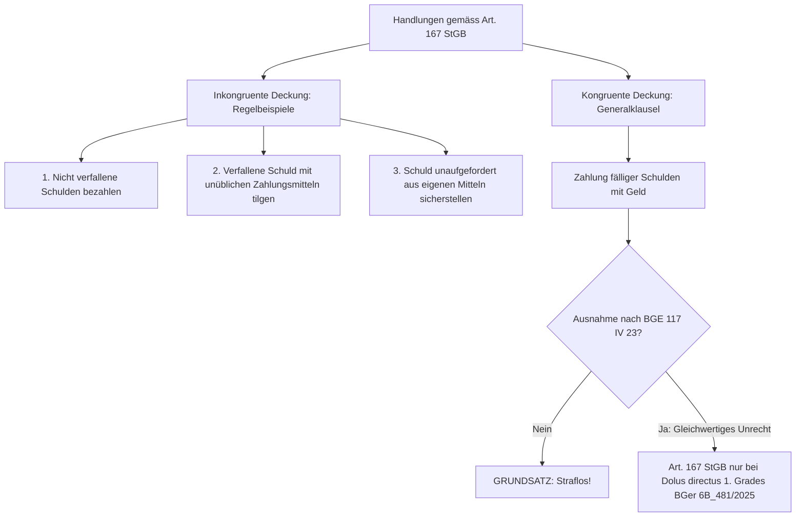

## Gesetzeswortlaut

> **Art. 167 StGB — Bevorzugung eines Gläubigers**
>
> Der Schuldner, der im Bewusstsein seiner Zahlungsunfähigkeit und in der Absicht, einzelne seiner Gläubiger zum Nachteil anderer zu bevorzugen, darauf abzielende Handlungen vornimmt, insbesondere nicht verfallene Schulden bezahlt, eine verfallene Schuld anders als durch übliche Zahlungsmittel tilgt, eine Schuld aus eigenen Mitteln sicherstellt, ohne dass er dazu verpflichtet war,
> wird, wenn über ihn der Konkurs eröffnet oder gegen ihn ein Verlustschein ausgestellt worden ist,
> mit Freiheitsstrafe bis zu drei Jahren oder Geldstrafe bestraft.
{: .gesetzeszitat}

*Wortlaut geprüft gegen [Fedlex, SR 311.0](https://www.fedlex.admin.ch/eli/cc/54/757_781_799/de), Stand der Konsolidierung 12. Juni 2026.*

### Die Tatbestandsformen auf einen Blick

| Tatbestandsvariante | Gesetzliche Regelung | Typische Tathandlungen | Dogmatische Besonderheit / Vorsatzmassstab |
|---|---|---|---|
| **Zahlung nicht verfallener Schulden** | Art. 167 1. Regelbeispiel | Vorzeitige Tilgung von Darlehen oder Lieferantenschulden vor Eintritt der Fälligkeit | Inkongruente Deckung; Gläubiger hat keinen fälligen Anspruch; Eventualabsicht genügt |
| **Tilgung durch unübliche Zahlungsmittel** | Art. 167 2. Regelbeispiel | Leistung an Erfüllungs statt (z.B. Abtretung von Fahrzeugen, Warenlagern, Maschinen, Verrechnung mit fragwürdigen Gegenforderungen) | Inkongruente Deckung; Entzug von Substanzwerten zu Lasten der Liquidität; Eventualabsicht genügt |
| **Freiwillige Sicherstellung aus eigenen Mitteln** | Art. 167 3. Regelbeispiel | Nachträgliche Verpfändung, Sicherungsübereignung oder Zession für bisher ungesicherte Altschulden ohne vorherige Rechtspflicht | Inkongruente Deckung; Umwandlung einer Drittklassforderung in eine pfandgesicherte Forderung; Eventualabsicht genügt |
| **Generalklausel («darauf abzielende Handlungen»)** | Art. 167 Auffangtatbestand | Tilgung fälliger Schulden mit Geldmitteln unter aussergewöhnlichen Umständen (z.B. Notverkäufe zur Befriedigung nahestehender Personen) | Kongruente Deckung ist grundsätzlich nicht tatbestandsmässig; setzt Gleichwertigkeit mit Regelbeispielen und zwingend direkten Vorsatz (Dolus directus 1. Grades) voraus |

---

## Überblick und Bedeutung

Art. 167 StGB schützt das **Prinzip der Gleichbehandlung der Gläubiger** (*Par conditio creditorum*) im Vorfeld des Generalexekutions- und Spezialexekutionsverfahrens. Sobald ein Schuldner zahlungsunfähig ist, bildet sein verbleibendes Vermögen den Haftungsfonds für die Gesamtheit aller Gläubiger. Befriedigt der Schuldner in diesem Stadium willkürlich einzelne Gläubiger auf Kosten der übrigen oder verschafft er einzelnen Gläubigern Vorzugsrechte, vereitelt er die gesetzliche Rangordnung und Verteilungsquote des SchKG.

### Schutzgut und Abgrenzung im System der Insolvenzdelikte

Das Rechtsgut von Art. 167 StGB ist das Recht der Gläubigergesamtheit auf verhältnismässige Befriedigung aus dem Schuldnervermögen nach den Grundsätzen des Zwangsvollstreckungsrechts:
- **Abgrenzung zu Art. 163 StGB (betrügerischer Konkurs)**: Art. 163 StGB schützt den **Bestand** des Vermögens vor Scheinverringerungen, Verheimlichung oder Verschleuderung. Werden echte Verbindlichkeiten getilgt, verringert sich zwar die Aktivmasse, aber im selben Umfang sinken die Passiven; die Masse wird rechnerisch nicht geschmälert. Geht die Begünstigungshandlung jedoch über eine echte Gläubigerbefriedigung hinaus (z.B. bei Scheingeschäften oder verdeckter Eigenbegünstigung des Schuldners), greift Art. 163 StGB Platz ([BGE 93 IV 16 E. 1](https://entscheidsuche.ch/docs/CH_BGE/CH_BGE_006_BGE-93-IV-16_1967-01-20.html)).
- **Abgrenzung zu Art. 164 StGB (Gläubigerschädigung)**: Art. 164 StGB pönalisiert tatsächliche Vermögensminderungen (z.B. grundlose Schenkungen, Zerstörung von Aktiven). Art. 167 StGB setzt dagegen zwingend voraus, dass der Begünstigte ein **tatsächlicher Gläubiger** mit echtem Rechtsanspruch ist.
- **Abgrenzung zu Art. 165 StGB (Misswirtschaft)**: Art. 165 StGB sanktioniert das Herbeiführen oder Verschlimmern der Zahlungsunfähigkeit durch Misswirtschaft. Zahlungen an Gläubiger zur Abwendung des sofortigen Konkurses fallen unter Art. 167 StGB, nicht unter Art. 165 StGB, es sei denn, die Geschäftsfortführung war von vornherein aussichtslos und führte zu reinem Verlustzuwachs.

In dogmatischer Hinsicht weist Art. 167 StGB folgende Strukturmerkmale auf:
1. **Echtes Sonderdelikt**: Täter kann nur der Schuldner sein (bzw. bei juristischen Personen deren formelle oder faktische Organe gemäss **Art. 29 StGB**).
2. **Schlechthiniges Tätigkeits- und Absichtsdelikt**: Der Tatbestand verlangt keine tatsächliche Benachteiligung oder Vermögensverschiebung; die Strafbarkeit knüpft an die Vornahme der auf Bevorzugung *abzielenden Handlung* an, verbunden mit der entsprechenden spezifischen Absicht.
3. **Objektive Strafbarkeitsbedingung**: Wie bei allen Konkursdelikten ist die Eröffnung des Konkurses oder die Ausstellung eines Pfändungsverlustscheins zwingende objektive Bedingung der Strafbarkeit, muss aber nicht vom Tätervorsatz umfasst sein.

---

### Prüfschema: Die Merkmale in ihrer Prüfungsreihenfolge

Die nachfolgende Tabelle definiert die systematische Prüfungsreihenfolge der Tatbestandsmerkmale von Art. 167 StGB. Sie bildet zugleich das Gliederungsgerüst der nachfolgenden Kommentierung: Jede Zeile entspricht einem Abschnitt.

| Nr. | Tatbestandsmerkmal | Was zu prüfen ist | Behauptungs- und Beweislast / Beweismass | Abschnitt |
|---|---|---|---|---|
| 0 | **Täterqualifikation & Organstellung (Art. 29 StGB)** | Schuldnereigenschaft; bei juristischen Personen Organstellung (formell nach Art. 29 lit. a StGB oder faktisch nach Art. 29 lit. d StGB); Generalbevollmächtigte mit In-sich-Geschäften | Staatsanwaltschaft; voller Beweis (Art. 10 Abs. 3 StPO) | [A](#a-täterqualifikation-und-organstellung-art-29-stgb) |
| 1 | **Zahlungsunfähigkeit des Schuldners** | Mangel an liquiden Mitteln zur Begleichung fälliger Schulden; dauerhaftes, nicht bloss vorübergehendes Unvermögen; bei juristischen Personen Überschuldung inkl. naher Fälligkeiten | Staatsanwaltschaft; Nachweis der Illiquidität / Überschuldung im Tatzeitpunkt | [B](#b-zahlungsunfähigkeit-des-schuldners) |
| 2 | **Tathandlungen (Regelbeispiele & Generalklausel)** | Inkongruente Deckung (nicht verfallene Schulden, unübliche Zahlungsmittel, unaufgeforderte Sicherstellung) vs. kongruente Deckung (Generalklausel nur bei Gleichwertigkeit nach BGE 117 IV 23) | Staatsanwaltschaft; Nachweis der Art und Weise der Befriedigung / Sicherung | [C](#c-die-tathandlungen-regelbeispiele-und-generalklausel) |
| 3 | **Subjektiver Tatbestand** | Doppelvorsatz: Bewusstsein der Zahlungsunfähigkeit (Wissen) UND Absicht der Bevorzugung; bei kongruenter Deckung zwingend Dolus directus 1. Grades ([BGer 6B_481/2025](https://entscheidsuche.ch/docs/CH_BGer/CH_BGer_006_6B-481-2025_2026-03-12.html)) | Staatsanwaltschaft; Nachweis der spezifischen Bevorzugungsabsicht | [D](#d-subjektiver-tatbestand-bewusstsein-und-bevorzugungsabsicht) |
| 4 | **Objektive Strafbarkeitsbedingungen** | Eröffnung des Konkurses (ordentlich, summarisch, Art. 230 SchKG) oder Ausstellung eines Verlustscheins; Ausschluss bei reiner Organisationsmangelliquidation ([BGE 148 IV 170](https://entscheidsuche.ch/docs/CH_BGE/CH_BGE_006_BGE-148-IV-170_2022.html)) | Gericht prüft von Amtes wegen (Prozessvoraussetzung) | [E](#e-objektive-strafbarkeitsbedingungen) |
| 5 | **Konkurrenzen und Abgrenzungen** | Abgrenzung zu Art. 163 StGB (echte Gläubiger vs. Scheingeschäfte), Art. 164 StGB, Art. 165 StGB und Art. 158 StGB; paulianische Anfechtung (Art. 288 SchKG) | Gericht / Rügeobliegenheit der Parteien | [F](#f-konkurrenzen-und-abgrenzungen) |

---

## Kommentierung

### A. Täterqualifikation und Organstellung (Art. 29 StGB)

#### 1. Was das Merkmal verlangt
Täter von Art. 167 StGB kann nur der **Schuldner** sein. Ist der Schuldner eine juristische Person (AG, GmbH, Genossenschaft) oder eine Personengesellschaft, greift die Zurechnungsnorm von **Art. 29 StGB**:
- **Formelle Organe (Art. 29 lit. a StGB)**: Mitglieder des Verwaltungsrats einer AG, Geschäftsführer einer GmbH oder Liquidatoren.
- **Faktische Organe (Art. 29 lit. d StGB)**: Personen, die ohne formelle Organstellung tatsächlich Entscheidungen treffen, die der Geschäftsführung oder dem Verwaltungsrat vorbehalten sind, oder die Geschäftsführung faktisch beherrschen ([BGer 6B_699/2012 vom 25. April 2013, E. 2.2](https://entscheidsuche.ch/docs/CH_BGer/CH_BGer_006_6B-699-2012_2013-04-25.html)).
- **Bevollmächtigte mit In-sich-Geschäft**: Wer gestützt auf eine umfassende Vollmacht der Gesellschaft Vermögenswerte auf sich selbst überträgt, um eigene Forderungen zu befriedigen, haftet als Organ nach Art. 29 StGB, wenn er faktisch wie ein Organ handelte.
- **Stellung des bevorzugten Gläubigers**: Der Gläubiger, der befriedigt wird, ist regelmässig Tatobjekt bzw. Begünstigter, nicht Täter. Er macht sich jedoch als **Teilnehmer (Anstifter oder Gehilfe)** strafbar, wenn er den zahlungsunfähigen Schuldner aktiv dazu bestimmt, ihn entgegen der Rangordnung zu befriedigen, oder wenn er als Organ der Schuldnergesellschaft auf beiden Seiten agiert (In-sich-Geschäft).

#### 2. Kasuistik: Organstellung und Täterzurechnung

##### Angewandt: Faktischer Geschäftsführer mit Generalvollmacht bei In-sich-Geschäften
Ein Gläubiger und Darlehensgeber einer Autohandels-AG liess sich von der formellen Verwaltungsratspräsidentin (seiner Lebenspartnerin) eine notarielle Generalvollmacht ausstellen. Als die AG zahlungsunfähig wurde und die Mieten für den Showroom aufliefen, übertrug er im Namen der AG vier Luxusfahrzeuge an sich selbst, um damit angebliche Mietzinsforderungen seiner eigenen Einzelfirma zu tilgen. Das Bundesgericht bestätigte die Verurteilung wegen Gläubigerbevorzugung gemäss Art. 167 i.V.m. Art. 29 lit. d StGB: Wer dank einer Generalvollmacht die Gesellschaft operativ beherrscht und eigenmächtig über deren Substanzwerte zugunsten eigener Forderungen verfügt, ist **faktisches Organ** und haftet als Haupttäter ([BGer 6B_699/2012 vom 25. April 2013, E. 2.2.3](https://entscheidsuche.ch/docs/CH_BGer/CH_BGer_006_6B-699-2012_2013-04-25.html)).

##### Verworfen: Straflosigkeit des reinen Gläubigers bei Annahme von Zahlungen
Ein Bauhandwerker mahnte eine fällige Werklohnforderung bei einer Generalunternehmerin an. Die Generalunternehmerin stand kurz vor dem Konkurs, was der Handwerker anhand von Gerüchten auf der Baustelle vermutete. Die Generalunternehmerin bezahlte die fällige Rechnung per Banküberweisung. Das Obergericht stellte klar: Das blosse Entgegennehmen einer fälligen Leistung durch einen Gläubiger erfüllt weder Mittäterschaft noch Gehilfenschaft zu Art. 167 StGB. Der Gläubiger darf fällige Schulden fordern und annehmen, solange er den Schuldner nicht durch Drohung, Täuschung oder unzulässigen Druck zur Verletzung von Gläubigerrechten anstiftet ([ZH OG UE210242 vom 26. September 2022, E. 3.2](https://entscheidsuche.ch/docs/ZH_Obergericht/ZH_OG_002_UE210242_2022-09-26.pdf)).

> **Leitsatz.** Täter von Art. 167 StGB ist der Schuldner bzw. dessen formelles oder faktisches Organ (Art. 29 StGB). Der begünstigte Gläubiger haftet nur dann als Teilnehmer, wenn er den Schuldner aktiv zur gesetzeswidrigen Bevorzugung verleitet hat; das blosse Einfordern und Entgegennehmen fälliger Zahlungen ist straflos.

---

### B. Zahlungsunfähigkeit des Schuldners

#### 1. Was das Merkmal verlangt
Art. 167 StGB setzt im Zeitpunkt der Tathandlung das Bestehen der **Zahlungsunfähigkeit** voraus:
- **Begriff**: Zahlungsunfähigkeit liegt vor, wenn dem Schuldner die flüssigen Mittel fehlen, um seine fälligen Verbindlichkeiten zu begleichen, und er nicht in der Lage ist, sich die erforderlichen Mittel innert nützlicher Frist zu beschaffen.
- **Abgrenzung zum blossen Zahlungsstocken**: Ein kurzfristiger Liquiditätsengpass, der voraussichtlich durch bevorstehende Debitorenzahlungen oder zugesicherte Kredite überwunden werden kann, begründet noch keine Zahlungsunfähigkeit. Die Zahlungsunfähigkeit muss **dauerhaft** sein.
- **Zahlungsunfähigkeit bei juristischen Personen (Überschuldung)**: Bei Gesellschaften ist Zahlungsunfähigkeit nach ständiger Rechtsprechung regelmässig mit der **Überschuldung** verknüpft: Ein Zustand, bei dem die Aktiven die Verbindlichkeiten nicht mehr decken und in naher Zukunft fällig werdende Verpflichtungen nicht mehr bedient werden können ([BGE 104 IV 77 E. 2](https://entscheidsuche.ch/docs/CH_BGE/CH_BGE_006_BGE-104-IV-77_1978-04-14.html)).
- **Indizien für Zahlungsunfähigkeit**:
  - Vielzahl offener Betreibungen und Konkursandrohungen;
  - Sistierung von Zahlungen an Stamm- und Grossgläubiger (Steuern, Sozialversicherungsbeiträge, Lieferanten);
  - Rückweisung von Lastschriften und Kündigung von Bankkreditlimiten;
  - Ausstellen ungedeckter Schecks oder wiederholte Bitte um Stundung ohne Sanierungskonzept ([BGer 6B_985/2016 vom 27. Februar 2017, E. 1.2](https://entscheidsuche.ch/docs/CH_BGer/CH_BGer_006_6B-985-2016_2017-02-27.html)).

#### 2. Kasuistik: Nachweis und Abgrenzung der Zahlungsunfähigkeit

##### Angewandt: Zahlungsunfähigkeit indiziert durch 105 offene Betreibungen
Der Verwaltungsrat einer Papeterie- und Geschenkartikel-AG verkaufte das gesamte verbleibende Warenlager an eine von ihm beherrschte Schwestergesellschaft und verrechnete den Kaufpreis mit einem Aktionärsdarlehen. Im Strafverfahren behauptete er, die Gesellschaft sei damals bloss in einer vorübergehenden Baisse gewesen und habe auf das Weihnachtsgeschäft gehofft. Das Bundesgericht verwarf die Rüge: Gegen die AG liefen zum Verfügungszeitpunkt 105 Betreibungen über mehrere hunderttausend Franken, Sozialversicherungsbeiträge waren seit Monaten unbezahlt und die Bank hatte die Kreditlimite gesperrt. Bei dieser Aktenlage lag eine manifeste, dauerhafte Zahlungsunfähigkeit vor, die jedem Organ vollkommen bewusst sein musste ([BGer 6B_985/2016 vom 27. Februar 2017, E. 1.2](https://entscheidsuche.ch/docs/CH_BGer/CH_BGer_006_6B-985-2016_2017-02-27.html); [BL KG 460 15 223 vom 24. Mai 2016](https://entscheidsuche.ch/docs/BL_Gerichte/BL_KG_004_460-15-223_2016-05-24.pdf)).

##### Angewandt: Einbezug naher Fälligkeiten und Rückstellungen (Fall Caropa)
Der Direktor einer Finanzierungsgesellschaft befriedigte ausgewählte private Investoren, während Grossforderungen institutioneller Anleger unbedient blieben. Er machte geltend, im massgeblichen Moment seien die Grossforderungen formell noch nicht fällig gewesen, sodass rein rechnerisch keine Zahlungsunfähigkeit bestanden habe. Das Bundesgericht verwarf die Argumentation: Für die Beurteilung der Zahlungsunfähigkeit dürfen fällig werdende Grossschulden, deren Begleichung bei Fälligkeit mangels Liquidität unmöglich sein wird, nicht ausgeblendet werden. Zeichnet sich der Kollaps unausweichlich ab, besteht Zahlungsunfähigkeit im Sinne von Art. 167 StGB bereits vor dem Stichtag der letzten Grossfälligkeit ([BGE 104 IV 77 E. 2](https://entscheidsuche.ch/docs/CH_BGE/CH_BGE_006_BGE-104-IV-77_1978-04-14.html)).

> **Leitsatz.** Zahlungsunfähigkeit im Sinne von Art. 167 StGB ist das dauerhafte Unvermögen, fällige Verbindlichkeiten zu erfüllen. Bei juristischen Personen fallen Zahlungsunfähigkeit und Überschuldung praktisch zusammen; drohende Fälligkeiten in naher Zukunft sind in die Beurteilung einzubeziehen.

---

### C. Die Tathandlungen: Regelbeispiele und Generalklausel

Art. 167 StGB unterscheidet im Gesetzestext zwischen **drei gesetzlichen Regelbeispielen** (die typischerweise Fälle inkongruenter Deckung darstellen) und der **Generalklausel** («darauf abzielende Handlungen vornimmt»):

#### 1. Erstes Regelbeispiel: Bezahlung nicht verfallener Schulden
- **Tatbestand**: Der Schuldner tilgt eine Verbindlichkeit, deren Fälligkeitstermin noch nicht eingetreten ist (vorzeitige Erfüllung).
- **Dogmatischer Grund**: Der Gläubiger hat keinen fälligen Anspruch auf Leistung. Durch die vorzeitige Befriedigung entzieht der Schuldner der Masse Liquidität, die zur Befriedigung bereits fälliger Gläubiger zwingend erforderlich wäre.
- **Kasuistik ([BGer 6S.34/2001 vom 11. Januar 2002, E. 2](https://entscheidsuche.ch/docs/CH_BGer/CH_BGer_006_6S-34-2001_2002-01-11.html))**: Der Alleinaktionär einer zahlungsunfähigen AG bezahlte Darlehen an eine Gesellschaft seiner Ehefrau zurück, deren vertragliche Fälligkeit erst in 18 Monaten eintrat. Dies erfüllt das 1. Regelbeispiel unmittelbar.

#### 2. Zweites Regelbeispiel: Tilgung verfallener Schulden durch unübliche Zahlungsmittel
- **Tatbestand**: Die Schuld ist zwar fällig, wird aber nicht mit den verkehrsüblichen Zahlungsmitteln (Bargeld, Banküberweisung) beglichen, sondern durch eine Leistung an Erfüllungs statt (*Datio in solutum*).
- **Typische unübliche Zahlungsmittel in der Kasuistik**:
  - **Abtretung von Sachwerten**: Übergabe von Geschäftsfahrzeugen, Maschinen oder Waren anstelle von Geld ([BGer 6B_361/2017 vom 2. November 2017, E. 1.2](https://entscheidsuche.ch/docs/CH_BGer/CH_BGer_006_6B-361-2017_2017-11-02.html): Überlassung eines Rennwagens Chevrolet Corvette an Zahlungs statt; [BGer 6B_699/2012](https://entscheidsuche.ch/docs/CH_BGer/CH_BGer_006_6B-699-2012_2013-04-25.html): Übertragung von vier Personenwagen zur Schuldentilgung).
  - **Verrechnung mit Gegenforderungen**: Verrechnung von Warenlieferungen oder Inventar mit Darlehens- oder Lohnschulden des Geschäftsführers ([ZH OG SB140131 vom 12. September 2014, E. 2.1](https://entscheidsuche.ch/docs/ZH_Obergericht/ZH_OG_002_SB140131_2014-09-12.pdf)).
  - **Zession von Kundenguthaben**: Abtretung noch nicht eingetriebener Debitoren an ausgewählte Gläubiger.

#### 3. Drittes Regelbeispiel: Freiwillige Sicherstellung aus eigenen Mitteln
- **Tatbestand**: Der Schuldner bestellt für eine bestehende, bisher ungesicherte Schuld eine Sicherheit (Grundpfand, Fahrnispfand, Zession), ohne dass er hierzu bei Begründung der Schuld oder durch nachträgliche Vereinbarung vor Eintritt der Zahlungsunfähigkeit rechtlich verpflichtet war.
- **Dogmatischer Grund**: Durch die Sicherstellung wird ein gewöhnlicher Drittklassgläubiger nachträglich in einen vorweg befriedigten Pfandgläubiger verwandelt, wodurch die Konkursmasse substanziell entwertet wird ([BGE 74 IV 40 E. 1](https://entscheidsuche.ch/docs/CH_UNIBE/CH_BGB_006_BGE-74-IV-40.pdf)).

#### 4. Die Generalklausel und das Problem der kongruenten Deckung

##### Das dogmatische Grundproblem
Darf ein zahlungsunfähiger Schuldner **fällige Schulden mit normalen Geldmitteln (Banküberweisung)** bezahlen?
- **Ausgangspunkt (Zivilrechtliche Maxime)**: Der Gläubiger hat einen klagbaren, fälligen Anspruch auf Erfüllung. Die Erfüllung einer fälligen Verbindlichkeit mit regulären Zahlungsmitteln ist **kongruente Deckung** und grundsätzlich **rechtmässig**. Ein Schuldner, der fällige Schulden bezahlt, tut genau das, wozu er rechtlich verpflichtet ist.
- **Einschränkung durch BGE 117 IV 23**: Das Bundesgericht entschied, dass auch die Tilgung einer fälligen Schuld mit gesetzlichen Zahlungsmitteln unter die Generalklausel von Art. 167 StGB fallen *kann*, wenn die Handlung nach den gesamten Umständen im **Unrechtsgehalt den Regelbeispielen gleichwertig** ist. Dies bejahte das Gericht damals beim Notverkauf des gesamten Betriebsinventars einer liquidierten AG, um ausschliesslich ein Altdarlehen eines Gründers zu tilgen ([BGE 117 IV 23 E. 1b](https://entscheidsuche.ch/docs/CH_BGE/CH_BGE_006_BGE-117-IV-23_1991-01-22.html)).
- **Präzisierung und Grenzziehung durch BGer 6B_481/2025 vom 12. März 2026**: Das Bundesgericht hat diesen Grundsatz jüngst mit Nachdruck bekräftigt: Die Bezahlung einer fälligen Geldschuld mit Geld ist **grundsätzlich nicht tatbestandsmässig**. Eine Subsumtion unter die Generalklausel bleibt die absolute Ausnahme. Sie setzt zwingend voraus:
  1. Einen **qualifizierten Unrechtsgehalt**, der den Regelbeispielen völlig gleichsteht (z.B. Verschleuderung der letzten Betriebsmittel zur selektiven Begünstigung von Nahestehenden);
  2. **Zwingend direkte Absicht (Dolus directus 1. Grades)**: Der Schuldner muss *gerade darauf abgezielt haben*, die anderen Gläubiger zu schädigen. Blosse Eventualabsicht genügt bei kongruenter Deckung keinesfalls! ([BGer 6B_481/2025 vom 12. März 2026, E. 2.1–2.4](https://entscheidsuche.ch/docs/CH_BGer/CH_BGer_006_6B-481-2025_2026-03-12.html)).

#### 5. Kasuistik zu den Tathandlungen

##### Angewandt: Tilgung eines Altdarlehens durch Notverkauf von Betriebsinventar (BGE 117 IV 23)
Die geschäftsführenden Organe einer Bauunternehmung stellten den Betrieb faktisch ein. Um die drohende Pfändung abzuwenden, verkauften sie das gesamte noch vorhandene Inventar und Baugeräte für CHF 120'000.– in bar. Den Erlös verwendeten sie nicht zur anteiligen Befriedigung der laufenden Löhne und Lieferanten, sondern zahlten damit ausschliesslich ein privates Darlehen an die Ehefrau des Hauptaktionärs zurück. Das Bundesgericht verurteilte die Organe gestützt auf die Generalklausel: Zwar war das Darlehen fällig und wurde mit Geld bezahlt, doch war die Notliquidation des letzten Betriebsmittels zur ausschliesslichen Begünstigung einer nahestehenden Person den Regelbeispielen an Unwert völlig gleichwertig ([BGE 117 IV 23 E. 1b](https://entscheidsuche.ch/docs/CH_BGE/CH_BGE_006_BGE-117-IV-23_1991-01-22.html)).

##### Angewandt: Überlassung eines Rennwagens als unübliches Zahlungsmittel
Ein verschuldeter Geschäftsführer schuldete einem Bekannten CHF 65'000.–. Mangels Kontoguthaben übergab er ihm einen zum Betriebsvermögen gehörenden Rennwagen der Marke Chevrolet Corvette mit der Abrede, der Gläubiger dürfe den Wagen verwerten und den Erlös behalten. Das Bundesgericht qualifizierte die Sachwertübergabe als Erfüllung an Zahlungs statt und damit als unübliches Zahlungsmittel gemäss dem 2. Regelbeispiel von Art. 167 StGB ([BGer 6B_361/2017 vom 2. November 2017, E. 1.2](https://entscheidsuche.ch/docs/CH_BGer/CH_BGer_006_6B-361-2017_2017-11-02.html)).

##### Verworfen: Bezahlung fälliger Anwaltshonorare mit Geldmitteln (BGer 6B_481/2025)
Die Geschäftsführerin einer krisengeschüttelten Gastro-Betreiberin bezahlte aus den verbliebenen Bankguthaben eine Honorarnote ihres Rechtsanwalts über CHF 32'000.– für dessen Bemühungen im Rahmen von Sanierungsverhandlungen. Die Vorinstanz verurteilte sie wegen Art. 167 StGB, weil andere Gläubiger leer ausgingen. Das Bundesgericht hob das Urteil auf und sprach die Geschäftsführerin frei: Honorarforderungen aus Auftrag (Art. 394 OR) sind von Gesetzes wegen fällig, sobald die Leistung erbracht wurde. Die Bezahlung einer fälligen Schuld mit normalem Buchgeld erfüllt Art. 167 StGB nicht, solange keine treuwidrige Manipulation vorliegt und kein Dolus directus 1. Grades auf Schädigung der Restgläubiger nachgewiesen ist ([BGer 6B_481/2025 vom 12. März 2026, E. 2.3–2.4](https://entscheidsuche.ch/docs/CH_BGer/CH_BGer_006_6B-481-2025_2026-03-12.html)).

##### Verworfen: Verteilung von Erlösen an mehrere fällige Lieferanten
Der Betreiber eines Lokals verkaufte Mobiliar und Gläser und überwies den Erlös zu gleichen Teilen an drei langjährige Lieferanten, um deren fällige Rechnungen zu reduzieren. Das Zürcher Obergericht verneinte Art. 167 StGB: Wer fällige Rechnungen mit Geldmitteln anteilig tilgt, handelt im Rahmen der zivilrechtlichen Leistungsbefugnis; eine planmässige Gläubigerbevorzugung liegt nicht vor ([ZH OG UE210242 vom 26. September 2022, E. 3.2](https://entscheidsuche.ch/docs/ZH_Obergericht/ZH_OG_002_UE210242_2022-09-26.pdf)).

---

### D. Subjektiver Tatbestand: Bewusstsein und Bevorzugungsabsicht

#### 1. Was das Merkmal verlangt
Art. 167 StGB statuiert gesteigerte Anforderungen an den subjektiven Tatbestand (**zweifaches subjektives Erfordernis**):

1. **Bewusstsein der Zahlungsunfähigkeit (Wissenselement)**:
   - Der Schuldner muss wissen oder ernsthaft damit rechnen und in Kauf nehmen, dass er zahlungsunfähig ist.
   - Eventualvorsatz genügt hinsichtlich dieses Merkmals: Wer die ernste Möglichkeit der Zahlungsunfähigkeit erkennt und dennoch handelt, erfüllt das Wissenselement.

2. **Absicht der Bevorzugung (Willenselement / Absichtsmerkmal)**:
   - Der Schuldner muss in der Absicht handeln, einzelne Gläubiger **zum Nachteil anderer zu bevorzugen**.
   - **Geforderter Vorsatzgrad (Judikaturdifferenzierung)**:
     - **Bei inkongruenter Deckung (Regelbeispiele)**: Hier genügt nach ständiger Rechtsprechung **Eventualabsicht** (*Dolus eventualis*). Wer einem Gläubiger ohne Verpflichtung Sicherheiten bestellt oder Sachwerte übergibt und dabei die Benachteiligung der anderen Gläubiger als notwendige Folge in Kauf nimmt, handelt tatbestandsmässig ([BGE 74 IV 40 E. 2](https://entscheidsuche.ch/docs/CH_UNIBE/CH_BGB_006_BGE-74-IV-40.pdf); [BGer 6B_361/2017 E. 1.2](https://entscheidsuche.ch/docs/CH_BGer/CH_BGer_006_6B-361-2017_2017-11-02.html)).
     - **Bei kongruenter Deckung (Generalklausel / Bezahlung fälliger Geldschulden)**: Hier schliesst das Bundesgericht Eventualabsicht strikt aus: Erforderlich ist zwingend **direkter Vorsatz (Dolus directus 1. Grades)**. Dem Schuldner muss es gerade darauf ankommen, den bevorzugten Gläubiger auf Kosten der Masse zu begünstigen ([BGer 6B_481/2025 vom 12. März 2026, E. 2.2](https://entscheidsuche.ch/docs/CH_BGer/CH_BGer_006_6B-481-2025_2026-03-12.html)).

#### 2. Echter Judikaturwiderspruch: Sanierungsbemühungen vs. Bevorzugungsabsicht
In der Praxis stellt sich regelmässig die Frage, wie Zahlungen zu beurteilen sind, die der Schuldner leistet, um den **Zusammenbruch abzuwenden** (z.B. Bezahlung von Schlüssel-Lieferanten oder Löhnen zwecks Fortführung des Betriebs):
- **Strenge Linie (u.a. GR KG SB 2008 13)**: Wer weiss, dass das Geld nicht für alle reicht, und dennoch selektiv zahlt, nimmt die Benachteiligung der Übrigen billigend in Kauf. Die Hoffnung auf Sanierung schützt nicht vor Eventualabsicht.
- **Differenzierende bundesgerichtliche Linie ([BGer 6B_481/2025](https://entscheidsuche.ch/docs/CH_BGer/CH_BGer_006_6B-481-2025_2026-03-12.html))**: Dient die Zahlung einer fälligen Schuld der Fortführung des Betriebs im Rahmen eines ernsthaften, vertretbaren Sanierungsversuchs, fehlt es am direkten Schädigungs- und Bevorzugungswillen. Sanierungszahlungen *lege artis* sind nicht nach Art. 167 StGB strafbar.

---

### E. Objektive Strafbarkeitsbedingungen

Art. 167 StGB verlangt als objektive Strafbarkeitsbedingung:
1. **Eröffnung des Konkurses**:
   - Gültiges Konkursdekret eines schweizerischen Konkursgerichts.
   - Erfasst sind alle Konkursarten (ordentliches Verfahren, summarisches Verfahren, Einstellung mangels Aktiven nach Art. 230 SchKG).
   - **Ausschlussgrund**: Die Konkursliquidation infolge eines Organisationsmangels nach **Art. 731b OR** erfüllt die objektive Strafbarkeitsbedingung für sich allein **nicht**, es sei denn, der Konkurs wurde originär wegen Überschuldung nach Art. 725b OR eröffnet ([BGE 148 IV 170 E. 3.4.8](https://entscheidsuche.ch/docs/CH_BGE/CH_BGE_006_BGE-148-IV-170_2022.html)).
2. **Ausstellung eines Verlustscheins**:
   - Verlustschein nach erfolgter Pfändung gemäss **Art. 149 SchKG** (oder Art. 115 Abs. 2 SchKG).
   - Pfändungsverlustscheine genügen; ein Konkursverlustschein (Art. 265 SchKG) setzt ohnehin Konkurseröffnung voraus.

---

### F. Konkurrenzen und Abgrenzungen

1. **Art. 163 StGB (Betrügerischer Konkurs)**:
   - Handelt es sich beim Begünstigten um einen Scheingläubiger oder schiebt der Schuldner eine Scheinforderung vor, um Vermögenswerte beiseitezuschaffen, liegt ausschliesslich **Art. 163 Ziff. 1 StGB** (Verheimlichen von Vermögenswerten) vor. Art. 167 StGB ist subsidiär und setzt eine echte Schuld voraus ([BGE 93 IV 16 E. 1](https://entscheidsuche.ch/docs/CH_BGE/CH_BGE_006_BGE-93-IV-16_1967-01-20.html)).
2. **Art. 164 StGB (Gläubigerschädigung durch Vermögensminderung)**:
   - Veräussert der Schuldner Vermögenswerte unter Wert an einen Gläubiger, liegt bezüglich der Differenz zum Marktwert Art. 164 StGB vor, bezüglich der Verrechnung mit der Schuld Art. 167 StGB (echte Idealkonkurrenz).
3. **Art. 165 StGB (Misswirtschaft)**:
   - Realkonkurrenz ist möglich, wenn neben den selektiven Bevorzugungen das Unternehmen durch Misswirtschaft in den Ruin getrieben wurde.
4. **Art. 158 StGB (Ungetreue Geschäftsbesorgung)**:
   - Bei Organen juristischer Personen scheidet Art. 158 StGB in der Regel aus, soweit der Schuldner echte Gesellschaftsschulden tilgt, da das Gesellschaftsvermögen rechnerisch um den gleichen Betrag entlastet wird. Liegt jedoch ein treuwidriges In-sich-Geschäft zu überhöhten Ansätzen vor, besteht Realkonkurrenz ([FR TC 501 2018 211 vom 6. Juli 2020, E. 4.2](https://entscheidsuche.ch/docs/FR_Gerichte/FR_TC_006_501-2018-211_2020-07-06.pdf)).

---

### G. Gegenüberstellung: Typische Sachverhalte (Angewandt vs. Verworfen)

Die folgende Übersicht fasst die zweiseitige Kasuistik der Leit- und Grenzentscheide zu Art. 167 StGB zusammen:

| Sachverhalt & Modalität der Befriedigung | Qualifikation als Deckung | Entscheid des Gerichts | Massgebliche Urteilsbegründung |
|---|---|---|---|
| **Erlös aus Notverkauf des gesamten Inventars an Ehefrau bezahlt** | Kongruente Deckung (Generalklausel) | **Angewandt** ([BGE 117 IV 23](https://entscheidsuche.ch/docs/CH_BGE/CH_BGE_006_BGE-117-IV-23_1991-01-22.html)) | Notverkauf der letzten Betriebssubstanz zur selektiven Tilgung eines Altdarlehens nahestehender Personen steht Regelbeispielen im Unwert gleich. |
| **Überlassung von 4 Fahrzeugen an Erfüllungs statt via Generalvollmacht** | Inkongruente Deckung (2. Regelbeispiel) | **Angewandt** ([BGer 6B_699/2012](https://entscheidsuche.ch/docs/CH_BGer/CH_BGer_006_6B-699-2012_2013-04-25.html)) | Sachwertübertragung zur Mietzinstilgung ist unübliches Zahlungsmittel; faktisches Organ haftet nach Art. 29 lit. d StGB. |
| **Übergabe eines Rennwagens (Chevrolet Corvette) an Erfüllungs statt** | Inkongruente Deckung (2. Regelbeispiel) | **Angewandt** ([BGer 6B_361/2017](https://entscheidsuche.ch/docs/CH_BGer/CH_BGer_006_6B-361-2017_2017-11-02.html)) | Gläubiger erhielt Sachwert zur Verwertung anstelle von Barzahlung; Eventualabsicht reicht bei inkongruenter Deckung aus. |
| **Vorzeitige Tilgung eines Darlehens 18 Monate vor Fälligkeit** | Inkongruente Deckung (1. Regelbeispiel) | **Angewandt** ([BGer 6S.34/2001](https://entscheidsuche.ch/docs/CH_BGer/CH_BGer_006_6S-34-2001_2002-01-11.html)) | Bezahlung nicht verfallener Forderungen erfüllt unmittelbar den gesetzlichen Tatbestand. |
| **Abtretung von Warenlagern unter Verrechnung mit Gesellschafterdarlehen** | Inkongruente Deckung (2. Regelbeispiel) | **Angewandt** ([BGer 6B_985/2016](https://entscheidsuche.ch/docs/CH_BGer/CH_BGer_006_6B-985-2016_2017-02-27.html)) | 105 Betreibungen indizierten Zahlungsunfähigkeit; Verrechnung von Warenverkäufen mit Darlehensschulden begünstigt Gesellschafter. |
| **Zahlung fälliger Anwaltshonorare mit Buchgeld im Sanierungsversuch** | Kongruente Deckung (Generalklausel) | **Verworfen** ([BGer 6B_481/2025](https://entscheidsuche.ch/docs/CH_BGer/CH_BGer_006_6B-481-2025_2026-03-12.html)) | Fällige Mandatshonorare mit Geld bezahlt; kongruente Deckung verlangt zwingend Dolus directus 1. Grades; Freispruch. |
| **Verteilung von Verwertungserlösen an mehrere fällige Lieferanten** | Kongruente Deckung (Generalklausel) | **Verworfen** ([ZH OG UE210242](https://entscheidsuche.ch/docs/ZH_Obergericht/ZH_OG_002_UE210242_2022-09-26.pdf)) | Barzahlung auf fällige Verbindlichkeiten ist zivilrechtlich geschuldet; kein Nachweis einer gezielten Schädigungsabsicht. |
| **Passives Entgegennehmen einer fälligen Werklohnzahlung durch Gläubiger** | Teilnahme des Gläubigers | **Verworfen** ([ZH OG UE210242](https://entscheidsuche.ch/docs/ZH_Obergericht/ZH_OG_002_UE210242_2022-09-26.pdf)) | Der Gläubiger darf fällige Gelder annehmen; straflos mangels Anstiftungshandlung. |

---

### H. Kantonale Praxisfragen

#### Praxisfrage 1: Strohmann-Organ vs. faktischer Geschäftsführer bei In-sich-Geschäften mit Vollmacht (BL KG 460 11 229 / BL KG 470 13 114)
- **Problem**: Wer haftet als Täter nach Art. 167 StGB, wenn eine überschuldete AG von einem Gläubiger beherrscht wird, der über eine Generalvollmacht verfügt, während das im Handelsregister eingetragene formelle Organ (häufig Lebenspartner oder Familienangehörige) lediglich untätig bleibt oder Blanko-Vollmachten unterschreibt?
- **Kantonale Praxis (Basel-Landschaft)**:
  - Das Kantonsgericht Basel-Landschaft schützte im Verfahren um die Übertragung von Fahrzeugen die Nichtanhandnahme bzw. Verfahrenseinstellung bezüglich der formellen Verwaltungsratspräsidentin: Wer als reine Strohfrau agiert, keinen Einblick in die Bücher hat und die Tathandlungen weder initiiert noch bewusst mitgetragen hat, erfüllt den subjektiven Tatbestand mangels Bevorzugungsabsicht nicht ([BL KG 470 13 114 vom 23. Juli 2013](https://entscheidsuche.ch/docs/BL_Gerichte/BL_KG_004_470-13-114_2013-07-23.pdf)).
  - Demgegenüber haftet der bevollmächtigte Gläubiger, der die Transaktionen operativ abwickelt, uneingeschränkt als **faktisches Organ gemäss Art. 29 lit. d StGB** ([BL KG 460 11 229 vom 7. August 2012](https://entscheidsuche.ch/docs/BL_Gerichte/BL_KG_004_460-11-229_2012-08-07.pdf); bestätigt durch [BGer 6B_699/2012](https://entscheidsuche.ch/docs/CH_BGer/CH_BGer_006_6B-699-2012_2013-04-25.html)).

#### Praxisfrage 2: Der Vorleistungseinwand bei Gesellschafterdarlehen in der Krise (GR KG SB 2008 13)
- **Problem**: Gesellschafter schiessen ihrer kriselnden Gesellschaft häufig private Gelder vor («Überbrückungskredite»), um Löhne zu bezahlen. Zeichnet sich das Scheitern ab, entnehmen sie Warenlager, Mobiliar oder Maschinen zwecks «Kompensation» ihrer Darlehen. Schützt der Einwand, man habe das Geld zuvor selbst eingeschossen?
- **Kantonale Praxis (Graubünden)**:
  - Das Kantonsgericht Graubünden stellte unmissverständlich klar: Private Vorleistungen oder Sanierungsdarlehen verschaffen dem Gesellschafter im Konkursfall **keine rechtliche Sonderstellung**. Forderungen aus Gesellschafterdarlehen sind gewöhnliche Drittklassforderungen.
  - Wer als Gesellschafter Warenlager oder Anlagegüter übernimmt, um sein Darlehen zu tilgen, begeht eine Gläubigerbevorzugung durch unübliche Zahlungsmittel. Der gute Wille, zuvor geholfen zu haben, schliesst die Bevorzugungsabsicht gegenüber den Drittgläubigern nicht aus ([GR KG SB 2008 13 vom 26. Juni 2008, E. 3](https://entscheidsuche.ch/docs/GR_Gerichte/GR_KG_004_SB-2008-13_2008-06-26.pdf)).

---

### I. Praxishinweise

#### 1. Für die Strafverteidigung
1. **Kongruenz der Leistung prüfen**: Kläre akribisch ab, ob die beanstandete Zahlung eine **fällige Geldschuld** betraf und mit **regulären Geldmitteln (Banküberweisung)** getilgt wurde. Ist dies der Fall, greift der Grundsatz von [BGer 6B_481/2025](https://entscheidsuche.ch/docs/CH_BGer/CH_BGer_006_6B-481-2025_2026-03-12.html): Kongruente Deckung ist grundsätzlich nicht tatbestandsmässig.
2. **Dolus directus 1. Grades bestreiten**: Liegt eine kongruente Zahlung vor, muss die Staatsanwaltschaft nachweisen, dass der Beschuldigte *zielgerichtet* auf die Benachteiligung der anderen Gläubiger abzielte. Eventualvorsatz reicht nicht aus. Zeige auf, dass die Zahlung der Aufrechterhaltung des Geschäftsbetriebs oder einer plausiblen Sanierungschance diente.
3. **Fälligkeit der Forderung darlegen**: Prüfe das Entstehen der Fälligkeit nach materiellem Zivilrecht (Art. 75 OR, Art. 394 OR bei Aufträgen). Die Fälligkeit tritt bei Honoraren und Werkverträgen oft unabhängig von der Rechnungsstellung ein.
4. **Strohmann-Konstellationen ausleuchten**: Hat der Beschuldigte lediglich auf Geheiss eines faktischen Machthabers Blanko-Dokumente unterzeichnet, beantrage die Einstellung mangels subjektiven Tatbestands ([BL KG 470 13 114](https://entscheidsuche.ch/docs/BL_Gerichte/BL_KG_004_470-13-114_2013-07-23.pdf)).

#### 2. Für die Staatsanwaltschaft
1. **Inkongruente Deckungsmerkmale herausschälen**: Prüfe vorrangig die Erfüllung der gesetzlichen Regelbeispiele (Sicherheiten ohne Pflicht, Vorfälligkeit, Sachwertübertragungen). Bei Vorliegen eines Regelbeispiels genügt der Nachweis von **Eventualabsicht** ([BGE 74 IV 40](https://entscheidsuche.ch/docs/CH_UNIBE/CH_BGB_006_BGE-74-IV-40.pdf)), was die Beweislast erheblich erleichtert.
2. **Zahlungsunfähigkeit lückenlos dokumentieren**: Hole das Betreibungsauszugs-Dossier, Pfändungsprotokolle, offene Steuer- und AHV-Ausstände sowie Kündigungsschreiben der Banken ein. Ab etwa 20–30 offenen Betreibungen oder gesperrten Kreditlinien ist das Bewusstsein der Zahlungsunfähigkeit gerichtlich kaum mehr bestreitbar ([BGer 6B_985/2016](https://entscheidsuche.ch/docs/CH_BGer/CH_BGer_006_6B-985-2016_2017-02-27.html)).
3. **Gleichwertigkeit bei der Generalklausel belegen**: Wird eine Barzahlung angeklagt, muss in der Anklageschrift explizit begründet werden, weshalb die Zahlung nach [BGE 117 IV 23](https://entscheidsuche.ch/docs/CH_BGE/CH_BGE_006_BGE-117-IV-23_1991-01-22.html) den Unrechtsgehalt der Regelbeispiele erreicht (z.B. Notverkauf aller Aktiven zugunsten von Verwandten).

#### 3. Für die Konkursverwaltung und Gläubiger
1. **Adhäsionsklage vs. Pauliana (Art. 288 SchKG)**: Art. 167 StGB begründet nicht automatisch einen vollumfänglichen Schadenersatzanspruch der geschädigten Einzelgläubiger im Strafverfahren, da der Schaden oft der Masse zusteht ([FR TC 501 2018 211](https://entscheidsuche.ch/docs/FR_Gerichte/FR_TC_006_501-2018-211_2020-07-06.pdf)). Primäres Rechtsmittel zur Rückführung bevorzugter Vermögenswerte bleibt die **Anfechtungsklage nach Art. 288 SchKG** (Absichtsanfechtung).
2. **Akteneinsicht im Strafverfahren für Zivilklagen nutzen**: Nutze die Konstituierung als Privatkläger im Strafverfahren nach Art. 118 StPO, um rasch an Kontoauszüge, Buchhaltungsbelege und Inventarlisten für die zivilrechtliche Pauliana oder aktienrechtliche Verantwortlichkeitsklage (Art. 754 OR) zu gelangen.

#### 4. Für die Geschäftsleitung und Sanierungsberater
1. **Keine Sachleistungen oder nachträglichen Sicherheiten**: In der Phase manifester Illiquidität dürfen Gläubigern unter keinen Umständen Sachwerte (Fahrzeuge, Maschinen, Vorräte) an Zahlungs statt überlassen oder unbesicherte Darlehen verpfändet werden. Dies erfüllt ohne Weiteres den Tatbestand von Art. 167 StGB.
2. **Keine vorzeitigen Rückzahlungen**: Darlehen von Gesellschaftern oder Nahestehenden dürfen vor Fälligkeit keinesfalls getilgt werden.
3. **Dokumentation von Sanierungszahlungen**: Sollen in der Krise unaufschiebbare Rechnungen bezahlt werden (z.B. Strom, IT-Infrastruktur, Rohstoffe für laufende Aufträge), muss schriftlich in einem VR-Protokoll dokumentiert werden, weshalb diese Aufwendungen objektiv zwingend erforderlich sind, um die Sanierung zu ermöglichen und den Gläubigerschaden zu minimieren.
