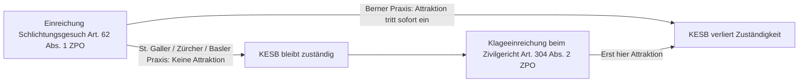

## Gesetzeswortlaut

> **Art. 298b**
>
> 1 Weigert sich ein Elternteil, die Erklärung über die gemeinsame elterliche Sorge abzugeben, so kann der andere Elternteil die Kindesschutzbehörde am Wohnsitz des Kindes anrufen.
>
> 2 Die Kindesschutzbehörde verfügt die gemeinsame elterliche Sorge, sofern nicht zur Wahrung des Kindeswohls an der alleinigen elterlichen Sorge der Mutter festzuhalten oder die alleinige elterliche Sorge dem Vater zu übertragen ist.
>
> 3 Zusammen mit dem Entscheid über die elterliche Sorge regelt die Kindesschutzbehörde die übrigen strittigen Punkte. Vorbehalten bleibt die Klage auf Leistung des Unterhalts an das zuständige Gericht; in diesem Fall entscheidet das Gericht auch über die elterliche Sorge sowie die weiteren Kinderbelange.
>
> 3bis Die Kindesschutzbehörde berücksichtigt beim Entscheid über die Obhut, den persönlichen Verkehr oder die Betreuungsanteile das Recht des Kindes, regelmässige persönliche Beziehungen zu beiden Elternteilen zu pflegen.
>
> 3ter Bei gemeinsamer elterlicher Sorge prüft sie im Sinne des Kindeswohls die Möglichkeit einer alternierenden Obhut, wenn ein Elternteil oder das Kind dies verlangt.
>
> 4 Ist die Mutter minderjährig oder steht sie unter umfassender Beistandschaft, so weist die Kindesschutzbehörde die elterliche Sorge dem Vater zu oder bestellt dem Kind einen Vormund, je nachdem, was zur Wahrung des Kindeswohls besser geeignet ist.

*Eingefügt durch Ziff. I des BG vom 21. Juni 2013 (Elterliche Sorge), in Kraft seit 1. Juli 2014 ([AS 2014 357](https://www.fedlex.admin.ch/eli/oc/2014/357/de); [BBl 2011 9077](https://fedlex.data.admin.ch/eli/fga/2011/1580)). Abs. 3 zweiter Satz sowie Abs. 3bis und 3ter eingefügt durch Ziff. I des BG vom 20. März 2015 (Kindesunterhalt), in Kraft seit 1. Januar 2017 ([AS 2015 4299](https://www.fedlex.admin.ch/eli/oc/2015/4299/de); [BBl 2014 529](https://fedlex.data.admin.ch/eli/fga/2014/529)). Stand der Konsolidierung: 1. Juli 2026.*

---

## Überblick und Bedeutung

Art. 298b ZGB ist die zentrale Kernbestimmung für die behördliche Zuteilung der elterlichen Sorge bei Kindern nicht miteinander verheirateter Eltern. Die Norm regelt den Rechtsschutz, wenn die Eltern nach der Geburt oder Vaterschaftsanerkennung keine einvernehmliche Erklärung über die gemeinsame elterliche Sorge gemäss Art. 298a ZGB abgeben ([BGE 141 III 472 E. 4.1](https://entscheidsuche.ch/docs/CH_BGE/CH_BGE_005_BGE-141-III-472_2015.html#consideration_4.1)). 

Mit der Sorgerechtsreform vom 1. Juli 2014 vollzog der Schweizer Gesetzgeber einen grundlegenden Paradigmenwechsel: Die gemeinsame elterliche Sorge beider Elternteile bildet seither unabhängig vom Zivilstand den gesetzlichen Grundsatz (Art. 296 Abs. 2 ZGB). Für unverheiratete Eltern statuiert Art. 298b Abs. 2 ZGB eine gesetzliche Vermutung zugunsten der gemeinsamen Sorge. Die Zuteilung oder Belassung der alleinigen elterlichen Sorge an einen Elternteil stellt eine eng begrenzte Ausnahme dar ([BGE 142 III 197 E. 3.7](https://entscheidsuche.ch/docs/CH_BGE/CH_BGE_005_BGE-142-III-197_2016.html#consideration_3.7); [BGE 142 III 1 E. 3.3](https://entscheidsuche.ch/docs/CH_BGE/CH_BGE_005_BGE-142-III-1_2016.html#consideration_3.3)).

Durch die Kindesunterhaltsnovelle vom 1. Januar 2017 wurde die Norm zweifach erweitert:
1. **Richterliche Kompetenzattraktion (Abs. 3 Satz 2 i.V.m. Art. 304 Abs. 2 ZPO)**: Zur Vermeidung von Doppelspurigkeiten zwischen Zivilgerichten und der Kindes- und Erwachsenenschutzbehörde (KESB) attrahiert eine beim Zivilgericht anhängig gemachte Klage auf Kindesunterhalt von Gesetzes wegen sämtliche Kinderbelange (Sorge, Obhut, Betreuungsanteile, persönlicher Verkehr; [BGE 145 III 436 E. 4](https://entscheidsuche.ch/docs/CH_BGE/CH_BGE_005_BGE-145-III-436_2019.html#consideration_4)).
2. **Recht auf persönliche Beziehungen & Alternierende Obhut (Abs. 3bis und 3ter)**: Das Kindesrecht garantiert die regelmässige Pflege persönlicher Beziehungen zu beiden Elternteilen und verpflichtet Behörden und Gerichte, bei entsprechendem Verlangen die alternierende Betreuung vorrangig am Massstab des Kindeswohls zu prüfen ([BGE 142 III 612 E. 4.2](https://entscheidsuche.ch/docs/CH_BGE/CH_BGE_005_BGE-142-III-612_2016.html#consideration_4.2); [BGer 5A_972/2023 vom 23. Mai 2024 E. 3.1](https://entscheidsuche.ch/docs/CH_BGer/CH_BGer_005_5A-972-2023_2024-05-23.html)).

### Prüfschema: Erstzuteilung nach Art. 298b ZGB

| Prüfstufe / Merkmal | Rechtliche Voraussetzung & Dogmatik | Verfahrensgrundsatz & Beweislast | Abschnitt |
|---|---|---|---|
| **1. Anrufung der KESB & Legitimation (Abs. 1)** | Weigerung eines Elternteils zur gemeinsamen Erklärung (Art. 298a ZGB); Zuständigkeit am Kindeswohnsitz (Art. 315 ZGB); zeitlich unbefristet für nach dem 1.7.2014 geborene Kinder | Uneingeschränkte Untersuchungs- und Offizialmaxime (Art. 446 ZGB); kein Fristablauf | [Abschnitt A](#a-anrufung-der-kindesschutzbehörde-und-zeitliche-geltung-abs-1) |
| **2. Regelfall der gemeinsamen Sorge (Abs. 2)** | Gesetzliche Vermutung; gemeinsame Sorge zwingend zu verfügen, ausser Kindeswohl gebietet Ausnahme; Abgrenzung zu Art. 311 ZGB | Der verweigernde Elternteil trägt die Substanziierungslast für konkrete Kindeswohlgefährdung | [Abschnitt B](#b-gemeinsame-elterliche-sorge-als-regelfall-und-ausnahmevoraussetzungen-abs-2) |
| **3. Schwellenwert der Alleinsorge (Abs. 2)** | Schwerwiegender, chronischer Dauerkonflikt oder anhaltende Kommunikationsunfähigkeit auf gesamter Elternebene; Aussicht auf Entlastung | Zweiseitige Kasuistik: Sanktionsverbot; Fehlen von Informations- und physischem Zugang | [Abschnitt C](#c-zweiseitige-kasuistik-der-alleinsorge-abs-2) |
| **4. Übrige Kinderbelange & Kompetenzattraktion (Abs. 3)** | Obligatorische Regelung von Obhut und Besuchsrecht; richterliche Attraktion bei Unterhaltsklage (Art. 304 Abs. 2 ZPO) | Gericht entscheidet von Amtes wegen im vereinfachten Verfahren; Einbezug beider Eltern | [Abschnitt D](#d-übrige-strittige-kinderbelange-und-richterliche-kompetenzattraktion-abs-3) |
| **5. Recht auf persönliche Beziehungen (Abs. 3bis)** | Gegenseitiges Pflichtrecht; Vorrang des Kindeswohls vor elterlichen Befindlichkeiten; Bindungstoleranz | Erziehungsfähigkeit und Kooperationsbereitschaft; kindliches Zeitempfinden | [Abschnitt E](#e-recht-auf-persönliche-beziehungen-und-betreuungsanteile-abs-3bis) |
| **6. Alternierende Obhut (Abs. 3ter)** | Prüfungspflicht bei Antrag eines Elternteils oder des Kinds; Betreuung unter der Woche als Obhutsfrage | Prognose: Erziehungsfähigkeit, Kooperation, geografische Nähe, Stabilität, Kindeswille | [Abschnitt F](#f-alternierende-obhut-und-betreuungsanteile-abs-3ter) |
| **7. Sonderordnung bei Schutzbedürftigkeit der Mutter (Abs. 4)** | Minderjährigkeit oder umfassende Beistandschaft (Art. 398 ZGB) der Kindsmutter | Zuteilung an Vater oder Vormundschaft (Art. 327a ZGB) nach Eignung | [Abschnitt G](#g-minderjährigkeit-oder-umfassende-beistandschaft-der-mutter-abs-4) |

---

## Kommentierung

### A. Anrufung der Kindesschutzbehörde und zeitliche Geltung (Abs. 1)

Verweigert ein Elternteil die Abgabe der gemeinsamen Erklärung gemäss Art. 298a ZGB, eröffnet Art. 298b Abs. 1 ZGB dem anderen Elternteil das Recht, die Kindesschutzbehörde am Wohnsitz des Kindes (Art. 315 Abs. 1 ZGB) anzurufen. Das Verfahren vor der KESB untersteht der uneingeschränkten Untersuchungs- und Offizialmaxime (Art. 446 ZGB).

#### 1. Zeitliche Unbefristetheit für nach dem 1. Juli 2014 geborene Kinder

Art. 298b Abs. 1 ZGB enthält dem Wortlaut nach keinerlei Befristung. Das Bundesgericht hat geklärt, dass ein nicht verheirateter Vater den Antrag auf Zuteilung der gemeinsamen elterlichen Sorge nach Art. 298b ZGB für ein nach dem 1. Juli 2014 geborenes Kind **jederzeit während der gesamten Dauer der Minderjährigkeit** stellen kann ([BGer 5A_239/2021 vom 29. November 2021 E. 3.6](https://entscheidsuche.ch/docs/CH_BGer/CH_BGer_005_5A-239-2021_2021-11-29.html)). 

Demgegenüber galt für Kinder, die **vor dem 1. Juli 2014** geboren wurden, die einjährige Übergangsfrist von Art. 12 Abs. 4 SchlT ZGB bis zum 30. Juni 2015. Nach unbenutztem Ablauf dieser Verwirkungsfrist ist ein Gesuch des Vaters zwingend als Abänderungsbegehren nach Art. 298d Abs. 1 ZGB zu behandeln und setzt den Nachweis wesentlich veränderter Verhältnisse voraus ([BGer 5A_239/2021 E. 3.4](https://entscheidsuche.ch/docs/CH_BGer/CH_BGer_005_5A-239-2021_2021-11-29.html); [BGer 5A_617/2021 vom 13. September 2022 E. 3.1](https://entscheidsuche.ch/docs/CH_BGer/CH_BGer_005_5A-617-2021_2022-09-13.html)).

#### 2. Antragslegitimation

Zur Anrufung legitimiert ist jeder Elternteil, zu dem ein Kindesverhältnis besteht (Art. 252 ZGB). Voraussetzung auf Seiten des Vaters ist die vollzogene Vaterschaftsanerkennung (Art. 260 ZGB) oder das rechtskräftige Vaterschaftsurteil (Art. 261 ZGB). Wurde das Kindesverhältnis noch nicht begründet, kann die gemeinsame elterliche Sorge nicht isoliert bei der KESB nach Art. 298b ZGB erwirkt werden; diesfalls entscheidet das Zivilgericht im Rahmen der Vaterschaftsklage nach Art. 298c ZGB ([BGer 5A_239/2021 E. 3.10](https://entscheidsuche.ch/docs/CH_BGer/CH_BGer_005_5A-239-2021_2021-11-29.html)).

> **Leitsatz.** Das Antragsrecht zur behördlichen Zuteilung der gemeinsamen elterlichen Sorge nach Art. 298b Abs. 1 ZGB unterliegt bei Kindern, die nach dem 1. Juli 2014 geboren wurden, keiner Verwirkungsfrist und kann während der gesamten Minderjährigkeit ohne Nachweis veränderter Verhältnisse ausgeübt werden.

---

### B. Gemeinsame elterliche Sorge als Regelfall und Ausnahmevoraussetzungen (Abs. 2)

Gemäss Art. 298b Abs. 2 ZGB verfügt die Kindesschutzbehörde die gemeinsame elterliche Sorge, sofern nicht zur Wahrung des Kindeswohls an der alleinigen elterlichen Sorge der Mutter festzuhalten oder die alleinige elterliche Sorge dem Vater zu übertragen ist. 

#### 1. Gesetzliche Vermutung und Systemwechsel

Art. 298b Abs. 2 ZGB begründet eine gesetzliche Vermutung zugunsten der gemeinsamen elterlichen Sorge als Regelfall ([BGE 142 III 197 E. 3.7](https://entscheidsuche.ch/docs/CH_BGE/CH_BGE_005_BGE-142-III-197_2016.html#consideration_3.7)). Dem liegt die Wertung des Gesetzgebers zugrunde, dass dem Kindeswohl in der Regel am besten gedient ist, wenn beide Elternteile gemeinsam die elterliche Verantwortung tragen ([Botschaft zur Revision der elterlichen Sorge, BBl 2011 9077, S. 9102](https://fedlex.data.admin.ch/eli/fga/2011/1580)). Die Alleinzuteilung oder Belassung der Alleinsorge muss daher eine eng begrenzte Ausnahme bleiben ([BGE 141 III 472 E. 4.7](https://entscheidsuche.ch/docs/CH_BGE/CH_BGE_005_BGE-141-III-472_2015.html#consideration_4.7)).

#### 2. Abgrenzung zum Sorgerechtsentzug nach Art. 311 ZGB

In der bundesrätlichen Botschaft wurde missverständlich suggeriert, die Alleinzuteilung nach Art. 298b Abs. 2 ZGB setze die gleichen Voraussetzungen voraus wie der Entzug der elterlichen Sorge als schwerste Kindesschutzmassnahme nach Art. 311 ZGB ([BBl 2011 9105](https://fedlex.data.admin.ch/eli/fga/2011/1580)). Das Bundesgericht hat diese Gleichsetzung im Grundsatzentscheid BGE 141 III 472 ausdrücklich verworfen:

> «Die Kriterien für die Alleinzuteilung des Sorgerechts sind nicht die gleichen wie für dessen Entzug im Sinn einer Kindesschutzmassnahme. [...] Es wäre nicht sachgerecht und würde auch nicht mit den Voten im Parlament übereinstimmen, wenn die Alleinzuteilung des Sorgerechtes [...] nur bei ganz krassen Ausnahmefällen erfolgen würde.»  
> — [BGE 141 III 472 E. 4.5](https://entscheidsuche.ch/docs/CH_BGE/CH_BGE_005_BGE-141-III-472_2015.html#consideration_4.5)

Während Art. 311 ZGB eine konkrete Kindeswohlgefährdung und das Scheitern sämtlicher milderer Kindesschutzmassnahmen (Art. 307–310 ZGB) als *ultima ratio* verlangt, dient Art. 298b ZGB der Zuteilung im wohlverstandenen Kindesinteresse. Eine Alleinsorge fällt in Betracht, wenn:
- ein schwerwiegender und chronischer Dauerkonflikt auf Elternebene vorliegt,
- die Eltern in Bezug auf die Kinderbelange anhaltend kommunikations- und kooperationsunfähig sind,
- sich dieser Mangel negativ auf das Kindeswohl auswirkt, und
- von der Zuteilung der Alleinsorge eine spürbare Entlastung der Situation für das Kind erwartet werden kann ([BGE 141 III 472 E. 4.6](https://entscheidsuche.ch/docs/CH_BGE/CH_BGE_005_BGE-141-III-472_2015.html#consideration_4.6); [BGE 142 III 197 E. 3.5](https://entscheidsuche.ch/docs/CH_BGE/CH_BGE_005_BGE-142-III-197_2016.html#consideration_3.5)).

> **Leitsatz.** Die Hürde für das Absehen von der gemeinsamen elterlichen Sorge nach Art. 298b Abs. 2 ZGB deckt sich nicht mit der Interventionsschwelle für einen Sorgerechtsentzug nach Art. 311 ZGB. Erforderlich ist ein chronischer Dauerkonflikt oder eine anhaltende Kommunikationsunfähigkeit, die das Kindeswohl konkret beeinträchtigt und bei der eine Alleinzuteilung Aussicht auf Entlastung bietet.

---

### C. Zweiseitige Kasuistik der Alleinsorge (Abs. 2)

Die Beurteilung, ob die Ausnahmevoraussetzungen für eine Alleinsorge gemäss Art. 298b Abs. 2 ZGB erfüllt sind, verlangt eine strikte Grenzkasuistik. Das Bundesgericht verlangt eine tatsachenbasierte Sachverhaltsprognose. Blosse Befürchtungen künftiger Streitigkeiten oder normale Trennungskonflikte genügen nicht.

#### 1. Anwendungsfälle: Alleinsorge bejaht bzw. geschützt

Die Verweigerung der gemeinsamen Sorge und Belassung bzw. Zuteilung der Alleinsorge setzt nach der Judikatur voraus, dass die gemeinsame Ausübung des Sorgerechts eine leere Hülle bliebe und das Kind durch die Beibehaltung permanenten behördlichen Interventionen ausgesetzt würde.

##### a. Vollständiges Fehlen physischen und informationellen Zugangs: BGE 142 III 197

> **Sachverhalt ([BGE 142 III 197](https://entscheidsuche.ch/docs/CH_BGE/CH_BGE_005_BGE-142-III-197_2016.html)):**  
> Die nicht verheirateten Eltern lebten nie zusammen. Bei Geburt der Tochter im Jahr 2010 war die Mutter mit einem anderen Mann verheiratet. Der Kindsvater war ein abgewiesener Asylbewerber mit vorläufigem Bleiberecht, der von Nothilfe in einer Notschlafstelle lebte. Seit Mai 2011 — als das Kind 16 Monate alt war — fand keinerlei Kontakt mehr zwischen Vater und Tochter statt. Die KESB räumte dem Vater 2013 ein begleitetes Besuchsrecht von zwei Stunden alle zwei Wochen ein und errichtete eine Beistandschaft. Die Mutter verweigerte jedoch jegliche Kooperation und vereitelte das Besuchsrecht über Jahre hinweg, selbst unter Androhung einer Ungehorsamsstrafe nach Art. 292 StGB. Im Juli 2014 verlangte der Vater die Erteilung der gemeinsamen elterlichen Sorge. Die Vorinstanzen wiesen das Gesuch ab und beliessen die Alleinsorge bei der Mutter.  
>
> **Erwägungen des Bundesgerichts ([E. 3.5–3.7](https://entscheidsuche.ch/docs/CH_BGE/CH_BGE_005_BGE-142-III-197_2016.html#consideration_3.5)):**  
> Das Bundesgericht bestätigte die Belassung der Alleinsorge bei der Mutter. Die elterliche Sorge ist ein Pflichtrecht und verlangt einen aktuellen Informationszugang sowie in der Regel persönlichen Kontakt zum Kind. Da der Vater seit Jahren weder physischen noch informationellen Zugang zur Tochter hatte, wäre die gemeinsame Sorge eine formale Hülse gewesen. Er wäre gezwungen gewesen, für jede alltägliche Entscheidung die KESB anzurufen, was das Kind massiv belastet hätte.  
> Zugleich stellte das Bundesgericht klar: Die Zuteilung darf **keinesfalls von Sanktionsgedanken** gegen den unkooperativen Elternteil geleitet sein:  
> > «Eine über die Ausgestaltung des Sorgerechts erfolgende Massregelung des für den Elternkonflikt verantwortlich gemachten Elternteils würde unweigerlich auf dem Buckel des Kindes geschehen. Bereits aus dem Wortlaut von Art. 296 ff. ZGB ergibt sich, dass das Kindeswohl die einzige Maxime für die Sorgerechtszuteilung sein kann.» ([E. 3.7](https://entscheidsuche.ch/docs/CH_BGE/CH_BGE_005_BGE-142-III-197_2016.html#consideration_3.7)).  
> Obwohl das Ergebnis unbillig wirkte, weil die gemeinsame Sorge an der mütterlichen Blockadehaltung scheiterte, war die Belassung der Alleinsorge zur Vermeidung endloser Behördenverfahren unumgänglich.

##### b. Völliges Desinteresse und Verweigerung von Erziehungsverantwortung: BGer 5A_239/2021

> **Sachverhalt ([BGer 5A_239/2021 vom 29. November 2021](https://entscheidsuche.ch/docs/CH_BGer/CH_BGer_005_5A-239-2021_2021-11-29.html)):**  
> Ein britischer Staatsangehöriger und eine Schweizerin bekamen 2013 eine Tochter in Grossbritannien. Nach der Trennung 2015 zog die Mutter in die Schweiz, wo sie 2016 den gemeinsamen Sohn gebar. Das Kindesverhältnis zum Sohn musste durch eine gerichtliche Vaterschaftsklage festgestellt werden. Der Vater kehrte 2017 in die Schweiz zurück, lebte nie mit dem Sohn zusammen und sah die Kinder Ende 2018 nur noch alle 14 Tage für fünf Stunden. Im Abklärungsverfahren erklärte der Vater offen, dass er bei so wenigen Stunden «keine erzieherischen Aufgaben übernehmen bzw. die Zeit mit ihnen einfach geniessen wolle und sich meistens bewusst nicht an die verabredeten Zeiten halte». Ende 2019 verlangte er die gemeinsame elterliche Sorge über den Sohn nach Art. 298b ZGB.  
>
> **Erwägungen des Bundesgerichts ([E. 3.10](https://entscheidsuche.ch/docs/CH_BGer/CH_BGer_005_5A-239-2021_2021-11-29.html)):**  
> Das Bundesgericht schützte die Verweigerung der gemeinsamen Sorge nach Art. 298b Abs. 2 ZGB. Zwar handelte es sich um einen Grenzfall. Entscheidend war jedoch, dass der Vater nicht zum ersten Mal Vater wurde und dennoch die kindlichen Bedürfnisse nicht erkennen konnte. Wer sich explizit weigert, erzieherische Aufgaben wahrzunehmen, ein Kindesverhältnis erst nach gerichtlicher Klage feststellen lässt und jahrelang keinerlei Verantwortung trägt, besitzt nicht die für das Sorgerecht erforderliche Eignung. Die Alleinsorge der Mutter blieb geschützt.

---

#### 2. Verwerfungsfälle: Alleinsorge verweigert / Gemeinsame Sorge durchgesetzt

In zahlreichen Verfahren berufen sich betreuende Mütter auf angebliche Dauerkonflikte, Vorstrafen des Vaters, Verhaltenskritik oder bevorstehende Auslandsaufenthalte, um die gemeinsame Sorge abzuwenden. Das Bundesgericht weist solche Anträge regelmässig ab, wenn die Vorwürfe das Kind nicht unmittelbar gefährden.

##### a. Geplanter Wegzug ins Ausland und Verfahrensstreit: BGE 142 III 1

> **Sachverhalt ([BGE 142 III 1](https://entscheidsuche.ch/docs/CH_BGE/CH_BGE_005_BGE-142-III-1_2016.html)):**  
> Die unverheirateten Eltern einer 2006 geborenen Tochter lebten nie zusammen; das Kind stand unter der Alleinsorge der Mutter. Als die Mutter 2014 mitteilte, sie wolle mit ihrem neuen Ehemann und der Tochter nach Doha (Katar) übersiedeln, verlangte der Vater die Übertragung der Sorge und die Untersagung des Wegzugs. Die Vorinstanzen erteilten den Eltern gestützt auf Art. 298b Abs. 2 ZGB die gemeinsame elterliche Sorge, belieben die Obhut bei der Mutter und erlaubten die Ausreise. Die Mutter focht die gemeinsame Sorge an und machte geltend, durch den Wegzug nach Katar und das gerichtliche Verfahren sei ein unlösbarer Konflikt vorprogrammiert.  
>
> **Erwägungen des Bundesgerichts ([E. 3.4–3.6](https://entscheidsuche.ch/docs/CH_BGE/CH_BGE_005_BGE-142-III-1_2016.html#consideration_3.4)):**  
> Das Bundesgericht wies die Beschwerde der Mutter ab. Streitigkeiten, die im Kontext eines Verfahrens oder eines Wegzugs entstehen, sind kein Grund für eine Alleinsorge:  
> > «Die Behauptung, bei der Erteilung des gemeinsamen Sorgerechtes sei eine Ausweitung des Konfliktes vorprogrammiert, ist für die Zuteilung der Alleinsorge kein genügender Grund. Es war nicht die Meinung des Gesetzgebers, dass ein Elternteil in abstrakter Weise auf einen Konflikt soll verweisen und daraus einen Anspruch auf Alleinsorge ableiten können.» ([E. 3.4](https://entscheidsuche.ch/docs/CH_BGE/CH_BGE_005_BGE-142-III-1_2016.html#consideration_3.4)).  
> Da sich die Eltern ausserhalb des Aufenthaltsortes nicht grundsätzlich über die Kinderbelange stritten, war die gemeinsame Sorge anzuordnen.

##### b. Vorstrafen, getrübter Leumund und Feststreitigkeiten: BGer 5A_173/2025

> **Sachverhalt ([BGer 5A_173/2025 vom 16. Oktober 2025](https://entscheidsuche.ch/docs/CH_BGer/CH_BGer_005_5A-173-2025_2025-10-16.html)):**  
> Die unverheirateten Eltern eines 2021 geborenen Kindes stritten über die elterliche Sorge. Die KESB Luzern und das Kantonsgericht Luzern erteilten den Eltern die gemeinsame Sorge gemäss Art. 298b Abs. 2 ZGB. Die Mutter wehrte sich vor Bundesgericht mit massiven Vorwürfen gegen den Vater: Er habe drei Vorstrafen (Waffengesetz, Strassenverkehr), habe vor neun Jahren drei Bordelle betrieben und als Callboy gearbeitet, habe angeblich eine illegale Hanfplantage betrieben und sei ihr gegenüber tätlich geworden. Zudem herrsche Uneinigkeit über die Taufe und die Ausrichtung eines teuren Tauffestes, und die Mutter leide unter einer psychischen Erkrankung, die den Kontakt erschwere.  
>
> **Erwägungen des Bundesgerichts ([E. 3.2–3.4](https://entscheidsuche.ch/docs/CH_BGer/CH_BGer_005_5A-173-2025_2025-10-16.html)):**  
> Das Bundesgericht bestätigte die gemeinsame elterliche Sorge. Die Vorstrafen und der frühere Leumund des Vaters berührten dessen Erziehungsfähigkeit gegenüber dem Kleinkind nicht. Der Vater nahm seine Besuche zuverlässig wahr und zeigte sich kooperativ. Dass er finanzielle Forderungen der Mutter (teures Tauffest, Zusatzversicherungen) ablehnte, belegte keinen pathologischen Dauerkonflikt. Da die Kommunikationsprobleme massgeblich auf die Erkrankung der Mutter zurückzuführen waren, hätte eine Alleinsorge keine Entlastung gebracht. Zur Unterstützung der gemeinsamen Entscheidungsfindung genügte die bestehende Beistandschaft.

##### c. Mütterliche Beeinflussung und mangelnde Bindungstoleranz: BGer 5A_833/2016

> **Sachverhalt ([BGer 5A_833/2016 vom 1. Februar 2017](https://entscheidsuche.ch/docs/CH_BGer/CH_BGer_005_5A-833-2016_2017-02-01.html)):**  
> Ein 2006 geborener Knabe stand unter der mütterlichen Alleinsorge. Der Vater beantragte gestützt auf Art. 298b Abs. 2 ZGB die gemeinsame Sorge. Die Mutter wehrte sich vehement, verweigerte Besuche und verlangte ein psychiatrisches Gutachten. Das Gutachten stellte bei der Mutter eine ausgeprägte emotionale Labilität und Verzerrungstendenzen fest. Bei der gerichtlichen Anhörung gab der neunjährige Knabe an, keinen Kontakt zum Vater zu wollen. Das Kantonsgericht stellte fest, dass das Kind unter massivem Druck der Mutter stand und sich nicht frei äusserte.  
>
> **Erwägungen des Bundesgerichts ([E. 3–5](https://entscheidsuche.ch/docs/CH_BGer/CH_BGer_005_5A-833-2016_2017-02-01.html)):**  
> Das Bundesgericht schützte die gemeinsame Sorge. Wenn ein Kind durch den betreuenden Elternteil instrumentalisiert wird und die ablehnenden Aussagen nicht authentisch sind, darf die gemeinsame Sorge nicht verweigert werden. Eine emotional labile Mutter hat es hinzunehmen, dass der Vater an der elterlichen Verantwortung mitbeteiligt wird ([E. 3](https://entscheidsuche.ch/docs/CH_BGer/CH_BGer_005_5A-833-2016_2017-02-01.html)).

---

#### 3. Kriterien- und Vergleichstabelle der Sorgerechtszuteilung

Die nachfolgende Tabelle stellt die Schwellenwerte der bundesgerichtlichen Praxis gegenüber:

| Kriterium / Sachverhaltselement | Gemeinsame Sorge angeordnet (Art. 298b Abs. 2 ZGB) | Alleinsorge belassen / übertragen (Art. 298b Abs. 2 ZGB) |
|---|---|---|
| **Kommunikationslage der Eltern** | Streitigkeiten im Scheidungs-/KESB-Verfahren; Uneinigkeit über Einzelfragen (Taufe, Privatschule, Wohnort) ([BGE 142 III 1](https://entscheidsuche.ch/docs/CH_BGE/CH_BGE_005_BGE-142-III-1_2016.html); [BGer 5A_173/2025](https://entscheidsuche.ch/docs/CH_BGer/CH_BGer_005_5A-173-2025_2025-10-16.html)) | Vollständige, chronische Kommunikationsunfähigkeit auf gesamter Elternebene; absolute Verweigerung jeglicher Interaktion ([BGE 141 III 472](https://entscheidsuche.ch/docs/CH_BGE/CH_BGE_005_BGE-141-III-472_2015.html)) |
| **Physischer und informationeller Kontakt** | Vater pflegt regelmässigen persönlichen Verkehr oder strebt diesen ernsthaft an ([BGer 5A_833/2016](https://entscheidsuche.ch/docs/CH_BGer/CH_BGer_005_5A-833-2016_2017-02-01.html)) | Vater hat seit Jahren keinerlei Kontakt zum Kind und ist vom Informationsfluss vollständig abgeschnitten ([BGE 142 III 197](https://entscheidsuche.ch/docs/CH_BGE/CH_BGE_005_BGE-142-III-197_2016.html)) |
| **Leumund und Vorstrafen** | Ältere Vorstrafen (Waffengesetz, Strassenverkehr), Milieu-Vergangenheit vor 9 Jahren ohne aktuellen Kindesbezug ([BGer 5A_173/2025](https://entscheidsuche.ch/docs/CH_BGer/CH_BGer_005_5A-173-2025_2025-10-16.html)) | Akute Gefährdung des Kindeswohls, schwere Gewalt gegen das Kind oder im häuslichen Umfeld |
| **Verantwortungsbereitschaft des Vaters** | Vater ist bereit, Pflichten und Erziehungsverantwortung mitzutragen ([BGer 5A_833/2016](https://entscheidsuche.ch/docs/CH_BGer/CH_BGer_005_5A-833-2016_2017-02-01.html)) | Vater lehnt erzieherische Aufgaben explizit ab («will nur die Zeit geniessen») und blockierte Vaterschaftsanerkennung ([BGer 5A_239/2021](https://entscheidsuche.ch/docs/CH_BGer/CH_BGer_005_5A-239-2021_2021-11-29.html)) |
| **Psychische Verfassung des Obhutsinhabers** | Labilität der Mutter führt zu Abwehr; Alleinsorge würde keine Entlastung bringen; Beistandschaft hilft ([BGer 5A_173/2025](https://entscheidsuche.ch/docs/CH_BGer/CH_BGer_005_5A-173-2025_2025-10-16.html)) | Schwere psychiatrische Erkrankung gefährdet Kindeswohl direkt; Zuteilung der Alleinsorge an den Vater ([BS APG VD.2019.245](https://entscheidsuche.ch/docs/BS_Omni/BS_APG_001_VD-2019-245_2020-06-10.html)) |

---

### D. Übrige strittige Kinderbelange und richterliche Kompetenzattraktion (Abs. 3)

Art. 298b Abs. 3 ZGB enthält eine zweistufige Zuständigkeits- und Koordinationsordnung:
1. **Grundzuständigkeit der KESB (Satz 1)**: Zusammen mit dem Entscheid über die elterliche Sorge regelt die Kindesschutzbehörde die übrigen strittigen Punkte (Obhut, Betreuungsanteile, persönlicher Verkehr gemäss Art. 298b Abs. 2 und Art. 273 ZGB).
2. **Richterliche Kompetenzattraktion bei Unterhaltsklage (Satz 2)**: Wird beim zuständigen Zivilgericht eine Klage auf Leistung des Kindesunterhalts eingereicht (Art. 279 ZGB i.V.m. Art. 303 ZPO), entscheidet das Zivilgericht von Gesetzes wegen auch über die elterliche Sorge und sämtliche weiteren Kinderbelange (Art. 298b Abs. 3 Satz 2 ZGB i.V.m. Art. 304 Abs. 2 ZPO).

#### 1. Zweck der Kompetenzattraktion: Vermeidung von Doppelspurigkeiten

Vor der Revision des Kindesunterhaltsrechts per 1. Januar 2017 war umstritten, ob das Zivilgericht die Obhuts- und Betreuungsverhältnisse als Vorfrage selbst beurteilen durfte oder das Unterhaltsverfahren bis zum KESB-Entscheid sistieren musste. Mit Art. 298b Abs. 3 Satz 2 ZGB und Art. 304 Abs. 2 ZPO schuf das Parlament ein «Urteil aus einer Hand»: Da sich die Höhe des Bar- und Betreuungsunterhalts (Art. 285 Abs. 2 ZGB) zwingend nach den tatsächlichen Betreuungsanteilen bemisst, soll ein und dieselbe Behörde gesamthaft über Geld und Betreuung befinden ([BGE 145 III 436 E. 4](https://entscheidsuche.ch/docs/CH_BGE/CH_BGE_005_BGE-145-III-436_2019.html#consideration_4)).

#### 2. Prozessuales Paradoxon: Parteiidentität und amtliche Parteistellung beider Eltern

In der gerichtlichen Praxis führt die Kompetenzattraktion zu einer grundlegenden verfahrensrechtlichen Divergenz ([LU KG 3B 19 2 vom 5. Februar 2020 / LGVE 2020 II Nr. 2](https://entscheidsuche.ch/docs/LU_Gerichte/LU_KG_002_3B-19-2_2020-02-05.html)):
- **Im KESB-Verfahren**: Die Parteien des Verfahrens sind die beiden **Eltern** (Art. 298b Abs. 1 ZGB).
- **Im gerichtlichen Unterhaltsprozess**: Kläger ist das **Kind** (vertreten durch einen Elternteil), Beklagter der andere Elternteil (Art. 289 Abs. 1 ZGB).

Macht der beklagte Vater im Unterhaltsprozess widerklageweise die gemeinsame Sorge oder eine alternierende Obhut geltend, richtet sich dieser Anspruch gegen die Mutter, die formell gar nicht Klägerin ist. Das Kantonsgericht Luzern hat dieses Dilemma zutreffend gelöst: Aufgrund der Offizial- und Untersuchungsmaxime (Art. 296 Abs. 1 und 3 ZPO) sowie des verfassungsmässigen Gehörsanspruchs (Art. 29 Abs. 2 BV) muss das Zivilgericht **von Amtes wegen beide Elternteile als selbständige Prozessparteien** in das Verfahren aufnehmen ([LU KG 3B 19 2 E. 1.5](https://entscheidsuche.ch/docs/LU_Gerichte/LU_KG_002_3B-19-2_2020-02-05.html)).

#### 3. Rechtsfolge eines KESB-Entscheids trotz Attraktion: Keine absolute Nichtigkeit

Urteilt die KESB über Obhut oder Besuchsrecht, obwohl beim Zivilgericht bereits eine Unterhaltsklage rechtshängig ist, verstösst sie gegen die gesetzliche Kompetenzattraktion. Das Bundesgericht entschied in [BGE 145 III 436 E. 4](https://entscheidsuche.ch/docs/CH_BGE/CH_BGE_005_BGE-145-III-436_2019.html#consideration_4), dass ein solcher Entscheid **nicht nichtig, sondern lediglich anfechtbar** ist:
- Die KESB verfügt über eine genuine Kernzuständigkeit für Kinderbelange (Art. 315 ZGB).
- Der Kompetenzverlust ist nicht derart offensichtlich, dass er die Nichtigkeit nach sich ziehen würde.
- Haben sich die Parteien rügelos auf das KESB-Verfahren eingelassen, bleibt der Entscheid im Rechtsmittelweg überprüfbar, ist aber nicht *ex tunc* wirkungslos ([BGE 145 III 436 E. 4](https://entscheidsuche.ch/docs/CH_BGE/CH_BGE_005_BGE-145-III-436_2019.html#consideration_4)).

> **Leitsatz.** Bei Einreichung einer Unterhaltsklage zieht das Zivilgericht die Zuteilung der elterlichen Sorge und der weiteren Kinderbelange von Amtes wegen an sich (Art. 298b Abs. 3 ZGB i.V.m. Art. 304 Abs. 2 ZPO). Beide Elternteile sind von Amtes wegen als Parteien in das vereinfachte Verfahren einzubeziehen. Ein trotz Attraktion ergangener KESB-Entscheid ist anfechtbar, aber nicht nichtig.

---

### E. Recht auf persönliche Beziehungen und Betreuungsanteile (Abs. 3bis)

Art. 298b Abs. 3bis ZGB verpflichtet die Kindesschutzbehörde, beim Entscheid über die Obhut, den persönlichen Verkehr oder die Betreuungsanteile das Recht des Kindes zu berücksichtigen, regelmässige persönliche Beziehungen zu beiden Elternteilen zu pflegen.

#### 1. Das Besuchsrecht als kindeszentriertes Pflichtrecht

Der Anspruch auf persönlichen Verkehr (Art. 273 Abs. 1 ZGB) dient in erster Linie dem Kind und soll dessen gesunde Identitätsfindung fördern ([BGE 131 III 209 E. 4](https://entscheidsuche.ch/docs/CH_BGE/CH_BGE_005_BGE-131-III-209_2005.html#consideration_4)). Das Kindeswohl ist oberste Richtschnur; elterliche Streitigkeiten oder Befindlichkeiten haben zurückzutreten ([BGE 130 III 585 E. 2.1](https://entscheidsuche.ch/docs/CH_BGE/CH_BGE_005_BGE-130-III-585_2004.html#consideration_2.1)).

#### 2. Bindungstoleranz als materielle Pflicht

Aus Abs. 3bis fliesst für beide Elternteile die Rechtspflicht, eine positive Beziehung zum jeweils anderen Elternteil aktiv zu fördern (Bindungstoleranz). Insbesondere trifft den obhutsberechtigten Elternteil die Pflicht, das Kind positiv auf Besuche und Kontakte vorzubereiten ([BGE 142 III 1 E. 3.4](https://entscheidsuche.ch/docs/CH_BGE/CH_BGE_005_BGE-142-III-1_2016.html#consideration_3.4)). Chronische Kontaktverweigerung stellt eine Kindeswohlgefährdung dar und kann flankierende Massnahmen wie Erziehungsbeistandschaften (Art. 308 Abs. 2 ZGB) oder begleitete Übergaben erfordern.

---

### F. Alternierende Obhut und Betreuungsanteile (Abs. 3ter)

Verlangt ein Elternteil oder das Kind die Anordnung der alternierenden Obhut, ist die Behörde bzw. das Zivilgericht gemäss Art. 298b Abs. 3ter ZGB von Gesetzes wegen verpflichtet, diese Möglichkeit am Massstab des Kindeswohls zu prüfen.

#### 1. Reichweite von Abs. 3ter: Betreuungsanteile unter der Woche als Obhutsfrage

Art. 298b Abs. 3ter ZGB gelangt nicht nur dann zur Anwendung, wenn eine strikt hälftige Betreuung (50/50) beantragt wird. Das Bundesgericht hielt fest, dass die Bestimmung auch dann greift, wenn ein Elternteil Betreuungsanteile unter der Woche verlangt, die über das klassische Besuchsrecht am Wochenende hinausgehen ([BGer 5A_972/2023 vom 23. Mai 2024 E. 3.1.1](https://entscheidsuche.ch/docs/CH_BGer/CH_BGer_005_5A-972-2023_2024-05-23.html); [BGer 5A_373/2018 vom 8. April 2019 E. 3.1](https://entscheidsuche.ch/docs/CH_BGer/CH_BGer_005_5A-373-2018_2019-04-08.html)). Diesfalls geht es materiell um Betreuungsanteile und damit um die Ausgestaltung der Obhut selbst.

#### 2. Beurteilungskriterien der alternierenden Obhut

Die Prüfung der alternierenden Obhut erfolgt nach den in [BGE 142 III 612 E. 4.3](https://entscheidsuche.ch/docs/CH_BGE/CH_BGE_005_BGE-142-III-612_2016.html#consideration_4.3) und [BGE 144 III 10 E. 5.1](https://entscheidsuche.ch/docs/CH_BGE/CH_BGE_005_BGE-144-III-10_2018.html#consideration_5.1) entwickelten Grundsätzen:
1. **Erziehungsfähigkeit beider Eltern**: Zwingende Grundvoraussetzung. Fehlt einem Elternteil die Erziehungsfähigkeit, scheidet eine alternierende Obhut ohne Weiteres aus.
2. **Kommunikations- und Kooperationsfähigkeit**: Ein Mindestmass an organisatorischer Absprache ist unerlässlich. Ein massiver, unüberwindbarer Elternkonflikt schliesst die alternierende Obhut aus, wenn das Kind den Streitigkeiten unausweichlich ausgesetzt würde.
3. **Geografische Nähe**: Die Distanz zwischen den elterlichen Wohnungen muss kurze Schul- und Betreuungswege gewährleisten.
4. **Möglichkeit zur persönlichen Betreuung**: Eigene Betreuungskapazitäten geniessen Vorrang vor extensiver Drittbetreuung.
5. **Stabilität und Kontinuität**: Bei Säuglingen und Kleinkindern stehen die Bindung zur Hauptbezugsperson und stabile Rhythmen im Vordergrund ([BGer 5A_972/2023 E. 3.1.2](https://entscheidsuche.ch/docs/CH_BGer/CH_BGer_005_5A-972-2023_2024-05-23.html)).
6. **Kindeswille**: Bei urteilsfähigen Kindern (in der Regel ab ca. 11–12 Jahren) kommt dem autonomen Wunsch erhebliches Gewicht zu ([BGer 5A_833/2016 E. 4](https://entscheidsuche.ch/docs/CH_BGer/CH_BGer_005_5A-833-2016_2017-02-01.html)).

> **Leitsatz.** Die Prüfung der alternierenden Obhut nach Art. 298b Abs. 3ter ZGB erfordert keine strikt paritätische Betreuung; sie greift bei jedem Begehren um substantielle Betreuungsanteile unter der Woche. Massgebend ist eine sachverhaltsbasierte Kindeswohlprognose unter Berücksichtigung von Erziehungsfähigkeit, Kooperation, geografischer Nähe und Kontinuität.

---

### G. Minderjährigkeit oder umfassende Beistandschaft der Mutter (Abs. 4)

Art. 298b Abs. 4 ZGB normiert eine zwingende Schutzbestimmung für den Fall, dass die unverheiratete Mutter im Zeitpunkt der Geburt oder des Entscheids selbst **minderjährig** ist oder unter **umfassender Beistandschaft** (Art. 398 ZGB) steht.

#### 1. Dogmatischer Hintergrund

Eine minderjährige oder umfassend verbeiständete Mutter besitzt von Gesetzes wegen keine Handlungsfähigkeit (Art. 13 und 17 ZGB; Art. 398 Abs. 3 ZGB). Sie kann die elterliche Sorge, welche die gesetzliche Vertretung des Kindes und die Vermögensverwaltung umfasst (Art. 304 und 318 ZGB), von Rechts wegen nicht ausüben ([Basler Kommentar ZGB I-Schwenzer/Cottier, 7. Aufl. 2022, Art. 298b N 20](https://entscheidsuche.ch)).

#### 2. Duale Entscheidungspflicht der KESB: Alleinsorge des Vaters vs. Vormundschaft

Die KESB hat diesfalls eine echte Ermessensentscheidung zu treffen:
1. **Zuteilung der alleinigen elterlichen Sorge an den Vater**: Ist der Vater volljährig, erziehungsfähig und zur Übernahme der vollen Verantwortung bereit und geeignet, wird ihm die Alleinsorge übertragen.
2. **Bestellung eines Vormunds (Art. 327a ZGB)**: Ist der Vater unbekannt, rechtlich nicht festgestellt, desinteressiert, ebenfalls handlungsunfähig oder fehlt ihm die Erziehungsfähigkeit, bestellt die Kindesschutzbehörde dem Kind einen Vormund.

Die Zuteilung an den Vater geniesst Vorrang, sofern sie dem Kindeswohl entspricht, da das Aufwachsen unter elterlicher Verantwortung einer staatlichen Vormundschaft vorzuziehen ist (Subsidiaritätsprinzip).

---

## Kantonale Praxisfragen und Judikaturdivergenzen

Die praktische Handhabung von Art. 298b ZGB offenbarte in den kantonalen Gerichten zwei tiefgreifende Judikaturdivergenzen zur richterlichen Kompetenzattraktion (Abs. 3). Diese Brüche werden nachfolgend offengelegt.

### 1. Streitpunkt: Eintritt der Kompetenzattraktion — Schlichtungsgesuch vs. Klageeinreichung

Uneinheitlich beantwortet wird die Frage, zu welchem Zeitpunkt die KESB ihre Entscheidbefugnis an die Ziviljustiz verliert, wenn eine Partei den Unterhaltsprozess einleitet.

#### a. Die Berner Praxis: Sofortiger Attraktionseintritt ab Schlichtungsgesuch

Das Obergericht des Kantons Bern vertritt die Auffassung, dass die Kompetenzattraktion bereits im Moment der Begründung der Rechtshängigkeit nach Art. 62 Abs. 1 ZPO — mithin mit der Einreichung des Schlichtungsgesuchs beim Vermittleramt — eintritt ([OGer BE ZK 2018 503 vom 7. Januar 2019 E. III.6.3](https://entscheidsuche.ch/docs/BE_ZivilStraf/BE_OG_001_ZK-2018-503_2019-01-07.pdf); bestätigt in [OGer BE KES 2020 852 vom 17. Dezember 2020 E. II.5.2](https://entscheidsuche.ch/docs/BE_ZivilStraf/BE_OG_001_KES-2020-852_2020-12-17.pdf)).  
*Begründung:* Das Schlichtungsverfahren bilde die obligatorische gesetzliche Vorstufe zum Gerichtsverfahren. Was funktional der Gerichtszuständigkeit zugewiesen sei, müsse bereits von der Schlichtungsbehörde erfasst werden.

#### b. Die Praxis in St. Gallen, Zürich und Basel-Stadt: Attraktion erst ab Klageeinreichung

Demgegenüber lehnen das Kantonsgericht St. Gallen, das Obergericht Zürich und das Appellationsgericht Basel-Stadt einen Attraktionseintritt im Schlichtungsstadium strikt ab ([SG KG FO.2022.15-K2 vom 25. August 2023 E. III/1/e](https://entscheidsuche.ch/docs/SG_Gerichte/SG_KG_002_FO-2022-15-K2_2023-08-25.pdf); [OGer ZH PQ190072 vom 18. November 2019 E. II.4.8.3](https://entscheidsuche.ch/docs/ZH_Obergericht/ZH_OG_001_PQ190072_2019-11-18.pdf); [AppGer BS VD.2022.255 vom 16. Februar 2023 E. 2.3](https://entscheidsuche.ch/docs/BS_Omni/BS_APG_001_VD-2022-255_2023-02-16.pdf)).  
*Begründung:* 
- Nach Art. 212 Abs. 1 ZPO *e contrario* verfügt die Schlichtungsbehörde über keinerlei Entscheidungskompetenz in nicht vermögensrechtlichen Streitigkeiten (Sorgerecht, Obhut, Besuchsrecht).
- Würde die KESB die Zuständigkeit bereits mit dem Schlichtungsgesuch verlieren, entstünde ein vorschriftswidriges Kompetenzvakuum, da die Schlichtungsbehörde keine Kinderbelange anordnen kann.
- Zieht der Kläger das Schlichtungsgesuch zurück oder reicht er nach erteilter Klagebewilligung keine Klage ein, würde das Verfahren blockiert.
- Folglich greift die Kompetenzattraktion erst mit Einreichung der eigentlichen Klage beim Zivilgericht.

---

### 2. Streitpunkt: Kompetenzattraktion im KESB-Rechtsmittelstadium

Ein ungelöster Widerspruch besteht in der Frage, was geschieht, wenn die KESB bereits entschieden hat und die Sache bei der Rechtsmittelinstanz (Bezirksrat, Verwaltungsgericht, Kantonsgericht) hängig ist, während eine Partei neu eine Unterhaltsklage beim Zivilgericht einreicht.

| Gericht / Instanz | Position zur Kompetenzattraktion im Rechtsmittelstadium | Begründung & Leitentscheid |
|---|---|---|
| **Obergericht Zürich (I. Zivilkammer)** | **Attraktion greift auch im Rechtsmittelstadium**: Das Zivilgericht zieht die Kinderbelange an sich; das KESB-Rechtsmittelverfahren wird hinfällig oder sistiert. | Zweck des «Urteils aus einer Hand» gebietet die vollständige Verfahrenskonzentration beim Zivilgericht, um widersprüchliche Entscheide zu verhindern ([OGer ZH LZ190008 vom 27. Juni 2019](https://entscheidsuche.ch/docs/ZH_Obergericht/ZH_OG_001_LZ190008_2019-06-27.pdf)). |
| **Kantonsgericht St. Gallen & Obergericht Bern** | **Keine Attraktion nach erstinstanzlichem KESB-Entscheid**: Die Zuständigkeit der KESB-Rechtsmittelbehörde ist fixiert; das Zivilgericht tritt auf Kinderbelange nicht ein. | Die funktionelle Zuständigkeit der Rechtsmittelbehörde ist mit Fällung des KESB-Entscheids fixiert (`perpetuatio fori`). Kompetenzattraktion darf nicht dazu missbraucht werden, ein unliebsames KESB-Urteil durch Klageeinreichung auszuhebeln ([SG KG FO.2022.15-K2 E. III/1/f](https://entscheidsuche.ch/docs/SG_Gerichte/SG_KG_002_FO-2022-15-K2_2023-08-25.pdf); [OGer BE KES 2020 852 E. II.5.2](https://entscheidsuche.ch/docs/BE_ZivilStraf/BE_OG_001_KES-2020-852_2020-12-17.pdf); bestätigt durch [BGer 5A_995/2017 E. 3.4](https://entscheidsuche.ch/docs/CH_BGer/CH_BGer_005_5A-995-2017_2018-07-13.html) und [BGer 5A_574/2022 E. 2.5.2](https://entscheidsuche.ch/docs/CH_BGer/CH_BGer_005_5A-574-2022_2023-05-11.html)). |

---

## Praxishinweise

### Für den Vater (Gesuchsteller auf gemeinsame elterliche Sorge / Betreuung):

1. **Den Antrag nach Art. 298b Abs. 1 ZGB ohne Verzug stellen:** Bei Kindern, die nach dem 1. Juli 2014 geboren wurden, gilt zwar keine Verwirkungsfrist ([BGer 5A_239/2021 E. 3.6](https://entscheidsuche.ch/docs/CH_BGer/CH_BGer_005_5A-239-2021_2021-11-29.html)). Wer jedoch jahrelang untätig bleibt, riskiert, dass ihm Unerfahrenheit und mangelnde Verantwortungsbereitschaft vorgehalten werden ([E. 3.10](https://entscheidsuche.ch/docs/CH_BGer/CH_BGer_005_5A-239-2021_2021-11-29.html)).
2. **Den bestehenden Kontakt lückenlos dokumentieren:** Den physischen und informationellen Zugang zum Kind konsequent aufrechterhalten. Wer den Kontakt abbricht oder sich bei Besuchen weigert, Erziehungsaufgaben zu übernehmen, setzt die gesetzliche Vermutung der gemeinsamen Sorge aufs Spiel ([BGE 142 III 197 E. 3.5](https://entscheidsuche.ch/docs/CH_BGE/CH_BGE_005_BGE-142-III-197_2016.html#consideration_3.5); [BGer 5A_239/2021 E. 3.10](https://entscheidsuche.ch/docs/CH_BGer/CH_BGer_005_5A-239-2021_2021-11-29.html)).
3. **Betreuungsanteile unter der Woche als Obhutsfrage beantragen:** Soll das Kind über das klassische Besuchsrecht hinaus unter der Woche betreut werden, ist explizit ein Antrag auf Festlegung der Betreuungsanteile bzw. alternierende Obhut nach Art. 298b Abs. 3ter ZGB zu stellen ([BGer 5A_972/2023 E. 3.1.1](https://entscheidsuche.ch/docs/CH_BGer/CH_BGer_005_5A-972-2023_2024-05-23.html)).

### Für die Mutter (Inhaberin der alleinigen elterlichen Sorge):

1. **Keine Scheinkonflikte vorschieben:** Abstrakte Befürchtungen künftiger Streitigkeiten oder Auseinandersetzungen im KESB-Verfahren rechtfertigen die Alleinsorge nicht ([BGE 142 III 1 E. 3.4](https://entscheidsuche.ch/docs/CH_BGE/CH_BGE_005_BGE-142-III-1_2016.html#consideration_3.4)). Verlangt werden aktenmässig erstellte Nachweise eines chronischen Dauerkonflikts in wesentlichen Belangen der Lebensgestaltung des Kindes.
2. **Bindungstoleranz wahren und Besuchsrechte befolgen:** Eine Verweigerungshaltung und Instrumentalisierung des Kindes schadet dem eigenen Standpunkt. Sanktionsgedanken gegen den Vater greifen nicht; vielmehr führt mangelnde Bindungstoleranz zur Beistandschaft oder zur Anordnung begleiteter Übergaben ([BGE 142 III 197 E. 3.7](https://entscheidsuche.ch/docs/CH_BGE/CH_BGE_005_BGE-142-III-197_2016.html#consideration_3.7); [BGer 5A_833/2016 E. 3](https://entscheidsuche.ch/docs/CH_BGer/CH_BGer_005_5A-833-2016_2017-02-01.html)).
3. **Vorstrafen des Vaters nur bei direktem Kindesbezug einwenden:** Ältere Vorstrafen, Betreibungen oder Milieu-Vergangenheiten, die keinen unmittelbaren Bezug zum Kind aufweisen, hindern die Erteilung der gemeinsamen Sorge nach Art. 298b Abs. 2 ZGB nicht ([BGer 5A_173/2025 E. 3.2](https://entscheidsuche.ch/docs/CH_BGer/CH_BGer_005_5A-173-2025_2025-10-16.html)).

### Für die rechtsanwaltliche Praxis bei Parallelverfahren (KESB vs. Zivilgericht):

1. **Die Kompetenzattraktion frühzeitig und präzise auslösen:** Um ein einheitliches Urteil über Betreuung und Unterhalt zu erwirken, ist die Unterhaltsklage direkt beim Zivilgericht einzureichen, bevor die KESB entscheidet ([BGE 145 III 436 E. 4](https://entscheidsuche.ch/docs/CH_BGE/CH_BGE_005_BGE-145-III-436_2019.html#consideration_4)). In den meisten Kantonen (SG, ZH, BS) genügt das blosse Schlichtungsgesuch für den Kompetenzübergang nicht ([SG KG FO.2022.15-K2 E. III/1/e](https://entscheidsuche.ch/docs/SG_Gerichte/SG_KG_002_FO-2022-15-K2_2023-08-25.pdf)).
2. **Keine Rechtsmittelumgehung durch nachträgliche Unterhaltsklage versuchen:** Liegt bereits ein KESB-Entscheid vor, muss zwingend das KESB-Beschwerdeverfahren beschritten werden. Eine nachträgliche Klage beim Kreis-/Bezirksgericht führt in St. Gallen, Bern und vor Bundesgericht zum Nichteintreten ([SG KG FO.2022.15-K2 E. III/1/g](https://entscheidsuche.ch/docs/SG_Gerichte/SG_KG_002_FO-2022-15-K2_2023-08-25.pdf); [BGer 5A_574/2022 E. 2.5.2](https://entscheidsuche.ch/docs/CH_BGer/CH_BGer_005_5A-574-2022_2023-05-11.html)).
3. **Beide Elternteile im Unterhaltsprozess förmlich als Parteien konstituieren:** Da die Unterhaltsklage namens des Kindes eingereicht wird, die Sorge- und Obhutsfragen aber die Elternebene betreffen, ist die förmliche Aufnahme beider Eltern als selbständige Verfahrensparteien zu beantragen ([LU KG 3B 19 2 E. 1.5](https://entscheidsuche.ch/docs/LU_Gerichte/LU_KG_002_3B-19-2_2020-02-05.html)).

### Für die Kindesschutzbehörde (KESB):

1. **Minderjährige Mütter unverzüglich prüfen (Abs. 4):** Ist die Mutter minderjährig oder umfassend verbeiständet, von Amtes wegen unverzüglich die Eignung des Vaters zur Alleinsorge prüfen; andernfalls ist dem Kind ein Vormund nach Art. 327a ZGB zu bestellen.
2. **Verfahrenskoordination bei Zivilklagen:** Bei Mitteilung einer hängigen gerichtlichen Unterhaltsklage die Entscheidkompetenz für Kinderbelange formell an das Zivilgericht übertragen, um anfechtbare Doppelentscheide zu vermeiden (Art. 298b Abs. 3 ZGB; [BGE 145 III 436 E. 4](https://entscheidsuche.ch/docs/CH_BGE/CH_BGE_005_BGE-145-III-436_2019.html#consideration_4)).
