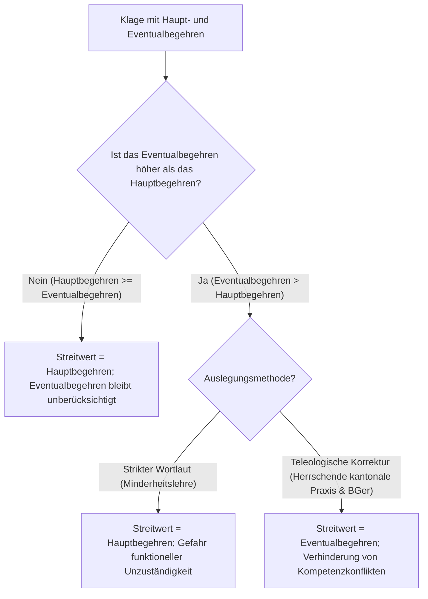

## Gesetzeswortlaut

> **Art. 91 ZPO — Grundsatz**
>
> ^1^ Der Streitwert wird durch das Rechtsbegehren bestimmt. Zinsen und Kosten des laufenden Verfahrens oder einer allfälligen Publikation des Entscheids sowie allfällige Eventualbegehren werden nicht hinzugerechnet.
>
> ^2^ Lautet das Rechtsbegehren nicht auf eine bestimmte Geldsumme, so setzt das Gericht den Streitwert fest, sofern sich die Parteien darüber nicht einigen oder ihre Angaben offensichtlich unrichtig sind.

---

## Überblick und Bedeutung

Art. 91 ZPO verankert das grundlegende Prinzip der **Streitwertermittlung** für das gesamte schweizerische Zivilprozessrecht. Der Streitwert bildet den in Geld ausgedrückten Wert des materiellen Streitgegenstands. An ihn knüpft das Gesetz zentrale verfahrensrechtliche Rechtsfolgen:
- die **sachliche Zuständigkeit** von Fachgerichten (insb. des Handelsgerichts nach Art. 6 Abs. 2 lit. b ZPO ab Fr. 30'000.-);
- die **Verfahrensart** (vereinfachtes Verfahren nach Art. 243 Abs. 1 ZPO bei Streitwerten bis zu Fr. 30'000.-; ordentliches Verfahren darüber);
- die **Zulässigkeit des Schlichtungsverfahrens** bzw. den Verzicht darauf (Art. 198 f. ZPO);
- die **Bemessung von Gerichtskosten und Parteientschädigungen** (Art. 95 f. ZPO i.V.m. den kantonalen Tarifen);
- die **Kostenbefreiung** in besonderen Streitigkeiten (z.B. Arbeitsstreitigkeiten nach Art. 114 lit. c ZPO bis Fr. 30'000.-);
- den **Rechtsmittelzugang** im kantonalen Verfahren (Berufung nach Art. 308 Abs. 2 ZPO ab Fr. 10'000.- bzw. Fr. 30'000.-) sowie vor Bundesgericht (Beschwerde in Zivilsachen nach Art. 74 Abs. 1 BGG ab Fr. 15'000.- bzw. Fr. 30'000.-).

Zwar belässt Art. 96 ZPO den Kantonen die Tarifautonomie bei der Festsetzung der Gebührenansätze, doch binden die bundesrechtlichen Streitwertregeln gemäss Art. 91 ff. ZPO die kantonalen Instanzen zwingend: Wenn ein kantonaler Tarif auf den Streitwert abstellt (sog. Gebühren- oder Kostenstreitwert), darf dieser nicht nach kantonalen Sonderregeln, sondern muss zwingend nach den bundesrechtlichen Kriterien von Art. 91 ff. ZPO berechnet werden ([BGE 139 III 195 E. 4.3](https://entscheidsuche.ch/docs/CH_BGE/CH_BGE_005_BGE-139-III-195_2013.html#consideration_4.3); [BGer 5A_139/2025 vom 29.9.2025 E. 3.5.1](https://entscheidsuche.ch/docs/CH_BGer/CH_BGer_005_5A-139-2025_2025-09-29.html)). Zudem gilt der Grundsatz der **Einheitlichkeit des Streitwerts**: Innerhalb desselben Prozesses darf es für unterschiedliche Funktionen (z.B. Entscheidgebühr einerseits und Kostenverteilung andererseits) nicht zwei divergierende Streitwerte geben ([AG OG ZOR.2015.102 vom 16.3.2016 E. 4.2](https://entscheidsuche.ch/docs/AG_Gerichte/AG_OG_001_ZOR-2015-102_2016-03-16.pdf)).

### Prüfschema: Der Merkmalskatalog der Streitwertermittlung

| Schritt / Merkmal | Tatbestandliche Prüfung | Behauptungs- & Beweislast |
|---|---|---|
| **A. Natur der Streitsache** | Vorliegen einer vermögensrechtlichen Streitigkeit (keine Parteidisposition; von Amtes wegen zu prüfen) | Klagende Partei begründet das wirtschaftliche Interesse |
| **B. Bestimmung durch das Rechtsbegehren (Abs. 1 Satz 1)** | Beziffertes Geldbegehren; massgeblicher Zeitpunkt ist die Rechtshängigkeit (Art. 62 ZPO) | Klagende Partei im Rechtsbegehren (Art. 221 Abs. 1 lit. b ZPO) |
| **C. Gesetzliche Abzugspositionen (Abs. 1 Satz 2)** | Nichtberücksichtigung von laufenden Zinsen, Verfahrenskosten und Publikationskosten | Ex lege durch das Gericht in Abzug zu bringen |
| **D. Behandlung von Eventualbegehren (Abs. 1 Satz 2)** | Kumulationsverbot; Schicksal eines das Hauptbegehren wertmässig übersteigenden Eventualbegehrens | Klagende Partei formuliert Anträge; Auslegung durch das Gericht |
| **E. Nicht auf Geldsumme lautende Begehren (Abs. 2)** | Vorrang übereinstimmender Parteivereinbarungen; Relativierung sachlicher Unzuständigkeit | Klägerische Angabe und Einigung mit beklagter Partei |
| **F. Schranke der offensichtlichen Unrichtigkeit (Abs. 2)** | Prüfung von Amtes wegen auf Scheinvereinbarungen, Rechtsmissbrauch und krasse Fehleinschätzungen | Gericht von Amtes wegen; Parteien zur Stellungnahme beizuziehen |
| **G. Richterliche Ermessensschätzung (Abs. 2)** | Autoritatives Abstellen auf das objektive ökonomische Interesse der Klagepartei nach Aktenlage | Gerichtlich nach Ermessen; Parteien sind mitwirkungspflichtig |
| **H. Besonderheiten bei Art. 85 ZPO (Unbezifferte Klage / Stufenklage)** | Vorläufiger Mindestwert vs. endgültiger Streitwert; Schicksal bei Vergleich vor Bezifferung | Klagende Partei nennt Mindestwert; Gericht schätzt bei Vergleich |
| **I. Rechtsschutz & Anfechtbarkeit** | Anfechtung der Streitwertfestsetzung im Zwischenstadium (Art. 103 ZPO vs. Art. 319 lit. b Ziff. 2 ZPO) | Beschwerdeführende Partei weist Nachteil nach |

---

## Kommentierung

### A. Vorfrage: Vermögensrechtliche Natur der Streitigkeit

Art. 91 ZPO befasst sich ausschliesslich mit der Methode zur Ermittlung des Streitwerts, wenn ein bezifferbarer Geldwert Gegenstand des Prozesses bildet. Die Bestimmung setzt begrifflich voraus, dass überhaupt eine **vermögensrechtliche Streitigkeit** vorliegt. Streitigkeiten über rein ideelle Inhalte haben keinen Streitwert und werden nicht von Art. 91 ZPO erfasst.

Die Qualifikation einer Klage als vermögensrechtlich oder nichtvermögensrechtlich unterliegt **nicht der Disposition der Parteien**. Weder Art. 91 Abs. 1 ZPO noch Art. 91 Abs. 2 ZPO finden direkte oder analoge Anwendung auf die Beantwortung dieser Vorfrage ([BGE 142 III 145 E. 5.2](https://entscheidsuche.ch/docs/CH_BGE/CH_BGE_005_BGE-142-III-145_2016.html#consideration_5.2)). Eine Streitigkeit ist vermögensrechtlich, wenn mit der Klage letztlich und überwiegend ein wirtschaftlicher Zweck verfolgt wird oder die begehrte Anordnung unmittelbare finanzielle Auswirkungen zeitigt ([BGE 142 III 145 E. 6.1](https://entscheidsuche.ch/docs/CH_BGE/CH_BGE_005_BGE-142-III-145_2016.html#consideration_6.1); [BGE 139 II 404 E. 12.1](https://entscheidsuche.ch/docs/CH_BGE/CH_BGE_005_BGE-139-II-404_2013.html#consideration_12.1)).

#### Grenzkasuistik: Vermögensrechtlich vs. Nichtvermögensrechtlich

1. **Nichtvermögensrechtlich: Datenherausgabesperre durch Bankangestellte ([BGE 142 III 145](https://entscheidsuche.ch/docs/CH_BGE/CH_BGE_005_BGE-142-III-145_2016.html))**  
   Eine ehemalige Bankmitarbeiterin verlangte vom Arbeitsgericht Zürich im summarischen Verfahren, ihrer früheren Arbeitgeberin unter Strafandrohung zu verbieten, dem US-Justizministerium (DoJ) Mitarbeiterdokumente und Kundendaten zu übermitteln. Sie bezifferte den Streitwert auf Fr. 10'833.- (ein Monatslohn). Die beklagte Bank erklärte sich damit einverstanden und stimmte der Durchführung des vereinfachten Verfahrens zu. Die Vorinstanzen traten mangels sachlicher Zuständigkeit nicht auf die Klage ein, da eine nichtvermögensrechtliche Streitigkeit vorliege, die zwingend im ordentlichen Verfahren vor dem Kollegialgericht zu verhandeln sei. Das Bundesgericht wies die Beschwerde der Mitarbeiterin ab: Die Parteien können eine nichtvermögensrechtliche Angelegenheit nicht durch Parteivereinbarung nach Art. 91 Abs. 2 ZPO in eine vermögensrechtliche umwandeln. Bei der Unterlassung der Datenlieferung überwiegen die ideellen Persönlichkeitsaspekte (Schutz vor ausländischen Strafverfahren); allfällige spätere Auswirkungen auf dem Arbeitsmarkt sind zu vage, um ein überwiegendes Vermögensinteresse zu begründen ([BGE 142 III 145 E. 6.3 f.](https://entscheidsuche.ch/docs/CH_BGE/CH_BGE_005_BGE-142-III-145_2016.html#consideration_6.3)).

2. **Vermögensrechtlich: Klage auf Ausstellung oder Berichtigung eines Arbeitszeugnisses ([BGE 116 II 379](https://entscheidsuche.ch/docs/CH_BGE/CH_BGE_005_BGE-116-II-379_1990.html); [BGE 74 II 43](https://entscheidsuche.ch/docs/CH_BGE/CH_BGE_005_BGE-074-II-43_1948.html))**  
   Klagen auf Ausstellung oder Änderung eines Arbeitszeugnisses sind trotz ihres Charakters als Urkundenanspruch vermögensrechtlicher Natur. Der Anspruch dient in erster Linie dem wirtschaftlichen Fortkommen des Arbeitnehmers, da ein lückenloser Zeugnisnachweis die Stellensuche massgeblich erleichtert. Ideelle Genugtuungsaspekte treten demgegenüber in den Hintergrund.

3. **Vermögensrechtlich: Herausgabe geschäftlicher Mandatskorrespondenz ([BGer 4A_338/2025 vom 15.10.2025](https://entscheidsuche.ch/docs/CH_BGer/CH_BGer_004_4A-338-2025_2025-10-15.html))**  
   Verlangt eine Stiftung von einer Beratungsgesellschaft die Herausgabe sämtlicher Korrespondenz mit beigezogenen ausländischen Anwälten der letzten zehn Jahre, um die Instruktion künftiger Anwälte sicherzustellen und Rechnungen zu kontrollieren, liegt eine vermögensrechtliche Streitigkeit vor. Das ökonomische Ziel überwiegt allfällige formelle Rechenschaftspflichten ([BGer 4A_338/2025 E. 3.1](https://entscheidsuche.ch/docs/CH_BGer/CH_BGer_004_4A-338-2025_2025-10-15.html)).

> **Leitsatz.** Art. 91 ZPO regelt die Ermittlung des Streitwerts in vermögensrechtlichen Streitigkeiten. Ob eine Streitigkeit vermögensrechtlicher Natur ist, entzieht sich der Parteidisposition und ist vom Gericht von Amtes wegen zu beurteilen.

---

### B. Bestimmung durch das Rechtsbegehren (Abs. 1 Satz 1)

Nach Art. 91 Abs. 1 Satz 1 ZPO wird der Streitwert primär durch das **Rechtsbegehren** der klagenden Partei bestimmt. Bei bezifferten Leistungsklagen ergibt sich der Streitwert direkt aus dem bezifferten Betrag (z.B. Klage auf Zahlung von Fr. 50'000.- ergibt einen Streitwert von Fr. 50'000.-).

#### 1. Massgeblicher Zeitpunkt
Massgebend für den Streitwert ist grundsätzlich der Zeitpunkt des Eintritts der **Rechtshängigkeit** (Art. 62 ff. ZPO), mithin das Datum der Einreichung des Schlichtungsgesuchs bzw. der Klage ([BGer 5A_139/2025 E. 3.4](https://entscheidsuche.ch/docs/CH_BGer/CH_BGer_005_5A-139-2025_2025-09-29.html)). Die zu diesem Zeitpunkt begründete sachliche Zuständigkeit und Verfahrensart bleiben gemäss dem Grundsatz der *perpetuatio fori* und *perpetuatio processus* grundsätzlich unverändert erhalten (vgl. Art. 227 Abs. 3 ZPO).

#### 2. Nachträgliche Klageänderung und Klagereduktion
Reduziert die klagende Partei ihr Rechtsbegehren im Lauf des Prozesses, berührt dies die Verfahrensart (Art. 243 ZPO) und die sachliche Zuständigkeit im Regelfall nicht mehr (Art. 227 Abs. 3 ZPO). Für die kantonale Gerichtsgebühr und die Parteientschädigung ist hingegen nach Massgabe der kantonalen Tarife zu differenzieren: Wird die Klage frühzeitig reduziert, bemessen sich die nachfolgenden Kosten häufig nach dem herabgesetzten Streitwert.

#### 3. Lohnklagen: Brutto- vs. Nettolohn ([BE OG ZK 2017 441 vom 30.10.2017](https://entscheidsuche.ch/docs/BE_ZivilStraf/BE_OG_001_ZK-2017-441_2017-10-30.pdf))
Eine besondere Streitfrage betrifft arbeitsrechtliche Lohnklagen. Klagt ein Arbeitnehmer einen Betrag von «Fr. 30'000.- netto» ein, um im kostenlosen vereinfachten Verfahren nach Art. 114 lit. c ZPO zu verbleiben, stellt sich die Frage, ob das Gericht an den Nettobetrag gebunden ist:
- **Ausgangslage**: Eine Klägerin verlangte aus Arbeitsvertrag Fr. 30'000.- netto als Leistungsentschädigung. Das erstinstanzliche Gericht rechnete pauschal 26% Sozialabgaben hinzu (Arbeitnehmer- und Arbeitgeberbeiträge), setzte den Streitwert auf Fr. 40'500.- fest, eröffnete das ordentliche Verfahren und forderte einen Gerichtskostenvorschuss von Fr. 5'500.- an.
- **Entscheid des Obergerichts Bern**: Der Streitwert von Lohnklagen bemisst sich nach dem **Bruttolohn** (Lohn vor Abzug der Arbeitnehmerbeiträge), nicht aber nach dem «Brutto-Brutto-Lohn» unter Einschluss von Arbeitgeberbeiträgen. Klagt der Arbeitnehmer netto, weicht der objektive Streitwert nach oben ab.
- **Richterliche Fragepflicht (Art. 56 ZPO)**: Weicht das Gericht bei der Streitwertberechnung vom klägerischen Antrag ab und droht dadurch der Verlust des kostenlosen Verfahrens, ist es verpflichtet, bei der Partei nachzufragen, ob sie ihr Begehren auf brutto Fr. 30'000.- reduzieren will ([BE OG ZK 2017 441 E. 16](https://entscheidsuche.ch/docs/BE_ZivilStraf/BE_OG_001_ZK-2017-441_2017-10-30.pdf)).

> **Leitsatz.** Der Streitwert bemisst sich im Zeitpunkt der Klageeinreichung nach dem objektiven Gehalt des Rechtsbegehrens. Bei Lohnklagen bildet der Bruttolohn (vor Abzug der Arbeitnehmerbeiträge) die massgebliche Bemessungsbasis.

---

### C. Gesetzliche Abzugspositionen (Abs. 1 Satz 2)

Art. 91 Abs. 1 Satz 2 ZPO ordnet an, dass bestimmte Nebenforderungen bei der Streitwertberechnung **nicht hinzugerechnet** werden:
1. **Zinsen des laufenden Verfahrens**: Nur die bis zum Zeitpunkt der Klageeinreichung bzw. Rechtshängigkeit aufgelaufenen Verzugszinsen erhöhen den Streitwert (sie gelten als vorprozessuale Zinsen und müssen im Begehren kapitalisiert werden). Die ab Klageeinreichung laufenden oder verlangten Verzugszinsen bleiben bei der Streitwertberechnung unberücksichtigt.
2. **Kosten des laufenden Verfahrens**: Gerichtskosten, Parteientschädigungen sowie behördliche Kostenvorschüsse des pendenten Verfahrens werden dem Streitwert nicht zugeschlagen. Demgegenüber erhöhen vorprozessuale Anwaltskosten den Streitwert dann, wenn sie als selbständiger materieller Schadenersatzanspruch eingeklagt werden.
3. **Publikationskosten des Entscheids**: Allfällige Kosten einer gerichtlich angeordneten Veröffentlichung (z.B. im Lauterkeits- oder Persönlichkeitsrecht) bleiben ausser Ansatz.

---

### D. Schicksal von Eventualbegehren: Kumulationsverbot vs. Höherwert (Abs. 1 Satz 2)

Nach Art. 91 Abs. 1 Satz 2 ZPO werden *«allfällige Eventualbegehren nicht hinzugerechnet»*. Die Norm regelt vordergründig ein klares **Kumulationsverbot**: Haupt- und Eventualbegehren dürfen nicht addiert werden, da sie sich logisch ausschliessen und der Kläger nicht beide Leistungen kumulativ beansprucht.

In der Praxis entsteht jedoch eine schwerwiegende Konfliktlage, wenn das **Eventualbegehren einen höheren Geldwert aufweist als das Hauptbegehren**.

#### Judikaturdivergenz und offener Meinungsstreit

- **Linie 1: Strikter Gesetzeswortlaut (Minderheit in der Lehre)**  
  Teile der Lehre (u.a. Diggelmann, z.T. Stein-Wigger) folgern aus dem Wortlaut von Art. 91 Abs. 1 Satz 2 ZPO, dass Eventualbegehren schlechthin unberücksichtigt bleiben. Der Streitwert bestimme sich ausnahmslos nach dem Hauptbegehren, selbst wenn das Eventualbegehren massiv höher beziffert sei.

- **Linie 2: Teleologische Reduktion / Höherwertprinzip (Herrschende Praxis kantonaler Obergerichte und Bundesgericht)**  
  Die kantonalen Obergerichte verwerfen diese wortgetreue Auslegung als unhaltbar:
  - **[BL KG 410 12 172 vom 17.07.2012](https://entscheidsuche.ch/docs/BL_Gerichte/BL_KG_001_410-2012-172_2012-07-17.pdf)**: Eine Arbeitnehmerin klagte im Hauptbegehren auf Lohn und Spesen von Fr. 14'533.-, stellte aber das Eventualbegehren auf Kündigungsentschädigung und Ferienguthaben von insgesamt Fr. 35'946.-. Sie verlangte die Kostenfreiheit nach Art. 114 lit. c ZPO, da das Hauptbegehren unter Fr. 30'000.- liege. Das Kantonsgericht Basel-Landschaft verwarf diese Haltung: Art. 91 Abs. 1 Satz 2 ZPO verbietet lediglich die *Addition* beider Begehren. Es besteht eine Gesetzeslücke: Weist das Eventualbegehren einen höheren Streitwert auf, bestimmt das **höhere Eventualbegehren** den Streitwert. Andernfalls wäre das Gericht bei Abweisung des tieferen Hauptbegehrens sachlich oder funktionell gar nicht zuständig, das höhere Eventualbegehren materiell zu beurteilen ([BL KG 410 12 172 E. 2.3](https://entscheidsuche.ch/docs/BL_Gerichte/BL_KG_001_410-2012-172_2012-07-17.pdf)).
  - **[SH OG 10/2022/15 vom 07.07.2023 / 08.05.2024](https://entscheidsuche.ch/docs/SH_OG/SH_OG_001_10-2022-15_2024-05-08.pdf)** (bestätigt durch BGer 4A_431/2023 vom 05.03.2024): Das Obergericht Schaffhausen bestätigte, dass bei einem wertmässig höheren Eventualbegehren zur Bemessung des Streitwerts trotz des Wortlauts auf das Eventualbegehren abzustellen ist ([SH OG 10/2022/15 E. 1.2](https://entscheidsuche.ch/docs/SH_OG/SH_OG_001_10-2022-15_2024-05-08.pdf)).

| Auslegungsansatz | Streitwertfolge bei Hauptantrag Fr. 15'000.- / Eventualantrag Fr. 80'000.- | Konsequenz für Zuständigkeit & Kosten |
|---|---|---|
| **Strikter Wortlaut (Linie 1)** | Streitwert = Fr. 15'000.- (vereinfachtes Verfahren) | Gericht müsste bei Abweisung des Hauptantrags über Fr. 80'000.- entscheiden, obwohl es als Einzelgericht sachlich unzuständig wäre |
| **Teleologische Korrektur (Linie 2 — h.M.)** | Streitwert = Fr. 80'000.- (ordentliches Verfahren) | Kollegialgericht beurteilt beide Anträge; Kostenvorschuss deckt den gesamten Prozessaufwand ab |

> **Leitsatz.** Art. 91 Abs. 1 Satz 2 ZPO verbietet die Zusammenrechnung von Haupt- und Eventualbegehren. Weist das Eventualbegehren einen höheren Streitwert auf als das Hauptbegehren, bestimmt nach herrschender Rechtsprechung das Eventualbegehren den Streitwert des gesamten Verfahrens.

---

### E. Nicht auf Geldsumme lautende Rechtsbegehren (Abs. 2)

Lautet das Rechtsbegehren nicht auf eine bestimmte Geldsumme (z.B. Feststellungsklagen, Gestaltungsbegehren, Auskunftsansprüche, Ausweisungsklagen oder Realerfüllungsansprüche), greift die subsidiäre Kaskade von Art. 91 Abs. 2 ZPO:
1. **Primär**: Parteivereinbarung über den Streitwert;
2. **Sekundär**: Richterliche Streitwertfestsetzung (wenn sich die Parteien nicht einigen oder ihre Angaben offensichtlich unrichtig sind).

#### Bindung an Parteivereinbarungen & Relativierung der sachlichen Zuständigkeit
Eignen sich die Parteien über den Streitwert einer nicht auf Geld lautenden vermögensrechtlichen Klage, ist das Gericht an diesen Wert gebunden. 

Hierdurch wird der Grundsatz, wonach die sachliche Zuständigkeit nicht der Parteidisposition unterliegt (Art. 60 ZPO; Prorogationsverbot für Sachzuständigkeit), **mittelbar relativiert**: Die Parteien können durch eine übereinstimmende Streitwertangabe steuern, ob ein Prozess vor das Handelsgericht (Art. 6 Abs. 2 lit. b ZPO, Streitwert über Fr. 30'000.-) oder das ordentliche Zivilgericht gelangt ([BGE 142 III 145 E. 5.2](https://entscheidsuche.ch/docs/CH_BGE/CH_BGE_005_BGE-142-III-145_2016.html#consideration_5.2); [BGer 4A_338/2025 E. 2.3](https://entscheidsuche.ch/docs/CH_BGer/CH_BGer_004_4A-338-2025_2025-10-15.html)). Diese Relativierung rechtfertigt sich dadurch, dass die Parteien das wirtschaftliche Ausmass des Streits meist verlässlicher beurteilen können als das Gericht zu Prozessbeginn.

---

### F. Schranke der offensichtlichen Unrichtigkeit (Abs. 2)

Das Gericht darf von den Angaben der Parteien nur abweichen, wenn diese **offensichtlich unrichtig** sind. «Offensichtlich unrichtig» ist eine Streitwertangabe nicht schon dann, wenn sie von einer gerichtlichen Schätzung abweicht, sondern nur bei **groben Missverhältnissen**, offensichtlichen Scheinvereinbarungen zur Umgehung von Gerichtsgebühren oder erkennbar rechtsmissbräuchlichem Überklagen (*forum shopping*).

#### Kasuistik: Beachtung vs. Verwerfung von Parteivereinbarungen

1. **Bejaht: Bindung an klägerische Zweckangabe bei Auskunfts- und Editionsbegehren ([BGer 4A_338/2025](https://entscheidsuche.ch/docs/CH_BGer/CH_BGer_004_4A-338-2025_2025-10-15.html))**  
   Eine Klage vor Handelsgericht Zürich auf Herausgabe von Korrespondenz der letzten 10 Jahre wurde von der Klägerin mit über Fr. 30'000.- beziffert, während die Beklagte die Handelsgerichtszuständigkeit mit der Einrede bestritt, der Streitwert betrage maximal Fr. 10'000.-. Mangels Einigung schätzte das Handelsgericht den Streitwert auf über Fr. 30'000.- unter Hinweis auf die 80 betroffenen Marken und das ökonomische Interesse der Klägerin, den Zusatzaufwand neuer Auslandskorrespondenten zu vermeiden. Das Bundesgericht schützte den Entscheid: Das Gericht darf auf den klägerisch angegebenen wirtschaftlichen Zweck abstellen; eine vorzeitige materielle Prüfung der Erfolgsaussichten findet bei der Streitwertschätzung nicht statt.

2. **Verworfen: Vorprozessuale emotionale Vergleichsangebote binden das Gericht nicht ([BGE 140 III 571](https://entscheidsuche.ch/docs/CH_BGE/CH_BGE_005_BGE-140-III-571_2014.html))**  
   Stockwerkeigentümer fochten Beschlüsse über den Einbau eines Boilers in der gemeinschaftlichen Waschküche an. In der Versammlung hatten die Kläger verärgert Fr. 30'000.- bis 40'000.- Entschädigung gefordert, woraufhin die Vorinstanzen den Streitwert ungeprüft auf Fr. 30'000.- festsetzten. Das Bundesgericht trat auf die Beschwerde in Zivilsachen mangels Streitwerts nicht ein: Die Angabe von Fr. 30'000.- war offensichtlich unrichtig. Der objektive wirtschaftliche Gehalt bestand einzig in den Verlegungskosten des Boilers (rund Fr. 3'500.-). Emotionale Vergleichsofferten in spannungsgeladenen Situationen begründen keinen massgeblichen Streitwert ([BGE 140 III 571 E. 1.4](https://entscheidsuche.ch/docs/CH_BGE/CH_BGE_005_BGE-140-III-571_2014.html#consideration_1.4)).

---

### G. Richterliche Ermessensschätzung (Abs. 2)

Können sich die Parteien nicht einigen oder erweisen sich ihre Angaben als offensichtlich unrichtig, muss das Gericht den Streitwert autoritativ **nach pflichtgemässem Ermessen** auf der Grundlage objektiver Kriterien schätzen ([BGer 4A_338/2025 E. 2.4](https://entscheidsuche.ch/docs/CH_BGer/CH_BGer_004_4A-338-2025_2025-10-15.html); [BGE 140 III 571 E. 1.2](https://entscheidsuche.ch/docs/CH_BGE/CH_BGE_005_BGE-140-III-571_2014.html#consideration_1.2)). Das Bundesgericht greift in solche Schätzungen nur bei Ermessensüberschreitung oder offensichtlicher Unbilligkeit ein.

#### Kasuistiktabelle: Leitlinien für typische Streitwertschätzungen

| Sachverhalt / Klageart | Massgebliche Kriterien der Schätzung | Leitentscheid |
|---|---|---|
| **Mieterausweisung nach Art. 257 ZPO (nur Ausweisung)** | Mietwert für **sechs Monate** (pauschalierte Verzögerungsdauer des Summarverfahrens) | [BGE 144 III 346 E. 1.2.1](https://entscheidsuche.ch/docs/CH_BGE/CH_BGE_005_BGE-144-III-346_2018.html#consideration_1.2.1) |
| **Mieterausweisung nach Art. 257 ZPO (vorfrageweise Kündigung streitig)** | Mietwert für **drei Jahre (36 Monate)** (gesetzliche Kündigungssperrfrist nach Art. 271a Abs. 1 lit. e OR) | [BGE 144 III 346 E. 1.2.2.3](https://entscheidsuche.ch/docs/CH_BGE/CH_BGE_005_BGE-144-III-346_2018.html#consideration_1.2.2.3) |
| **Nichtigkeit eines Liegenschaftskaufvertrags & Rückübertragung** | Voller Kaufpreis / Verkehrswert der Liegenschaft **ohne Abzug von Hypothekarschulden** | [SG KG BE.2015.44 vom 21.12.2015](https://entscheidsuche.ch/docs/SG_Gerichte/SG_KG_002_BE-2015-44_2015-12-21.pdf) |
| **Arresteinsprache / Arrestaufhebung (Art. 278 SchKG)** | Schätzwert der verarrestierten Objekte, sofern bekannt; nur bei unbekanntem Wert Gesamtforderung | [BGer 5A_28/2013 vom 15.4.2013 E. 2.4.2](https://entscheidsuche.ch/docs/CH_BGer/CH_BGer_005_5A-28-2013_2013-04-15.html) |
| **Materiell-rechtlicher Informations- & Auskunftsanspruch** | Bruchteil von **10% bis 40%** des vermögenswerten Hauptinteresses | [SH OG 40/2025/1 vom 20.5.2025 E. 4.3.1](https://entscheidsuche.ch/docs/SH_OG/SH_OG_001_40-2025-1_2025-05-23.pdf) |
| **Aberkennungsklage (Art. 83 Abs. 2 SchKG) nur wegen mangelnder Fälligkeit** | Wert des Zins- und Liquiditätsvorteils, erst bei Fälligkeit zahlen zu müssen | [ZH OG RB190020 vom 26.7.2019 E. 3.4](https://entscheidsuche.ch/docs/ZH_Obergericht/ZH_OG_001_RB190020_2019-07-26.pdf) |
| **Bestreitung neuen Vermögens (Art. 265a Abs. 4 SchKG) nur durch Schuldner** | Differenz zwischen dem im summarischen Verfahren bewilligten Betrag und dem Klägerantrag | [AG OG ZOR.2015.102 vom 16.3.2016 E. 4.3](https://entscheidsuche.ch/docs/AG_Gerichte/AG_OG_001_ZOR-2015-102_2016-03-16.pdf) |
| **Anfechtung von Stockwerkeigentümerbeschlüssen (Baumassnahme)** | Objektive Kosten der baulichen Massnahme bzw. deren Beseitigung (Interesse der Gemeinschaft) | [BGE 140 III 571 E. 1.1](https://entscheidsuche.ch/docs/CH_BGE/CH_BGE_005_BGE-140-III-571_2014.html#consideration_1.1) |

---

### H. Zusammenspiel mit Art. 85 ZPO (Unbezifferte Forderungsklage / Stufenklage)

Ist der klagenden Partei eine Bezifferung zu Beginn unmöglich oder unzumutbar, gibt sie nach Art. 85 Abs. 1 ZPO einen **vorläufigen Mindestwert** an. Dieser Mindestwert fixiert definitiv die sachliche Zuständigkeit, den Kostenvorschuss und die Verfahrensart. 

Die endgültigen Gerichts- und Anwaltskosten bestimmen sich demgegenüber nach der **nachträglichen definitiven Bezifferung** gemäss Art. 85 Abs. 2 ZPO.

#### Streitwertschicksal bei vorzeitigem Vergleichsabschluss ([BGer 5A_139/2025](https://entscheidsuche.ch/docs/CH_BGer/CH_BGer_005_5A-139-2025_2025-09-29.html))
Ein hochgradig praxisrelevantes Problem entsteht, wenn ein Prozess mit unbezifferter Forderungsklage vor der definitiven Bezifferung durch gerichtlichen Vergleich beendet wird:
- **Ausgangslage**: In einem Ehescheidungsverfahren verlangte der Ehemann gestützt auf Art. 85 ZPO eine güterrechtliche Ausgleichszahlung von frankengenau Fr. 370'853.- unter Vorbehalt des Beweisergebnisses. Nach Vorliegen einer Immobilienschätzung schlossen die Parteien einen Vergleich über Fr. 135'000.-. Das Obergericht Aargau bemessene die Entschädigung des unentgeltlichen Anwalts gestützt auf den Vergleichsbetrag von Fr. 135'000.-.
- **Entscheid des Bundesgerichts**: Das Vorgehen der kantonalen Instanz verletzt Art. 91 i.V.m. Art. 85 ZPO. Endet das Verfahren vor definitiver Bezifferung, gilt grundsätzlich der **vorläufige Mindeststreitwert** als Kostenstreitwert fort. 
- Das Gericht darf den Streitwert in analoger Anwendung von Art. 91 Abs. 2 ZPO nur dann anpassen, wenn der Mindeststreitwert offensichtlich unrichtig war.
- Das Gericht darf jedoch **keinesfalls unbesehen auf den Vergleichsbetrag abstellen**: Ein Vergleich zeichnet sich durch gegenseitiges Nachgeben aus und spiegelt den Streitwert des Rechtsstreits gerade nicht objektiv wider ([BGer 5A_139/2025 E. 3.6.3](https://entscheidsuche.ch/docs/CH_BGer/CH_BGer_005_5A-139-2025_2025-09-29.html)).

> **Leitsatz.** Endet ein Prozess mit unbezifferter Forderungsklage vor der definitiven Bezifferung durch Vergleich, richtet sich der Streitwert nach dem vorläufigen Mindestwert. Der vereinbarte Vergleichsbetrag darf nicht als Kostenstreitwert herangezogen werden.

---

### I. Rechtsschutz und selbständige Anfechtbarkeit

Verfügungen über den Streitwert ergehen meist im Vorfeld des Sachentscheids als **prozessleitende Zwischenverfügungen**. Ihre Anfechtbarkeit richtet sich nach dem Gegenstand der gerichtlichen Anordnung:
1. **Verbindung mit Kostenvorschuss (Art. 98 ZPO)**:  
   Wird der Streitwert im Rahmen einer Kostenvorschussverfügung festgelegt, ist der Entscheid gestützt auf Art. 103 i.V.m. Art. 319 lit. b Ziff. 1 ZPO direkt und **ohne Nachweis eines Nachteils mit Beschwerde anfechtbar**. Im Rahmen dieser Beschwerde kann gerügt werden, der Vorschuss beruhe auf einem unrichtig ermittelten Streitwert ([ZH OG RB190020 vom 26.7.2019 E. 2.2](https://entscheidsuche.ch/docs/ZH_Obergericht/ZH_OG_001_RB190020_2019-07-26.pdf)).
2. **Isolierte Streitwertfestsetzung (ohne Vorschuss)**:  
   Ergeht die Festsetzung als isolierte prozessleitende Verfügung, greift Art. 319 lit. b Ziff. 2 ZPO. Die Beschwerde ist nur zulässig, wenn durch sie ein **nicht leicht wiedergutzumachender Nachteil** droht. Ein solcher Nachteil wird bejaht, wenn durch die Streitwertfestsetzung die Verfahrensart (z.B. Wechsel vom vereinfachten ins ordentliche Verfahren mit Anwaltspflicht und Verlust von Art. 247 ZPO) oder die Gerichtszuständigkeit definitiv präjudiziert wird.

---

## Kantonale Praxisfragen

### 1. Arbeitsrechtliche Lohnklagen: Richterliche Fragepflicht bei Hochrechnung auf Bruttobetrag
- **Problem**: Kläger reichen Lohnklagen auf exakt Fr. 30'000.- netto ein, um die Kostenbefreiung des Schlichtungs- und Entscheidverfahrens (Art. 114 lit. c ZPO) in Anspruch zu nehmen. Kantons- und Bezirksgerichte rechnen von Amtes wegen Sozialabgaben hinzu und gelangen zu einem Streitwert von über Fr. 30'000.-.
- **Kantonale Praxis**: Die Gerichte sind zwar bundesrechtlich verpflichtet, auf den Bruttolohn abzustellen ([BE OG ZK 2017 441 E. 15](https://entscheidsuche.ch/docs/BE_ZivilStraf/BE_OG_001_ZK-2017-441_2017-10-30.pdf)). Sie dürfen das Verfahren jedoch nicht ohne Vorwarnung ins ordentliche und kostenpflichtige Verfahren überführen. Die Gerichte müssen gestützt auf die **richterliche Fragepflicht (Art. 56 ZPO)** zwingend bei der Klagepartei nachfragen, ob sie ihr Begehren zur Wahrung der Kostenfreiheit auf brutto Fr. 30'000.- herabsetzen will, bevor ein Kostenvorschuss verlangt oder die Verfahrensart gewechselt wird.

### 2. Mieterausweisung nach Art. 257 ZPO: Schwellenwert für Berufung vs. Beschwerde
- **Problem**: Bei Ausweisungsbegehren im summarischen Verfahren ist umstritten, ob für die Berechnung des Rechtsmittelstreitwerts (Art. 308 Abs. 2 ZPO, Fr. 10'000.-) auf sechs Monatsmieten oder drei Jahresmieten abzustellen ist.
- **Kantonale Praxis**: Die kantonalen Gerichte folgen der Differenzierung von [BGE 144 III 346](https://entscheidsuche.ch/docs/CH_BGE/CH_BGE_005_BGE-144-III-346_2018.html): Macht der Mieter lediglich formelle Ausweisungsmängel geltend, betragen die Streitwerte sechs Monatsmieten; die Berufung ist oft unzulässig (bloss subsidiäre Beschwerde nach Art. 319 ZPO). Bestreitet der Mieter dagegen die Wirksamkeit oder Gültigkeit der Kündigung (z.B. wegen Kündigungssperrfrist nach Art. 271a OR), beträgt der Streitwert drei Jahresmieten (36 Monatsmieten), womit die Berufungsgrenze von Fr. 10'000.- bei Wohnungsmieten regelmässig erreicht ist ([ZH OG PF200046 vom 3.4.2020](https://entscheidsuche.ch/docs/ZH_Obergericht/ZH_OG_001_PF200046_2020-04-03.pdf)).

---

## Praxishinweise

**Für die klagende Partei und ihre Anwaltschaft:**

1. Bei Lohnklagen den Betrag stets als **Bruttolohn** beziffern. Wer Fr. 30'000.- netto einklagt, riskiert, dass das Gericht durch Zuschlag von Sozialabgaben den Streitwert über Fr. 30'000.- anhebt und die Kostenbefreiung nach Art. 114 lit. c ZPO entfällt ([BE OG ZK 2017 441](https://entscheidsuche.ch/docs/BE_ZivilStraf/BE_OG_001_ZK-2017-441_2017-10-30.pdf)).
2. Bei Vorliegen eines wertmässig höheren **Eventualbegehrens** den Gesamtstreitwert nach dem Eventualantrag berechnen und den Kostenvorschuss entsprechend kalkulieren. Gerichte stellen zur Vermeidung funktioneller Unzuständigkeiten auf das höhere Begehren ab ([BL KG 410 12 172](https://entscheidsuche.ch/docs/BL_Gerichte/BL_KG_001_410-2012-172_2012-07-17.pdf); [SH OG 10/2022/15](https://entscheidsuche.ch/docs/SH_OG/SH_OG_001_10-2022-15_2024-05-08.pdf)).
3. Verzugszinsen ab Klageeinreichung nicht im Streitwert beziffern (Art. 91 Abs. 1 Satz 2 ZPO). Vorprozessuale Verzugszinsen bis zum Tag der Klageeinreichung müssen dagegen kapitalisiert und ausdrücklich zum Streitwert geschlagen werden.
4. Bei unbezifferten Forderungsklagen (Art. 85 ZPO) den vorläufigen Mindestwert sorgfältig wählen: Er bindet die Partei bis zur rechtskräftigen Erledigung und wird im Fall eines Vergleichs vor definitiver Bezifferung zur Grundlage der Gerichtskosten ([BGer 5A_139/2025](https://entscheidsuche.ch/docs/CH_BGer/CH_BGer_005_5A-139-2025_2025-09-29.html)).

**Für die beklagte Partei:**

1. Bei Auskunfts- oder Editionsklagen die Streitwertangabe der Klägerin im ersten Vortrag rügen, wenn sie unhaltbar hoch ist, um eine sachliche Unzuständigkeit des Handelsgerichts (Art. 6 Abs. 2 lit. b ZPO) oder eine unbillige Gebührenbelastung abzuwenden ([BGer 4A_338/2025](https://entscheidsuche.ch/docs/CH_BGer/CH_BGer_004_4A-338-2025_2025-10-15.html)).
2. In der Aberkennungsklage prüfen, ob die Klage die Forderung dem Grunde nach oder lediglich deren Fälligkeit bestreitet: Wird nur die Fälligkeit bestritten, entspricht der Streitwert nicht der Schuldsumme, sondern dem Zinsvorteil des Zahlungsaufschubs ([ZH OG RB190020](https://entscheidsuche.ch/docs/ZH_Obergericht/ZH_OG_001_RB190020_2019-07-26.pdf)).

**Für das Gericht und die Schlichtungsbehörde:**

1. Wenn die Streitwertkorrektur zum Wechsel vom kostenlosen vereinfachten ins kostenpflichtige ordentliche Verfahren führt, zwingend die **richterliche Fragepflicht (Art. 56 ZPO)** ausüben und der Klägerin Gelegenheit zur Reduktion des Antrags geben ([BE OG ZK 2017 441](https://entscheidsuche.ch/docs/BE_ZivilStraf/BE_OG_001_ZK-2017-441_2017-10-30.pdf)).
2. Nach Abschluss eines gerichtlichen Vergleichs bei einer unbezifferten Forderungsklage den Kostenentscheid nicht auf die Vergleichssumme stützen; massgebend bleibt der vorläufige Mindestwert, ausser dieser erweist sich als offensichtlich unrichtig ([BGer 5A_139/2025](https://entscheidsuche.ch/docs/CH_BGer/CH_BGer_005_5A-139-2025_2025-09-29.html)).
3. Bei Ausweisungsklagen nach Art. 257 ZPO stets differenzieren: Wird nur die Räumung verlangt, gilt der Halbjahresmietwert; ist vorfrageweise die Gültigkeit der Kündigung bestritten, gilt der Dreijahresmietwert ([BGE 144 III 346](https://entscheidsuche.ch/docs/CH_BGE/CH_BGE_005_BGE-144-III-346_2018.html)).
